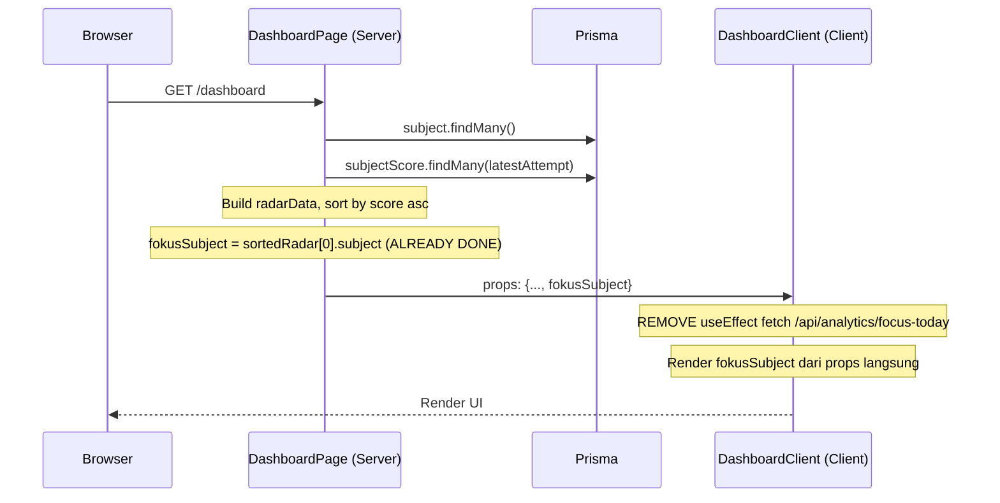
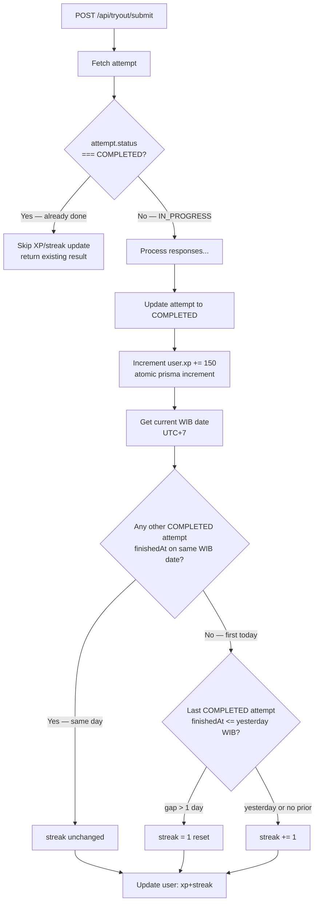

# Design Document — Polarius Gap Fixes

## Overview

Dokumen ini mendeskripsikan desain teknis untuk tujuh perbaikan (gap fixes) pada aplikasi Polarius ITS. Setiap gap diperlakukan sebagai perubahan inkremental yang tidak mengubah arsitektur utama — stack tetap Next.js 16 App Router, Prisma 7 (PostgreSQL), NextAuth v5 beta (JWT), Zustand, Recharts, dan Framer Motion.

Stack yang relevan per gap:
- **Auth Middleware** → `src/middleware.ts`, NextAuth v5 `auth()` helper
- **Logout** → `src/components/layout/Sidebar.tsx`, `signOut` dari `@/auth` (server action path)
- **Dashboard focus-today** → `src/app/(app)/dashboard/page.tsx` + `DashboardClient.tsx`
- **Tutor questions** → `src/app/(app)/tutor/[[...attemptId]]/page.tsx`, `/api/evaluation/questions`
- **Tryout list** → `src/app/tryout/list/page.tsx`, `TryoutListClient.tsx`
- **KaTeX MathText** → `src/components/ui/MathText.tsx`, KaTeX ^0.17.0 (sudah ada di `dependencies`)
- **Demo 404** → `src/app/tryout/demo/page.tsx` baru, `src/app/page.tsx`
- **XP & Streak** → Prisma migration, `/api/tryout/submit/route.ts`, `DashboardPage`, `DashboardClient`

---

## Architecture

Tidak ada perubahan arsitektur. Semua perubahan bersifat **additive** (file baru) atau **modification** (perubahan pada file yang sudah ada) di dalam layer yang sudah eksis.

```mermaid
graph TB
    subgraph "Next.js Edge Runtime"
        MW[middleware.ts\nnew file]
    end

    subgraph "App Router — Server Components"
        DLP[DashboardPage\nmodified]
        TLP[TryoutListPage\nalready server component]
        DEMO[tryout/demo/page.tsx\nnew file]
    end

    subgraph "App Router — Client Components"
        DLC[DashboardClient\nmodified — xp/streak props]
        TLC[TryoutListClient\nno change needed]
        TUTOR[TutorPage\nmodified — fetch target]
        SB[Sidebar\nmodified — signOut import]
    end

    subgraph "API Routes"
        SUBMIT[/api/tryout/submit\nmodified — xp/streak logic]
        EVALQ[/api/evaluation/questions\nmodified — add selectedIds]
        TQDELETE[/api/tutor/questions\nDELETE this file]
    end

    subgraph "Shared Components"
        MT[MathText.tsx\nnew component]
    end

    subgraph "Prisma / PostgreSQL"
        USER[User model\n+xp +streak fields]
    end

    MW -->|protects| DLP
    MW -->|protects| TUTOR
    DLP -->|passes xp,streak,fokusSubject| DLC
    TLP -->|passes templates| TLC
    TUTOR -->|fetches| EVALQ
    SUBMIT -->|increments| USER
    DLP -->|reads| USER
    MT -->|used by| TUTOR
```

---

## Components and Interfaces

### 1. `src/middleware.ts` (NEW)

```typescript
import { auth } from "@/auth"
import { NextResponse } from "next/server"

// Protected path prefixes — semua route di bawah ini memerlukan autentikasi
const PROTECTED_PREFIXES = [
  "/dashboard", "/analytics", "/tutor", "/chancing",
  "/counselor", "/onboarding", "/settings", "/evaluation",
  "/learning-path", "/practice", "/admin",
]

// Admin-only prefix
const ADMIN_PREFIX = "/admin"

export default auth((req) => {
  const { nextUrl, auth: session } = req
  const pathname = nextUrl.pathname

  const isProtected = PROTECTED_PREFIXES.some(p => pathname === p || pathname.startsWith(p + "/"))
  if (!isProtected) return NextResponse.next()

  // Unauthenticated → redirect ke /auth/login?callbackUrl=...
  if (!session) {
    const loginUrl = new URL("/auth/login", nextUrl.origin)
    loginUrl.searchParams.set("callbackUrl", pathname)
    return NextResponse.redirect(loginUrl)
  }

  // Admin prefix — non-admin → redirect ke /dashboard dengan 307
  if (pathname === ADMIN_PREFIX || pathname.startsWith(ADMIN_PREFIX + "/")) {
    if ((session.user as any)?.role !== "ADMIN") {
      return NextResponse.redirect(new URL("/dashboard", nextUrl.origin), 307)
    }
  }

  return NextResponse.next()
})

export const config = {
  matcher: [
    "/((?!_next/static|_next/image|favicon\\.ico|api/).*)",
  ],
}
```

**Catatan implementasi:**
- Middleware menggunakan `auth` yang di-export dari `@/auth` sebagai higher-order function (NextAuth v5 style: `export default auth(handler)`)
- `req.auth` adalah session object yang sudah di-resolve di edge runtime
- Matcher pattern menggunakan negative lookahead untuk exclude `_next/static`, `_next/image`, `favicon.ico`, dan semua path `/api/`
- `/tryout/list` dan `/tryout/demo` tidak ada di `PROTECTED_PREFIXES`, sehingga otomatis public

---

### 2. Sidebar Logout Fix

**File:** `src/components/layout/Sidebar.tsx`

Sidebar sudah mengimpor `signOut` dari `next-auth/react` dan memanggilnya dengan `{ callbackUrl: "/" }`. Ini adalah **client-side** `signOut`. Requirement menyebutkan menggunakan `signOut` dari `@/auth`, tapi karena Sidebar adalah `"use client"`, ia harus tetap menggunakan client-side `signOut` dari `next-auth/react`.

Yang perlu diperbaiki: parameter harus `{ redirectTo: "/" }` bukan `{ callbackUrl: "/" }` (perubahan API di NextAuth v5):

```tsx
// BEFORE (NextAuth v4 style)
onClick={() => signOut({ callbackUrl: "/" })}

// AFTER (NextAuth v5 style)
onClick={() => signOut({ redirectTo: "/" }).catch(err => console.error("signOut error:", err))}
```

Import tetap dari `next-auth/react` karena komponen ini adalah Client Component.

---

### 3. Dashboard Focus-Today Elimination

**Data flow diagram:**



**Perubahan di `DashboardPage`:** Tidak ada perubahan — `fokusSubject` sudah dihitung dan di-pass sebagai prop (baris sudah ada di kode):
```typescript
const sortedRadar = [...radarData].sort((a, b) => a.score - b.score)
const fokusSubject = sortedRadar[0]?.subject || "Penalaran Umum"
// ...
fokusSubject={fokusSubject}
```

**Perubahan di `DashboardClient`:**
1. Hapus `useState<any>(null)` untuk `focusData`
2. Hapus `useEffect` yang fetch `/api/analytics/focus-today`
3. Di card "Fokus Hari Ini", ganti `focusData?.action?.title` dengan fallback statis dan render `fokusSubject` dari props:

```tsx
// REMOVE:
const [focusData, setFocusData] = useState<any>(null)
useEffect(() => {
  fetch("/api/analytics/focus-today").then(r => r.json()).then(d => setFocusData(d)).catch(() => {})
}, [])

// Card render becomes:
<h3 className="...">Fokus Hari Ini</h3>
<p className="...">
  Skor {fokusSubject}-mu masih di bawah target. Ayo berlatih!
</p>
<button onClick={() => router.push("/tutor")} className="...">
  Mulai Latihan <ArrowRight className="w-3.5 h-3.5" />
</button>
```

---

### 4. Tutor Questions Cleanup

**File target:** `src/app/(app)/tutor/[[...attemptId]]/page.tsx`

**Mapping dari `/api/evaluation/questions` ke `WrongQuestion`:**

Response dari `/api/evaluation/questions` saat ini:
```typescript
{
  id: string           // = questionId
  text: string
  type: string
  difficulty: number
  subject: string
  subjectId: string
  chapter: string
  flagged: boolean
  lastAnsweredCorrectly: boolean | null
  options: { id, label, text, isCorrect }[]
  // MISSING: selectedIds — perlu ditambahkan
}
```

`WrongQuestion` interface yang dibutuhkan TutorPage:
```typescript
interface WrongQuestion {
  questionId: string      // ← dari response.id
  text: string
  subject: string
  selectedAnswer: string  // ← computed dari options + selectedIds
  correctAnswer: string   // ← computed dari options.filter(isCorrect)
  difficulty: number
  isCorrect?: boolean     // ← dari lastAnsweredCorrectly
  options: QuestionOption[]
  selectedIds: string[]   // ← HARUS ada di response
}
```

**Update `/api/evaluation/questions`** — tambahkan `selectedIds` ke response:
```typescript
// Di bagian uniqueQuestionsMap.set():
uniqueQuestionsMap.set(r.questionId, {
  id: r.question.id,
  // ... fields yang sudah ada ...
  selectedIds: r.selectedIds,  // ← TAMBAHKAN INI
  options: r.question.options.map(o => ({ ... }))
})
```

**Update TutorPage** — ganti fetch `/api/tutor/questions` → `/api/evaluation/questions`:
```typescript
// BEFORE:
const listRes = await fetch("/api/tutor/questions")
const listData = await listRes.json()
const mapped = listData.questions.map((q: any) => ({
  questionId: q.questionId,  // ← field name berbeda di /api/tutor/questions
  ...
}))

// AFTER:
const listRes = await fetch("/api/evaluation/questions")
const listData = await listRes.json()
const mapped: WrongQuestion[] = listData.questions.map((q: any) => {
  const selectedAnswers = q.options
    .filter((o: any) => q.selectedIds?.includes(o.id))
    .map((o: any) => `${o.label}. ${o.text}`)
    .join(", ")
  return {
    questionId: q.id,           // ← evaluation API pakai "id", bukan "questionId"
    text: q.text,
    subject: q.subject,
    selectedAnswer: selectedAnswers || "Tidak dijawab",
    correctAnswer: q.options
      .filter((o: any) => o.isCorrect)
      .map((o: any) => `${o.label}. ${o.text}`)
      .join(", ") || "—",
    difficulty: q.difficulty,
    isCorrect: q.lastAnsweredCorrectly ?? undefined,
    options: q.options,
    selectedIds: q.selectedIds ?? [],
  }
})
```

**Hapus file:** `src/app/api/tutor/questions/route.ts` — file ini **tidak ada** di codebase (sudah dikonfirmasi: file tidak ditemukan). Tidak perlu tindakan penghapusan.

---

### 5. Tryout Template List

**`TryoutListPage` sudah merupakan server component** dan sudah fetch dari Prisma + pass ke `TryoutListClient` via props. Implementasi saat ini sudah memenuhi Requirement 5, kecuali satu hal: **empty state**. Perlu tambahkan empty state di `TryoutListClient`:

```tsx
// Di TryoutListClient, setelah grid opening:
{templates.length === 0 ? (
  <div className="col-span-2 text-center py-20 text-slate-400">
    <BookOpen className="w-12 h-12 mx-auto mb-4 text-slate-200" />
    <p className="text-sm font-medium">Belum ada paket try out yang tersedia.</p>
  </div>
) : templates.map((t, i) => (
  // ... existing card rendering
))}
```

`Template` interface di `TryoutListClient` sudah sesuai — `attempts` field ada untuk future use (jumlah attempt per template).

---

### 6. KaTeX MathText Component

**`katex` sudah ada di `dependencies`** (`"katex": "^0.17.0"`). Yang perlu ditambahkan: `@types/katex` ke `devDependencies`.

**File baru:** `src/components/ui/MathText.tsx`

Parsing strategy: split string berdasarkan delimiter `$$...$$` (block) dan `$...$` (inline) menggunakan regex. Regex harus prioritaskan `$$` sebelum `$`.

```mermaid
flowchart TD
    A[content: string] --> B{contains '$'?}
    B -->|No| C[Return <span>{content}</span>]
    B -->|Yes| D[Split by /\\$\\$[\\s\\S]+?\\$\\$|\\$[^\\$]+?\\$/g]
    D --> E[For each segment]
    E --> F{is math segment?}
    F -->|starts & ends with $$| G[katex.renderToString\ndisplayMode: true]
    F -->|starts & ends with $| H[katex.renderToString\ndisplayMode: false]
    F -->|no $ delimiters| I[plain text node]
    G --> J{ParseError?}
    H --> J
    J -->|yes| K[<span data-katex-error='true'>\nraw segment\n</span>]
    J -->|no| L[<span dangerouslySetInnerHTML=... />]
    I --> M[text node]
    K --> N[Assemble output]
    L --> N
    M --> N
```

**Implementasi:**

```tsx
"use client"

import katex from "katex"

interface MathTextProps {
  content: string
  className?: string
}

// Regex: match $$...$$ first (block), then $...$ (inline)
const MATH_REGEX = /(\$\$[\s\S]+?\$\$|\$[^$\n]+?\$)/g

function renderSegment(segment: string, index: number): React.ReactNode {
  const isBlock  = segment.startsWith("$$") && segment.endsWith("$$")
  const isInline = !isBlock && segment.startsWith("$") && segment.endsWith("$")

  if (!isBlock && !isInline) {
    return <span key={index}>{segment}</span>
  }

  const latex = isBlock
    ? segment.slice(2, -2).trim()
    : segment.slice(1, -1).trim()

  try {
    const html = katex.renderToString(latex, {
      throwOnError: false,
      displayMode: isBlock,
    })
    return (
      <span
        key={index}
        dangerouslySetInnerHTML={{ __html: html }}
        className={isBlock ? "block my-2" : "inline"}
      />
    )
  } catch {
    return (
      <span key={index} data-katex-error="true">
        {segment}
      </span>
    )
  }
}

export default function MathText({ content, className }: MathTextProps) {
  if (!content.includes("$")) {
    return <span className={className}>{content}</span>
  }

  const segments: React.ReactNode[] = []
  let lastIndex = 0
  let match: RegExpExecArray | null

  MATH_REGEX.lastIndex = 0
  while ((match = MATH_REGEX.exec(content)) !== null) {
    if (match.index > lastIndex) {
      segments.push(
        <span key={`text-${lastIndex}`}>{content.slice(lastIndex, match.index)}</span>
      )
    }
    segments.push(renderSegment(match[0], match.index))
    lastIndex = match.index + match[0].length
  }

  if (lastIndex < content.length) {
    segments.push(
      <span key={`text-${lastIndex}`}>{content.slice(lastIndex)}</span>
    )
  }

  return <span className={className}>{segments}</span>
}
```

**Import KaTeX CSS** — tambahkan ke `src/app/layout.tsx` atau `src/app/globals.css`:
```typescript
// src/app/layout.tsx (root layout)
import 'katex/dist/katex.min.css'
```

**Penggunaan di CBT Engine, Review Page, dan TutorPage:**
```tsx
// Before:
<p>{currentQ.text}</p>
<span>{opt.text}</span>

// After:
<MathText content={currentQ.text} />
<MathText content={opt.text} />
```

---

### 7. Demo 404 Fix

**File baru:** `src/app/tryout/demo/page.tsx`

```tsx
import { redirect } from "next/navigation"

export default function DemoPage() {
  redirect("/tryout/list")
}
```

Next.js `redirect()` di server component menggunakan HTTP 307 secara default.

**Update Landing Page** (`src/app/page.tsx`) — "Coba Demo Gratis" button sudah mengarah ke `/tryout/list` (baris: `router.push("/tryout/list")`). **Tidak ada perubahan yang diperlukan** — landing page sudah benar.

---

### 8. XP & Streak

#### 8a. Prisma Migration

**Perubahan pada `prisma/schema.prisma`:**
```prisma
model User {
  // ... existing fields ...
  irtAbility Float  @default(0.0)
  xp         Int    @default(0)    // ← NEW
  streak     Int    @default(0)    // ← NEW
}
```

Jalankan: `npx prisma migrate dev --name add_xp_streak`

#### 8b. Submit API — XP & Streak Logic

**Data flow streak calculation (WIB timezone):**



**Implementasi WIB timezone helper:**
```typescript
function getWIBDate(date: Date): string {
  // UTC+7 = UTC + 7 * 60 * 60 * 1000
  const wib = new Date(date.getTime() + 7 * 60 * 60 * 1000)
  return wib.toISOString().slice(0, 10) // "YYYY-MM-DD"
}
```

**Tambahan di `submit/route.ts`** — setelah `status: "COMPLETED"` update:

```typescript
// 1. Guard: skip jika attempt sudah COMPLETED sebelumnya
// attempt di-fetch sebelum processing — cek di awal route handler:
if (attempt.status === "COMPLETED") {
  return NextResponse.json({ error: "Attempt sudah selesai." }, { status: 400 })
}

// 2. XP increment — atomic
await prisma.user.update({
  where: { id: attempt.userId },
  data: { xp: { increment: 150 } },
})

// 3. Streak logic
const nowWIB = getWIBDate(new Date())

const sameDay = await prisma.examAttempt.findFirst({
  where: {
    userId: attempt.userId,
    status: "COMPLETED",
    id: { not: attemptId }, // exclude current attempt
    finishedAt: {
      gte: new Date(`${nowWIB}T00:00:00+07:00`),
      lt:  new Date(`${nowWIB}T23:59:59+07:00`),
    },
  },
})

if (!sameDay) {
  // Check last attempt untuk determine reset vs increment
  const lastAttempt = await prisma.examAttempt.findFirst({
    where: {
      userId: attempt.userId,
      status: "COMPLETED",
      id: { not: attemptId },
    },
    orderBy: { finishedAt: "desc" },
  })

  if (!lastAttempt?.finishedAt) {
    // First ever completion
    await prisma.user.update({
      where: { id: attempt.userId },
      data: { streak: { increment: 1 } },
    })
  } else {
    const lastWIB = getWIBDate(lastAttempt.finishedAt)
    const yesterday = getWIBDate(new Date(Date.now() + 7*3600000 - 86400000))
    if (lastWIB === yesterday) {
      // Yesterday — increment
      await prisma.user.update({
        where: { id: attempt.userId },
        data: { streak: { increment: 1 } },
      })
    } else {
      // Gap > 1 day — reset
      await prisma.user.update({
        where: { id: attempt.userId },
        data: { streak: 1 },
      })
    }
  }
  // sameDay exists → no streak update
}
```

#### 8c. DashboardPage — Read XP & Streak

Tambahkan `xp` dan `streak` ke query existing user:

```typescript
const user = userId ? await prisma.user.findUnique({
  where: { id: userId },
  select: {
    name: true,
    irtAbility: true,
    xp: true,      // ← NEW
    streak: true,  // ← NEW
    profile: { include: { targetMajor1: { include: { university: true } }, targetMajor2: true } },
  },
}) : null

// Pass ke DashboardClient:
return (
  <DashboardClient
    // ... existing props ...
    xp={user?.xp ?? 0}
    streak={user?.streak ?? 0}
  />
)
```

#### 8d. DashboardClient — Props Update

```typescript
interface Props {
  // ... existing props ...
  xp: number        // ← NEW (replaces hardcoded)
  streak: number    // ← NEW
}

export default function DashboardClient({ ..., xp, streak }: Props) {
  // REMOVE: const xp = totalAttempts * 150 || 345
  const level = Math.floor(xp / 500) + 1
  const xpProgress = ((xp % 500) / 500) * 100
  // ...
}
```

**Streak stat card** — tambahkan ke stats row (menggantikan atau di samping "Belajar (jam)"):
```tsx
<UnifiedStatItem
  value={streak.toString()}
  label="Streak"
  icon={<Flame className="w-5 h-5 text-orange-500" />}
  bgColor="var(--pastel-orange)"
/>
```

---

## Data Models

### Perubahan Schema

```prisma
// prisma/schema.prisma — penambahan pada model User
model User {
  id         String   @id @default(cuid())
  name       String
  email      String   @unique
  password   String
  avatar     String?
  role       Role     @default(STUDENT)
  irtAbility Float    @default(0.0)
  xp         Int      @default(0)     // ← BARU: experience points
  streak     Int      @default(0)     // ← BARU: hari berturut-turut aktif
  createdAt  DateTime @default(now())
  updatedAt  DateTime @updatedAt
  // ... relations tidak berubah
}
```

**Migration:** `npx prisma migrate dev --name add_xp_streak`  
Karena field baru memiliki `@default(0)`, migration tidak memerlukan backfill manual.

### `WrongQuestion` Interface (TutorPage)

```typescript
interface WrongQuestion {
  questionId: string
  text: string
  subject: string
  selectedAnswer: string  // computed: options filtered by selectedIds → label + text
  correctAnswer: string   // computed: options filtered by isCorrect → label + text
  difficulty: number
  isCorrect?: boolean
  options: QuestionOption[]
  selectedIds: string[]   // ← field ini harus ada di /api/evaluation/questions response
}
```

### `/api/evaluation/questions` Response Shape

```typescript
{
  questions: {
    id: string
    text: string
    type: string
    difficulty: number
    subject: string
    subjectId: string
    chapter: string
    flagged: boolean
    lastAnsweredCorrectly: boolean | null
    selectedIds: string[]   // ← DITAMBAHKAN
    options: {
      id: string
      label: string
      text: string
      isCorrect: boolean
    }[]
  }[]
  subjects: { id: string; name: string }[]
}
```

---

## Correctness Properties

*A property is a characteristic or behavior that should hold true across all valid executions of a system — essentially, a formal statement about what the system should do. Properties serve as the bridge between human-readable specifications and machine-verifiable correctness guarantees.*

---

### Property 1: Protected routes always redirect unauthenticated users

*For any* path that begins with one of the protected prefixes (`/dashboard`, `/analytics`, `/tutor`, `/chancing`, `/counselor`, `/onboarding`, `/settings`, `/evaluation`, `/learning-path`, `/practice`, `/admin`), an unauthenticated request shall receive a redirect response to `/auth/login` with a `callbackUrl` query parameter equal to the URL-encoded original path.

**Validates: Requirements 1.1, 1.2**

---

### Property 2: Non-admin users are blocked from all `/admin/*` paths

*For any* path under `/admin/` and *for any* authenticated session with `role !== "ADMIN"`, the middleware response shall be an HTTP 307 redirect to `/dashboard`.

**Validates: Requirements 1.3**

---

### Property 3: Evaluation questions response always includes `selectedIds`

*For any* question returned by `/api/evaluation/questions`, the response object shall contain a `selectedIds` field of type `string[]` (which may be empty but shall not be absent).

**Validates: Requirements 4.5**

---

### Property 4: TutorPage mapping preserves all required WrongQuestion fields

*For any* valid object from the `/api/evaluation/questions` response array, mapping it through the TutorPage transform function shall produce a `WrongQuestion` object where all five fields are present and correctly derived: `questionId` equals `input.id`, `selectedIds` equals `input.selectedIds`, `options` equals `input.options`, `isCorrect` equals `input.lastAnsweredCorrectly`, and `selectedAnswer` is the concatenation of options whose id appears in `selectedIds`.

**Validates: Requirements 4.2**

---

### Property 5: TryoutListClient renders all templates passed as props

*For any* non-empty array of `Template` objects passed to `TryoutListClient` as the `templates` prop, every template's `name` shall appear in the rendered output, and clicking the card or "Mulai" button for any template shall call `router.push("/tryout/" + template.id)`.

**Validates: Requirements 5.1, 5.2, 5.3**

---

### Property 6: MathText renders math segments and passes through plain text

*For any* string containing one or more `$...$` or `$$...$$` delimiters, `MathText` shall produce HTML output where each delimited segment is rendered as a KaTeX span, and each non-delimited segment appears as plain text; *for any* string containing no `$` characters, `MathText` shall render the content in a single `<span>` without invoking `katex.renderToString`.

**Validates: Requirements 6.2, 6.6**

---

### Property 7: MathText error handling — malformed LaTeX never crashes

*For any* string containing a syntactically invalid LaTeX expression inside `$...$` delimiters, `MathText` shall not throw or propagate an error; the malformed segment shall be rendered inside a `<span data-katex-error="true">` with the original raw segment text as content.

**Validates: Requirements 6.7**

---

### Property 8: XP increments exactly once per attempt completion

*For any* user and *for any* attempt that transitions from `IN_PROGRESS` to `COMPLETED` exactly once, the user's `xp` value after completion shall be exactly `previous_xp + 150`; if the submit route is called again with the same `attemptId` (already `COMPLETED`), the user's `xp` shall remain unchanged.

**Validates: Requirements 8.2, 8.3**

---

### Property 9: Streak increments correctly based on WIB calendar date

*For any* user completing their first attempt of a WIB calendar day, `streak` shall increment by 1 if the previous completion was on the immediately preceding WIB day, shall reset to `1` if the gap is greater than 1 WIB day, and shall remain unchanged if another completion already exists on the same WIB calendar day.

**Validates: Requirements 8.4, 8.5**

---

### Property 10: DashboardClient level and XP progress computation

*For any* non-negative integer `xp`, the `level` computed by `DashboardClient` shall equal `Math.floor(xp / 500) + 1` and `xpProgress` shall equal `((xp % 500) / 500) * 100`, with no fallback or clamping applied when `xp === 0`.

**Validates: Requirements 8.8, 8.10**

---

## Error Handling

| Scenario | Handling |
|---|---|
| Middleware: session token invalid/expired | `auth()` mengembalikan `null` → redirect ke `/auth/login` seperti unauthenticated |
| Middleware: `/api/*` routes | Dikecualikan via matcher pattern — route handler menangani auth sendiri via `auth()` |
| `signOut` throws | `catch(err => console.error(...))` — tidak memblokir UI |
| `katex.renderToString` ParseError | `try/catch` → render `<span data-katex-error="true">` dengan raw text |
| `katex.renderToString` dengan `throwOnError: false` | KaTeX render error sebagai span merah di dalam output (double safety) |
| Submit route: attempt already COMPLETED | Return 400 tanpa update DB — idempotent |
| Submit route: streak WIB date calculation | Gunakan `Date.now() + 7*3600000` offset yang deterministik |
| `/api/evaluation/questions`: user tanpa attempt | Mengembalikan `{ questions: [], subjects: [] }` — TutorPage menampilkan empty state |
| TryoutListPage: DB kosong | `templates = []` → TryoutListClient menampilkan empty state message |

---

## Testing Strategy

### Unit Tests (example-based)

Gunakan **Vitest** sebagai test runner (konsisten dengan ekosistem Next.js modern).

| Test | File | Jenis |
|---|---|---|
| Middleware redirects unauthenticated to login | `__tests__/middleware.test.ts` | Property (PBT) |
| Middleware blocks non-admin from /admin | `__tests__/middleware.test.ts` | Property (PBT) |
| MathText renders inline math | `__tests__/MathText.test.tsx` | Property (PBT) |
| MathText renders block math | `__tests__/MathText.test.tsx` | Property (PBT) |
| MathText no-op for plain text | `__tests__/MathText.test.tsx` | Property (PBT) |
| MathText error fallback | `__tests__/MathText.test.tsx` | Property (PBT) |
| Evaluation questions mapping | `__tests__/tutorMapping.test.ts` | Property (PBT) |
| XP increment per completion | `__tests__/submitXP.test.ts` | Property (PBT) |
| Streak logic WIB calendar | `__tests__/submitStreak.test.ts` | Property (PBT) |
| DashboardClient level/xpProgress formula | `__tests__/dashboardFormulas.test.ts` | Property (PBT) |
| TryoutListClient renders all templates | `__tests__/TryoutList.test.tsx` | Property (PBT) |
| Sidebar logout button has onClick | `__tests__/Sidebar.test.tsx` | Example |
| Demo page redirects to /tryout/list | `__tests__/demoPage.test.ts` | Example |
| DashboardClient streak stat card renders | `__tests__/DashboardClient.test.tsx` | Example |

### Property-Based Testing Configuration

Library: **fast-check** (JavaScript/TypeScript PBT library, tidak butuh framework terpisah).

Install: `npm install --save-dev fast-check`

Setiap property test dikonfigurasi minimum **100 iterasi** (`numRuns: 100`). Tag format di komentar test:

```typescript
// Feature: polarius-gap-fixes, Property 1: Protected routes always redirect unauthenticated users
it.prop([fc.constantFrom(...PROTECTED_PREFIXES).chain(prefix => fc.string().map(s => prefix + "/" + s))])(
  "unauthenticated request to protected path → redirect to /auth/login",
  async (path) => {
    // ...
  },
  { numRuns: 100 }
)
```

### Integration Tests

| Test | Tool |
|---|---|
| E2E login → logout → landing page | Playwright (sudah ada `@playwright/test` di deps) |
| Submit route: XP/streak end-to-end dengan DB test | Vitest + Prisma test client terhadap DB test |
| `/api/evaluation/questions` response shape | Vitest + supertest / `fetch` ke test server |

### Files to Create / Modify

**Files BARU:**
- `src/middleware.ts`
- `src/components/ui/MathText.tsx`
- `src/app/tryout/demo/page.tsx`
- `prisma/migrations/{timestamp}_add_xp_streak/migration.sql` (generated by `prisma migrate dev`)

**Files DIMODIFIKASI:**
- `prisma/schema.prisma` — tambah `xp`, `streak` ke `User`
- `src/components/layout/Sidebar.tsx` — fix signOut parameter
- `src/app/(app)/dashboard/DashboardClient.tsx` — hapus useEffect focus-today, tambah xp/streak props
- `src/app/(app)/dashboard/page.tsx` — tambah xp/streak ke user query & props
- `src/app/(app)/tutor/[[...attemptId]]/page.tsx` — ganti fetch target ke /api/evaluation/questions
- `src/app/api/evaluation/questions/route.ts` — tambah `selectedIds` ke response
- `src/app/api/tryout/submit/route.ts` — tambah XP/streak logic
- `src/app/tryout/list/TryoutListClient.tsx` — tambah empty state
- `src/app/layout.tsx` — import KaTeX CSS
- `package.json` — tambah `@types/katex` ke devDependencies

**Files DIHAPUS:**
- `src/app/api/tutor/questions/route.ts` — sudah tidak ada di codebase, tidak perlu tindakan

**Files TIDAK BERUBAH:**
- `src/app/tryout/list/page.tsx` — sudah server component, sudah fetch dari Prisma
- `src/app/page.tsx` — "Coba Demo Gratis" sudah mengarah ke `/tryout/list`
