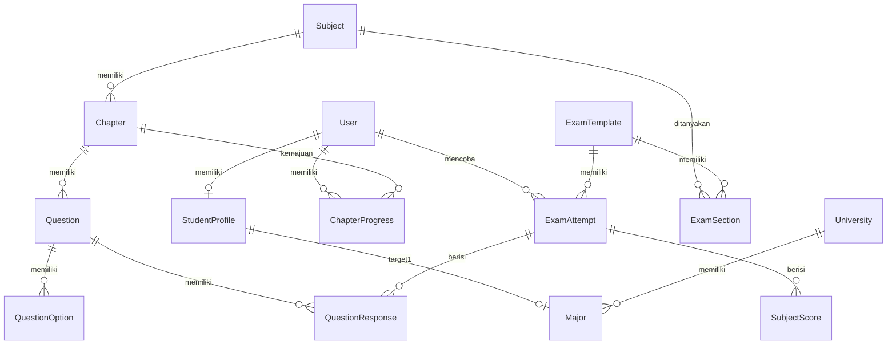

# Lexica UTBK-SNBT: Platform Persiapan Ujian Adaptif & Personal

Lexica adalah platform persiapan ujian UTBK-SNBT (Ujian Tulis Berbasis Komputer - Seleksi Nasional Berdasarkan Tes) berbasis web yang dirancang secara dinamis, personal, dan interaktif. Platform ini dibangun khusus untuk melayani siswa SMA di Indonesia meningkatkan skor kelulusan mereka melalui pendekatan analitik pintar, pendampingan AI secara real-time, simulasi ujian nyata, dan estimasi kelayakan jurusan (Chancing).

Dokumen ini menjelaskan secara menyeluruh aspek konsep, latar belakang, filosofi produk (non-teknis), serta arsitektur sistem, basis data, algoritma penilaian, integrasi AI, dan panduan visual (teknis) dari proyek Lexica.

---

## 🎯 Bagian I: Konsep & Aspek Non‑Teknis

### 1. Latar Belakang Pembuatan & Masalah yang Diselesaikan
Setiap tahun, lebih dari 700.000 siswa di Indonesia berjuang dalam UTBK-SNBT untuk memperebutkan kursi di Perguruan Tinggi Negeri (PTN) impian. Namun, proses persiapan mereka sering dihadapkan pada beberapa kendala besar:
- **Try Out Konvensional yang Pasif:** Ujian simulasi biasa hanya memberikan skor akhir tanpa memberikan peta jalan tindakan (*actionable roadmap*) bagi siswa untuk memperbaiki kekurangannya. Siswa tahu mereka lemah di satu subtest, tetapi tidak tahu bab mana yang harus dipelajari kembali.
- **Budaya "Menyuapi" Jawaban:** Banyak platform persiapan memberikan kunci jawaban instan beserta pembahasannya secara langsung. Hal ini melatih siswa menghafal langkah jawaban (*rote learning*), bukan memahami konsep dasarnya. Begitu tipe soal diubah sedikit pada ujian asli, siswa kesulitan menjawabnya.
- **Informasi Kelulusan yang Simpang Siur:** Adanya klaim tidak berdasar mengenai batas nilai kelulusan (*passing grade*) yang membuat siswa mengalami kecemasan akademis atau rasa percaya diri berlebih yang semu.
- **Materi Belajar yang Tersebar:** Rangkuman materi biasanya berbentuk buku tebal atau tumpukan file PDF drive yang tidak praktis untuk dibaca tepat saat siswa sedang latihan soal.

---

### 2. Filosofi Produk & Nilai Jual Utama (Value Proposition)
Konsep utama Lexica adalah **"Efisiensi Belajar Berbasis Data untuk Persiapan Ujian High-Stakes"**. UTBK-SNBT bukanlah ujian kenaikan kelas yang bersifat kumulatif (*mastery-oriented*), melainkan ujian *one-shot* dengan batas waktu ketat yang bersifat *performance-oriented*. Oleh karena itu, Lexica dirancang agar siswa dapat belajar secara efisien, terukur, dan personal—bukan sekadar tentang kecepatan dan ketepatan. Pendekatan ini bertumpu pada pilar-pilar utama berikut:
  - **Socratic Scaffolding (Membimbing, Bukan Menyuapi):** AI Tutor di Lexica kini menggunakan tiga level scaffolding (SOCRATIC, HINT, SOLUTION) yang dikelola lewat `useTutorChatStore`. AI tidak langsung membocorkan jawaban, melainkan memberikan pertanyaan pemandu (*Socratic questions*) dan petunjuk bertahap (*hints*) sebelum menampilkan solusi lengkap.
  - **Personalized Learning Path:** Rute belajar personal yang dinamis berbasis analisis kelemahan per bab dari hasil latihan siswa. Kini menggunakan komponen `StatusSoal` untuk menampilkan progres dan counter percobaan, serta menyimpan level scaffolding di store.
  - **Kesiapan Mental Simulasi Riil:** UTBK asli menggunakan sistem blok waktu per subtes yang ketat. Lexica mensimulasikan pembatasan ini secara nyata dengan mengunci navigasi antar‑subtest, menampilkan timer presisi, dan menambahkan badge level scaffolding pada panel AI.
  - **Fallback Hint Component:** Komponen `FallbackHint` menampilkan petunjuk alternatif ketika API key tidak tersedia, memastikan pengalaman tetap interaktif.
  - **Prediksi Peluang Kelulusan (Chancing):** Estimasi peluang berbasis data sekunder. Data estimasi skor batas aman program studi bersumber dari arsip publik forum alumni PTN, platform bimbel, dan laporan LTMPT yang tersedia secara terbuka. Algoritma kini memperhitungkan faktor keketatan dan menampilkan hasil di dashboard analytics.
  - **UX Navigasi 6-Item & Analitik Berbasis Route:** Navigasi sidebar menggunakan 6 item menu dalam 4 grup (BELAJAR & LATIHAN, ANALITIK & EVALUASI, BANTUAN AI, SISTEM) dengan label yang jelas: Dashboard, Belajar & Latihan, Try Out, Rapor & Evaluasi, Bahas Soal Luar, dan Pengaturan. Modul analitik diorganisir sebagai route terpisah (`/analytics/radar`, `/analytics/trend`, `/analytics/evaluation`, `/analytics/chancing`, `/analytics/explorer`, `/analytics/subject/[id]`) tanpa sistem tab *nested layout*.

---

### 3. Segmentasi Pengguna & Studi Kasus
Platform ini ditujukan bagi:
- **Siswa Kelas 12 SMA/MA/SMK:** Pengguna utama yang membutuhkan panduan belajar harian yang terstruktur di sela-sela kesibukan sekolah.
- **Pejuang Gap Year (Alumni):** Pengguna mandiri yang memerlukan alat evaluasi mandiri yang intensif dan kurikulum yang fleksibel.
- **Tutor / Lembaga Bimbingan Belajar:** Pengelola dapat menggunakan panel admin untuk memantau performa kelas, mengunggah bank soal baru, dan menganalisis tren kesiapan siswa.

---

## 🛠️ Bagian II: Tech Stack & Arsitektur Teknis

Platform Lexica didesain menggunakan arsitektur modern berkecepatan tinggi dengan integrasi serverless dan optimasi performa rendering:

### Frontend Layer
  - **Framework:** **Next.js 16.2.6 (React 19)** dengan App Router, mendukung server‑side rendering dan streaming.
  - **State Management:** **Zustand (v5)** untuk manajemen state CBT engine, timer presisi, dan riwayat obrolan AI Tutor, termasuk `scaffoldLevel`.
- **Animasi:** **Framer Motion (^12.38.0)** untuk menghadirkan mikro-animasi halus, transisi halaman, dan efek buka-tutup modal yang premium.
- **Styling:** **TailwindCSS v4 & Custom CSS Variables** untuk menerapkan sistem desain warna pastel-ungu dan aksen kontras modern, serta mendukung tata letak responsif.
- **Icons:** **Lucide React** sebagai pustaka ikon vektor seragam.

### AI & Rendering Utilities
- **AI Engine SDK (Groq API Connection):** Menghubungkan asisten tutor secara langsung ke model LLM **`llama-3.1-8b-instant`** melalui endpoint API Groq untuk pemrosesan prompt chatbot asisten secara streaming dan terstruktur.
- **Format Matematika & Markdown:** **`react-markdown`**, **`remark-math`**, dan **`rehype-katex`** (berbasis **KaTeX**) untuk merender rumus matematika LaTeX kompleks secara responsif di sisi klien.
- **Visualisasi Data:** **Recharts** untuk visualisasi bagan interaktif di dasbor analitik.

### Database & Backend Services
- **Database ORM:** **Prisma (v7.8.0)** sebagai lapisan abstraksi skema database PostgreSQL, dengan adaptor `@prisma/adapter-pg` untuk manajemen koneksi pooling yang efisien.
- **Autentikasi Keamanan:** **NextAuth.js v5 (Beta)** terintegrasi dengan Prisma adapter untuk sesi login siswa yang aman menggunakan enkripsi sandi **bcryptjs**. NextAuth v5 dipilih karena kompatibilitas penuh dengan arsitektur Next.js App Router, dengan risiko ketidakstabilan di tingkat sesi dimitigasi melalui pengujian siklus login secara menyeluruh.

---

## 🚀 Bagian III: Fitur Utama & Logika Sistem

### 1. Sistem CBT (Computer-Based Test) Simulator
Simulasi ujian mandiri yang dirancang agar semirip mungkin dengan antarmuka dan aturan asli sistem UTBK Balai Pengelolaan Pengujian Pendidikan (BP3).
- **Subtest Block-Timer:** Setiap subtes (seperti Penalaran Umum, Literasi Bahasa Inggris, dll.) memiliki durasi waktu mundur yang berjalan secara terpisah. Sistem ini dimotori oleh state `sectionTimeLeft` di dalam store Zustand `useCbtStore.ts`.
- **Section Locking (Sistem Kunci):** Siswa tidak dapat membuka, membaca, atau kembali ke soal-soal di luar subtes yang sedang aktif. Kisi navigasi soal membatasi klik ke soal di luar subtest yang aktif (diberikan indikator visual abu-abu terkunci & cursor-not-allowed).
- **Ragu-Ragu & Kisi Soal:** Status pengerjaan soal (terjawab, belum terjawab, ragu-ragu) didukung oleh navigasi grid interaktif dengan penandaan warna HSL yang premium.

### 2. Personalized Learning Path & Rangkuman Bab
Sistem menyusun peta belajar siswa secara adaptif berdasarkan kelemahan dan kekuatan yang terdeteksi.
- **Visualisasi Progress:** Peta belajar bab demi bab per subtes dengan status "Dikuasai", "Sedang Dipelajari", dan "Belum Mulai".
- **Cheat Sheets / Modul Rangkuman:** Setiap bab menyediakan lembar rangkuman materi ringkas bersistem modal *glassmorphism blur* yang mendukung formatting Markdown & visualisasi persamaan matematika menggunakan LaTeX (KaTeX).
- **Latihan Soal Terarah (Targeted Practice):** Memungkinkan siswa melakukan *drill* latihan soal khusus pada bab yang dipilih, memanggil bank soal acak khusus bab tersebut dari server menggunakan query `chapterId`.

### 3. AI Tutor & Pembahasan Scaffolding
Lexica mengintegrasikan kecerdasan buatan berbasis model Llama-3.1 melalui Groq API untuk membimbing pola pikir siswa alih-alih hanya memberikan jawaban instan secara langsung. Pendekatan ini didesain menggunakan prinsip *Cognitive Load Theory* (Sweller, 1988) untuk meminimalkan beban kognitif yang tidak perlu (*extraneous cognitive load*).
- **Kesempatan Kedua (Second Chance):** Jika siswa salah menjawab saat latihan, AI Tutor memberikan petunjuk kontekstual agar siswa berpikir ulang sebelum mencoba kesempatan kedua.
- **Zero-Friction Context Injection:** Saat siswa menjawab salah, sistem secara diam-diam (*invisible*) menginjeksi metadata soal (teks soal, opsi yang dipilih siswa, dan kunci jawaban asli) ke dalam *context state* AI. Di UI siswa, kunci jawaban asli disembunyikan menggunakan masking `???` agar tidak bocor, namun AI di *backend* menerima data utuh untuk memberikan sapaan (*auto-greeting*) dan respons yang sangat kontekstual tanpa siswa harus melakukan *copy-paste* soal.
- **Free Chat Mode:** Siswa dapat berinteraksi langsung dengan AI Tutor melalui halaman `/tutor` atau tombol "Tanya AI" pada masing-masing bab di Learning Path. AI Tutor berperan sebagai asisten materi, motivator belajar, dan penyaji strategi ujian. Prompt khusus digunakan untuk menjaga fokus percakapan pada topik pendidikan dan mencegah jawaban instan.
- **Integrasi Bank Soal Salah:** Riwayat soal salah otomatis terintegrasi dengan modul evaluasi siswa untuk dipelajari kembali (*active recall*).

### 4. Chancing Engine (Prediksi Peluang Kelulusan)
Simulator analitis untuk memproyeksikan peluang masuk program studi universitas negeri pilihan.
- **Universitas & Program Studi:** Database lengkap PTN dan jurusan terkemuka di Indonesia.
- **Kalkulasi Probabilitas:** Menghitung probabilitas kelulusan siswa berdasarkan nilai rata-rata tryout terbaru, rasio keketatan jurusan, kuota daya tampung, serta faktor regionalitas. Hasilnya disajikan di route `/analytics/chancing` (daftar prodi) dan `/analytics/chancing/[majorId]` (detail prodi).

### 5. Modul Analitik & Evaluasi Terpisah (Route-Based Analytics)
Seluruh modul evaluasi diri siswa diorganisir sebagai route terpisah dalam grup `/analytics`, tanpa sistem tab *nested layout*. Setiap route memuat modul spesifik:
- **`/analytics/radar`** — Radar Kemampuan 7 subtes + Tabel Detail Per Subtes (skor, target, selisih, status) + Insight Analisis Cerdas (otomatis menyoroti subtes paling lemah dan paling kuat siswa).
- **`/analytics/trend`** — Tren Skor SNBT (grafik area perkembangan skor tryout dari waktu ke waktu dengan range Y-axis 300–800).
- **`/analytics/evaluation`** — Bank Soal Salah (*active recall*): menampilkan riwayat soal yang dijawab salah beserta flag "ragu-ragu", filterable, dan dapat dibuka ulang untuk latihan ulang.
- **`/analytics/chancing`** — Daftar prodi target (termasuk 2 target utama siswa + 4 prodi populer) dengan kartu prediksi peluang kelulusan (label AMAN/BERSAING/SULIT/SANGAT_SULIT, progress bar, dan tombol klik ke detail).
- **`/analytics/chancing/[majorId]`** — Detail prodi spesifik: informasi Universitas, Daya Tampung, Jumlah Peminat, Skor Estimasi Aman, dan breakdown per bab relevan.
- **`/analytics/explorer`** — Explorer lanjutan dengan filter dinamis: pilih subtes (ALL atau spesifik) dan rentang tanggal (7D, 30D, 3M, ALL), menampilkan chart garis perbandingan multi-attempt.
- **`/analytics/subject/[id]`** — Breakdown performa per topik (topic-level accuracy) dalam satu subtes tertentu.

`/analytics` (root) mengalihkan (`redirect`) ke `/analytics/radar`.

### 6. Admin Control Center
Panel khusus pengelola untuk mengawasi operasional platform.
  - **Manajemen Soal & Pembahasan:** Menambah, mengubah, dan menghapus soal tryout lengkap dengan kunci jawaban, kesulitan, bab, dan subtest.
  - **Manajemen Data PTN/Prodi:** Panel CRUD untuk mengelola data universitas, program studi, daya tampung, jumlah peminat, dan estimasi skor aman.
- **Statistik Pengguna:** Manajemen data pengguna dan pemantauan aktivitas belajar mereka.

---

## 🗮️ Bagian IV: Algoritma & Logika Matematika Internal

### 1. Estimasi Kemampuan Siswa dengan Item Response Theory (IRT)
Lexica menggunakan pemodelan **IRT 1-Parameter Logistic (1PL) / Rasch Model** untuk mengukur kemampuan siswa ($\theta$) dan tingkat kesulitan soal ($b$).

#### Rumus Probabilitas Menjawab Benar:
$$P(\theta) = \frac{1}{1 + e^{-(\theta - b)}}$$
*Di mana $\theta$ adalah kemampuan siswa (IRT score), dan $b$ adalah tingkat kesulitan soal (difficulty).*

*Justifikasi Metodologis:* Parameter tingkat kesulitan soal ($b$) di dalam bank data didefinisikan menggunakan pendekatan **content validity** oleh *expert judgment* (penilaian panel ahli/guru bidang studi) dengan pemetaan skala berikut: Mudah ($-1.0$), Sedang ($0.0$), dan Sulit ($+1.0$).

#### Estimasi Kemampuan ($\theta$) Menggunakan Newton-Raphson:
Untuk mengestimasi $\theta$ dari sekumpulan respons jawaban benar/salah, program melakukan iterasi Maximum Likelihood Estimation (MLE) dengan rumus pembaruan:
$$\theta_{k+1} = \theta_k + \frac{\sum (U_i - P_i)}{\sum P_i (1 - P_i)}$$
*Di mana:*
- $U_i$ adalah respons siswa untuk soal ke-$i$ (1 jika benar, 0 jika salah).
- $P_i$ adalah probabilitas menjawab benar untuk soal ke-$i$ pada kemampuan saat ini ($\theta_k$).
- Penyebut $\sum P_i (1 - P_i)$ adalah total **Fisher Information** dari seluruh soal yang dijawab.

Kriteria konvergensi ditetapkan jika $|\Delta \theta| < 0.001$ atau iterasi telah mencapai 50 kali. Nilai $\theta$ dibatasi secara ketat (*clamped*) pada rentang $[-3, 3]$.

*Justifikasi Tryout Linear:* IRT digunakan pada skema Tryout linear konvensional untuk kebutuhan estimasi skor kemampuan ($\theta$) akhir, bukan untuk melakukan pemilihan butir soal adaptif secara dinamis (Computerized Adaptive Testing / CAT). Pendekatan ini tetap valid karena memperhitungkan bobot tingkat kesulitan masing-masing butir soal yang berhasil atau gagal dijawab siswa untuk memperoleh skor yang lebih adil dibandingkan skor persentase mentah.

#### Konversi Skor Skala SNBT:
Setelah nilai $\theta$ didapatkan, nilai tersebut dikonversi secara linier ke rentang skor nasional UTBK (200 s.d. 800) dengan asumsi rata-rata nasional ($\mu = 500$) dan standar deviasi ($\sigma = 100$):
$$\text{Skor SNBT} = 500 + (\theta \times 100)$$

---

### 2. Algoritma Perhitungan Chancing (Peluang Lulus)
Modul Chancing menghitung persentase peluang kelulusan siswa pada program studi tujuan menggunakan **fungsi logistik (sigmoid)** yang menghasilkan transisi probabilitas lebih halus dan realistis, dibandingkan pendekatan bucket linear sederhana.

#### Formulasi Peluang Berbasis Sigmoid:
Peluang dihitung dengan fungsi logistik yang dipusatkan pada `estimatedScore` jurusan, dengan kecuraman kurva ($k$) yang dipengaruhi tingkat keketatan kompetisi:

$$P(x) = \frac{1}{1 + e^{-k(\text{SkorSiswa} - \text{SkorEstimasi} - \delta)}}$$

Di mana:
- $k = k_\text{base} \times (1 + \log_{10}(\max(1, \text{Keketatan})) \times 0.5)$, merupakan faktor kecuraman kurva yang dinaikkan oleh kompetisi tinggi.
- $\delta = \text{SkorEstimasi} \times 0.02$, merupakan *midpoint shift* yang menggeser titik ekuilibrium sehingga skor tepat sama dengan skor estimasi menghasilkan peluang sekitar **40%** (bukan 50%), mencerminkan kenyataan bahwa meraih nilai ambang tidak menjamin penerimaan.
- Persentase akhir diskalakan ke rentang **3%–95%** (tidak pernah 0% atau 100%).

#### Penalti Kompetisi Ekstrem:
Jika rasio peminat/kuota melebihi 20, diterapkan penalti tambahan:
$$\text{Penalti} = \min\left(30\%, (\text{Keketatan} - 20) \times 1\%\right)$$
$$\text{Peluang Akhir} = \text{Peluang}_\text{sigmoid} \times (1 - \text{Penalti})$$

#### Kategorisasi Label:
Label ditentukan dari persentase akhir (bukan dari ratio):
- **AMAN** ($\ge 65\%$), **BERSAING** ($\ge 45\%$), **PELUANG_CUKUP** ($\ge 30\%$), **SULIT** ($\ge 15\%$), **SANGAT_SULIT** ($< 15\%$)

---

### 3. Logika Scaffolding AI Tutor
AI Tutor memanfaatkan pemrosesan prompt kontekstual bertingkat (*scaffolding prompts*) dengan mengidentifikasi target motivasi siswa serta tingkat kegagalan menjawab.

- **Makro-Konteks Motivasi:** Skrip backend mengambil data program studi tujuan utama siswa (`StudentProfile.targetMajor1`) dan menyisipkannya ke dalam instruksi sistem LLM:
  > *"Siswa ini menargetkan jurusan **[Major] — [University]**. Sesekali hubungkan relevansi materi ini untuk memotivasi siswa agar lolos ke jurusan tersebut."*
- **Penjelasan Struktur Pembahasan (Level: SOLUTION):**
  Untuk menjamin kualitas pemahaman, LLM diinstruksikan memberikan respons terstruktur dalam format Markdown:
  1. **Konsep yang Diuji:** Teori inti di balik soal.
  2. **Langkah Penyelesaian:** Langkah demi langkah pemecahan soal secara logis.
  3. **Kesalahan Umum:** Mengidentifikasi jebakan soal yang sering mengecoh siswa.
  4. **Soal Latihan Serupa:** Satu soal buatan AI yang serupa untuk memperkuat pemahaman (*active recall*).

---

## 🗄️ Bagian V: Struktur Basis Data (Schema Prisma)

Berikut adalah definisi rinci relasi tabel basis data utama di dalam file `schema.prisma`:

### Penjelasan Tabel Kunci:
1. **`User`**: Menyimpan data login, peran (`STUDENT`, `ADMIN`), dan estimasi kemampuan global `irtAbility` ($\theta$).
2. **`StudentProfile`**: Terhubung 1-to-1 dengan user untuk mencatat sekolah, tahun kelulusan, dan relasi kunci asing ke tabel target program studi (`targetMajor1` & `targetMajor2`).
3. **`Major` & `University`**: Menyimpan katalog universitas nasional dan jurusan beserta daya tampung, jumlah peminat, keketatan, dan estimasi skor batas kelulusan.
4. **`Subject` & `Chapter`**: Hierarki materi ujian nasional. Tabel `Chapter` menyimpan kolom ringkasan teks panjang `theorySummary` (Tipe `@db.Text`) untuk cheat sheets.
5. **`Question` & `QuestionOption`**: Bank soal UTBK. `Question` mencatat parameter IRT `difficulty` (tingkat kesulitan) untuk penskoran analitik.
6. **`ExamTemplate` & `ExamSection`**: Template tryout linear terstruktur. `ExamSection` mencatat relasi subtest beserta jumlah soal (`itemCount`), urutan ujian (`order`), dan batas durasi subtest (`duration`).
7. **`ExamAttempt` & `QuestionResponse`**: Menyimpan rekaman percobaan tryout siswa, durasi per soal (`timeSpent`), bendera ragu-ragu (`flagged`), respons opsi pilihan (`selectedIds`), dan skor akhir.

---

## 🎨 Bagian VI: Panduan Desain & Estetika (Design System)

Lexica mengusung desain yang modern dan bersih (clean), dirancang untuk menarik minat belajar generasi muda:
- **Warna Utama:** Aksen ungu terang yang dipadukan dengan warna dasar putih bersih dan abu-abu terang untuk meminimalkan keletihan mata (*eye strain*).
- **Glassmorphism:** Menggunakan gradasi transparan berperekat blur (`backdrop-blur-md bg-white/80`) pada bagian navbar, header, dan panel dialog rangkuman untuk memberikan kedalaman antarmuka yang premium.
- **Micro-Animations:** Transisi halus pada kartu bab saat di-hover dan efek pegas (*spring motion*) saat modal atau pembahasan dimunculkan.

---

## ⚠️ Bagian VII: Batasan Penelitian & Limitasi Sistem

Untuk kepentingan pertanggungjawaban akademis dalam sidang skripsi, berikut adalah limitasi dan batasan sistem yang didokumentasikan secara transparan:
1. **Penentuan Parameter Kesulitan:** Parameter difficulty ($b$) ditentukan murni berbasis *expert judgment* (penilaian ahli bidang studi), bukan melalui kalibrasi empiris uji coba lapangan berskala besar.
2. **Karakter Estimatif Data Chancing:** Database passing grade dan skor batas aman prodi PTN merupakan data sekunder estimatif yang bersumber dari arsip historis publik dan alumni, bukan data batas kelulusan resmi yang diterbitkan secara real-time oleh SNPMB/BP3.
3. **Format Tryout Linear (Bukan CAT):** Pemodelan IRT digunakan pada skema Tryout linear konvensional untuk kebutuhan estimasi skor kemampuan ($\theta$) akhir, bukan untuk melakukan pemilihan butir soal adaptif secara dinamis (Computerized Adaptive Testing / CAT).
4. **Konsistensi Bimbingan AI:** Petunjuk pengerjaan (*scaffolding*) dari LLM memiliki batas konsistensi bawaan (kemungkinan adanya bias atau halusinasi minor khas generative AI) sehingga memerlukan pemantauan terus-menerus.
5. **Skala Validasi Terbatas:** Pengujian performa sistem dilakukan dalam skala terbatas dengan jumlah responden yang minim, sehingga validitas statistik sebaran parameter IRT secara populasi makro belum dapat diklaim secara penuh.

---

## 📚 Bagian VIII: Justifikasi Pemilihan Metode

Berikut rangkuman argumentasi ilmiah yang mendasari pemilihan masing‑masing komponen utama sistem:

1. **IRT vs Classical Test Theory (CTT)**
   * **Invarian Item** – IRT memberikan estimasi kemampuan (`θ`) yang tidak dipengaruhi oleh populasi tes, memungkinkan perbandingan antar‑siswa secara adil. CTT bersifat bergantung pada sampel dan tidak dapat memisahkan kemampuan siswa dari kesulitan item.
   * **Model Kesulitan Item** – Parameter difficulty (`b`) secara eksplisit dimodelkan dalam IRT, sehingga skor mencerminkan tingkat kesulitan tiap butir soal. CTT hanya memberikan skor total tanpa memperhitungkan variasi kesulitan.
   * **Presisi pada Tingkat Individu** – IRT menghasilkan standar error yang lebih kecil untuk siswa dengan kemampuan ekstrem, sedangkan CTT cenderung memiliki error konstan.

2. **Socratic Scaffolding vs Direct Instruction**
   * **Konstruktivisme** – Socratic questioning mendorong siswa membangun pengetahuan sendiri, terbukti meningkatkan retensi jangka panjang dibandingkan pemberian jawaban langsung (Direct Instruction).
   * **Second‑Chance Learning** – Dengan tiga level scaffolding (SOCRATIC → HINT → SOLUTION) siswa mendapatkan kesempatan memperbaiki pemahaman sebelum solusi akhir, mengurangi efek menghafal.
   * **Data‑Driven Feedback** – Setiap level tercatat di `useTutorChatStore`, memungkinkan analisis kuantitatif efektivitas scaffolding, sesuatu yang tidak tersedia pada pendekatan Direct Instruction.

 3. **Groq / Llama‑3.1 vs OpenAI GPT**
   * **Biaya Operasional** – Groq menawarkan tarif yang lebih kompetitif untuk inference skala besar, penting untuk aplikasi edukasi dengan ribuan pengguna simultan.
   * **Latency Rendah** – Infrastruktur Groq dirancang untuk streaming respons cepat, meningkatkan interaktivitas pada panel AI Tutor.
    * **Open‑Source Flexibility** – Llama‑3.1 memungkinkan penyesuaian prompt dan kontrol yang lebih besar dibanding model proprietary.

---

## 📏 Bagian IX: Metrik Evaluasi Sistem

Untuk menilai fungsionalitas dan kebergunaan platform secara kuantitatif, metrik evaluasi yang digunakan adalah:

1. **Pengujian Fungsional (Black-Box Testing)** – Menguji 27 *test case* yang mencakup seluruh fungsi utama sistem (autentikasi, simulasi ujian CBT, perhitungan skor IRT, *Chancing Engine*, *AI Tutor Scaffolding*, *Analytics*, *Learning Path*, dan panel Admin) menggunakan 6 teknik: *Equivalence Partitioning*, *Boundary Value Analysis*, *Decision Table*, *Use Case Testing*, *Error Guessing*, dan *Exploratory Testing*.
2. **Usability (SUS)** – Survei *System Usability Scale* (SUS) untuk mengevaluasi antarmuka dan *User Experience* dengan target skor penerimaan minimal ≥ 68 (*acceptable*).

---

## 🔄 Bagian X: Alur Pengguna (User Flow)

Berikut rangkaian langkah yang dialami siswa mulai dari pendaftaran hingga evaluasi akhir:

1. **Registrasi & Setup Profil** – Siswa membuat akun, mengisi data pribadi, dan memasukkan target jurusan PTN (`targetMajor1`, `targetMajor2`).
2. **Diagnostic Tryout (Wajib)** – Siswa diwajibkan mengerjakan *diagnostic tryout* pertama sebelum mengakses dashboard. Jika belum ada, siswa otomatis diarahkan ke `/onboarding?resume=diagnostic`. Tryout ini berfungsi sebagai baseline untuk estimasi kemampuan awal (`θ`) dan deteksi kelemahan.
3. **Perhitungan IRT** – Setelah diagnostic selesai, sistem menghitung kemampuan (`θ`) menggunakan IRT 1‑PL dan mengonversinya ke skor SNBT.
4. **Deteksi Bab Lemah** – Berdasarkan hasil IRT, platform mengidentifikasi bab‑bab dengan skor rendah di setiap subtes.
5. **Learning Path Generation** – Sistem menyusun rute belajar personal yang menekankan bab‑bab lemah, dengan fitur *mastery locking* (bab lanjutan terkunci hingga bab sebelumnya selesai).
6. **Drill Latihan Bab Lemah** – Siswa melakukan latihan terarah pada bab‑bab yang belum dikuasai, dengan dukungan komponen `StatusSoal` dan `FallbackHint`.
7. **AI Tutor Scaffolding** – Pada tiap soal latihan, jika jawaban salah, AI Tutor memberikan bantuan bertingkat:
    - **SOCRATIC** – Pertanyaan pemandu untuk memicu pemikiran kritis.
    - **HINT** – Petunjuk parsial yang mengarahkan siswa ke konsep yang benar.
    - **SOLUTION** – Penjelasan lengkap (Konsep, Langkah Penyelesaian, Kesalahan Umum, Soal Latihan Serupa) jika batas toleransi tercapai.
    Siswa juga dapat menggunakan **Free Chat Mode** di halaman `/tutor` atau tombol "Tanya AI" di setiap bab untuk menanyakan materi secara langsung.
8. **Evaluasi Bank Soal Salah (Active Recall)** – Soal‑soal yang dijawab salah otomatis tersimpan di route `/analytics/evaluation` sebagai bahan kajian ulang terfokus.
9. **Chancing Simulator (Peluang Lulus)** – Siswa dapat mensimulasikan kelayakan kelulusan di program studi target melalui route `/analytics/chancing` (daftar prodi) dan `/analytics/chancing/[majorId]` (detail prodi dengan breakdown).
10. **Analitik Lanjutan** – Siswa memantau perkembangan belajar melalui beberapa route terpisah:
    - `/analytics/radar` — Radar kemampuan 7 subtes + tabel detail + insight cerdas.
    - `/analytics/trend` — Tren skor SNBT dari waktu ke waktu.
    - `/analytics/explorer` — Explorer dengan filter dinamis (subtes & rentang tanggal).
    - `/analytics/subject/[id]` — Breakdown akurasi per topik dalam satu subtes.

---

## 📄 Ringkasan

Lexica adalah platform persiapan UTBK‑SNBT yang menggabungkan **AI‑tutor berbasis Socratic scaffolding**, **analisis IRT** untuk estimasi kemampuan, serta **Chancing Engine** untuk prediksi peluang kelulusan. Dengan arsitektur modern berbasis **Next.js 16.2.6 (React 19)**, **Zustand v5**, dan **Prisma v7.8.0**, sistem menyediakan simulasi CBT yang realistis, jalur belajar personal, dan metrik evaluasi yang dapat diukur. Platform ini menggunakan tata letak navigasi dengan **6 item menu** dalam 4 grup (Dashboard, Belajar & Latihan, Try Out, Rapor & Evaluasi, Bahas Soal Luar, dan Pengaturan) serta **modul analitik berbasis route terpisah** (`/analytics/radar`, `/analytics/trend`, `/analytics/evaluation`, `/analytics/chancing`, `/analytics/explorer`, `/analytics/subject/[id]`) untuk meminimalkan beban kognitif siswa dan menciptakan alur belajar yang lancar.

---

## 🚀 Rencana Pengembangan (Future Work)

1. **Integrasi Adaptive Testing (CAT)** – Menggunakan model IRT 2‑PL/3‑PL untuk menyesuaikan tingkat kesulitan soal secara dinamis selama tryout.
2. **Ekspansi Basis Data Soal** – Menambah bank soal dengan anotasi metadata (topik, tingkat kesulitan, sumber) untuk meningkatkan cakupan materi.
3. **Analisis Data Pembelajaran** – Menerapkan pipeline analitik berbasis **MLflow** untuk memantau efektivitas scaffolding dan mengoptimalkan model LLM.
4. **Mobile‑First Experience** – Mengoptimalkan UI untuk perangkat seluler dengan **React Native** atau **Expo**, memperluas aksesibilitas.
5. **Fitur Kolaboratif** – Menambahkan ruang diskusi kelompok dan fitur peer‑review untuk meningkatkan motivasi belajar.

---

*Dokumen ini mencerminkan status aplikasi pada tanggal 15 Juli 2026.*
