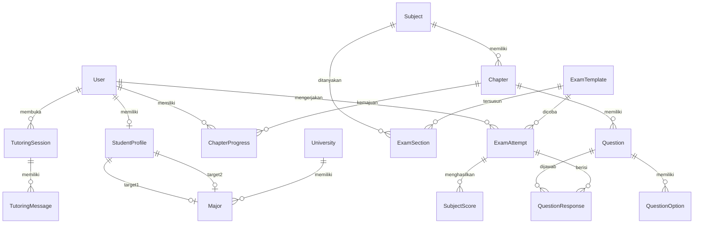

# Struktur Database — Prisma Schema Lexica

Dokumentasi lengkap skema basis data PostgreSQL yang dikelola melalui Prisma ORM v7.

---

## Entity Relationship Diagram (ERD)

---

## Tabel-Tabel Utama

### 1. `User` — Akun Pengguna
| Kolom | Tipe | Keterangan |
|-------|------|------------|
| `id` | `cuid` | Primary key |
| `name` | `String?` | Nama lengkap |
| `email` | `String` | Email unik untuk login |
| `password` | `String?` | Hash bcrypt |
| `role` | `Enum(STUDENT, ADMIN)` | Peran pengguna |
| `irtAbility` | `Float` (default: 0.0) | Estimasi kemampuan IRT global ($\theta$) |

### 2. `StudentProfile` — Profil Siswa
| Kolom | Tipe | Keterangan |
|-------|------|------------|
| `id` | `cuid` | Primary key |
| `userId` | `String` | FK → `User` (1:1) |
| `school` | `String?` | Nama sekolah asal |
| `graduationYear` | `Int?` | Tahun kelulusan SMA |
| `targetMajor1Id` | `String?` | FK → `Major` (jurusan target utama) |
| `targetMajor2Id` | `String?` | FK → `Major` (jurusan target cadangan) |

### 3. `University` — Perguruan Tinggi
| Kolom | Tipe | Keterangan |
|-------|------|------------|
| `id` | `cuid` | Primary key |
| `name` | `String` | Nama universitas (unik) |
| `code` | `String` | Kode PTN resmi (unik) |
| `location` | `String` | Kota/Provinsi |
| `type` | `Enum(NEGERI, SWASTA)` | Jenis perguruan tinggi |
| `logoUrl` | `String?` | URL logo universitas |

### 4. `Major` — Program Studi
| Kolom | Tipe | Keterangan |
|-------|------|------------|
| `id` | `cuid` | Primary key |
| `name` | `String` | Nama prodi |
| `code` | `String` | Kode prodi SNBT (unik) |
| `universityId` | `String` | FK → `University` |
| `faculty` | `String` | Fakultas |
| `degree` | `Enum(S1, D3, D4)` | Jenjang |
| `quota` | `Int` | Daya tampung |
| `applicants` | `Int` | Jumlah peminat tahun lalu |
| `estimatedScore` | `Float` | Estimasi skor aman (data sekunder) |
| `cluster` | `Enum(SAINTEK, SOSHUM, CAMPURAN)` | Kluster |
| `year` | `Int` (default: 2025) | Tahun data |

### 5. `Subject` — Mata Pelajaran / Subtes UTBK
| Kolom | Tipe | Keterangan |
|-------|------|------------|
| `id` | `cuid` | Primary key |
| `name` | `String` | Nama subtes (unik). Contoh: "Penalaran Matematika" |
| `cluster` | `Enum(SAINTEK, SOSHUM, CAMPURAN)` | Kluster subtes |

### 6. `Chapter` — Bab Materi
| Kolom | Tipe | Keterangan |
|-------|------|------------|
| `id` | `cuid` | Primary key |
| `name` | `String` | Nama bab. Contoh: "Aljabar Linear" |
| `subjectId` | `String` | FK → `Subject` |
| `order` | `Int` | Urutan bab dalam subtes |
| `theorySummary` | `Text?` | Rangkuman teori bab (Markdown/LaTeX) |

### 7. `Question` — Bank Soal
| Kolom | Tipe | Keterangan |
|-------|------|------------|
| `id` | `cuid` | Primary key |
| `chapterId` | `String` | FK → `Chapter` |
| `text` | `Text` | Teks soal (Markdown/LaTeX) |
| `imageUrl` | `String?` | URL gambar soal |
| `difficulty` | `Float` (default: 0.0) | Parameter IRT $b$ (skala logit: -3 s.d. +3) |
| `discrimination` | `Float` (default: 1.0) | Parameter IRT $a$ (untuk 2-PL, reserved) |
| `guessing` | `Float` (default: 0.2) | Parameter IRT $c$ (untuk 3-PL, reserved) |
| `type` | `Enum(MULTIPLE_CHOICE, MULTIPLE_SELECT, TRUE_FALSE)` | Jenis soal |

### 8. `QuestionOption` — Opsi Jawaban
| Kolom | Tipe | Keterangan |
|-------|------|------------|
| `id` | `cuid` | Primary key |
| `questionId` | `String` | FK → `Question` |
| `label` | `String` | Label opsi: "A", "B", "C", "D", "E" |
| `text` | `Text` | Teks jawaban |
| `imageUrl` | `String?` | Gambar jawaban |
| `isCorrect` | `Boolean` | Penanda kunci jawaban |

### 9. `ExamTemplate` — Template Ujian
| Kolom | Tipe | Keterangan |
|-------|------|------------|
| `id` | `cuid` | Primary key |
| `name` | `String` | Nama tryout. Contoh: "Try Out SNBT #1" |
| `description` | `String?` | Deskripsi |
| `duration` | `Int` | Durasi total (menit) |
| `totalItems` | `Int` | Jumlah total soal |
| `cluster` | `Enum` | Kluster tryout |
| `isDiagnostic` | `Boolean` | Penanda ujian diagnostik awal |

### 10. `ExamSection` — Seksi Subtes dalam Ujian
| Kolom | Tipe | Keterangan |
|-------|------|------------|
| `id` | `cuid` | Primary key |
| `templateId` | `String` | FK → `ExamTemplate` |
| `subjectId` | `String` | FK → `Subject` |
| `itemCount` | `Int` | Jumlah soal per seksi |
| `order` | `Int` | Urutan subtes dalam ujian |
| `duration` | `Int` (default: 15) | Durasi subtes (menit) |

### 11. `ExamAttempt` — Percobaan Ujian Siswa
| Kolom | Tipe | Keterangan |
|-------|------|------------|
| `id` | `cuid` | Primary key |
| `userId` | `String` | FK → `User` |
| `templateId` | `String` | FK → `ExamTemplate` |
| `status` | `Enum(IN_PROGRESS, COMPLETED, TIMED_OUT, ABANDONED)` | Status pengerjaan |
| `startedAt` | `DateTime` | Waktu mulai |
| `finishedAt` | `DateTime?` | Waktu selesai |
| `rawScore` | `Float?` | Skor mentah (% benar) |
| `irtScore` | `Float?` | Skor IRT ($\theta$ estimasi) |
| `scaledScore` | `Float?` | Skor skala SNBT (200–800) |

### 12. `QuestionResponse` — Respons Jawaban Siswa
| Kolom | Tipe | Keterangan |
|-------|------|------------|
| `id` | `cuid` | Primary key |
| `attemptId` | `String` | FK → `ExamAttempt` |
| `questionId` | `String` | FK → `Question` |
| `selectedIds` | `String[]` | Array ID opsi yang dipilih |
| `isCorrect` | `Boolean?` | Penanda benar/salah |
| `timeSpent` | `Int` (default: 0) | Waktu per soal (detik) |
| `flagged` | `Boolean` | Penanda ragu-ragu |
| `answeredAt` | `DateTime` | Waktu menjawab |

### 13. `SubjectScore` — Skor per Subtes
| Kolom | Tipe | Keterangan |
|-------|------|------------|
| `id` | `cuid` | Primary key |
| `attemptId` | `String` | FK → `ExamAttempt` |
| `subjectId` | `String` | Identifikasi subtes |
| `correct` | `Int` | Jumlah benar |
| `total` | `Int` | Jumlah total soal |
| `irtTheta` | `Float` | $\theta$ per subtes |
| `scaledScore` | `Float` | Skor skala per subtes |

### 14. `ChapterProgress` — Progres Bab Siswa
| Kolom | Tipe | Keterangan |
|-------|------|------------|
| `id` | `cuid` | Primary key |
| `userId` | `String` | FK → `User` |
| `chapterId` | `String` | FK → `Chapter` |
| `status` | `Enum(NOT_STARTED, IN_PROGRESS, COMPLETED)` | Status penguasaan |
| `masteryLevel` | `Float` (default: 0.0) | Tingkat penguasaan (0–100) |

### 15. `TutoringSession` & `TutoringMessage` — Sesi AI Tutor
| Kolom (Session) | Tipe | Keterangan |
|-------|------|------------|
| `id` | `cuid` | Primary key |
| `userId` | `String` | FK → `User` |
| `questionId` | `String` | Soal yang dibahas |
| `level` | `Enum(SOCRATIC, HINT, SOLUTION)` | Level scaffolding aktif |

| Kolom (Message) | Tipe | Keterangan |
|-------|------|------------|
| `id` | `cuid` | Primary key |
| `sessionId` | `String` | FK → `TutoringSession` |
| `role` | `Enum(USER, ASSISTANT, SYSTEM)` | Pengirim pesan |
| `content` | `Text` | Isi pesan (Markdown) |

---

*Skema ini mencerminkan kondisi database aktual per 15 Juni 2026.*
