# Dokumentasi Activity Diagram System Lexica UTBK

Dokumen ini berisi spesifikasi alur kerja (**Activity Diagram**) berorientasi pengguna (*User-Centric Activity Flow*) untuk seluruh fitur utama pada platform **Lexica UTBK**, mencakup peranan **Siswa (Student)** dan **Admin (Administrator)**.

Activity Diagram pada dokumen ini menitikberatkan pada **aktivitas & keputusan pengguna (User Actions)** serta bagaimana **Sistem** dan **AI Tutor** merespons aktivitas tersebut secara fungsional.

---

# BAGIAN 1: ACTIVITY DIAGRAM SISWA

---

## 1. Activity Diagram: Login & Lihat Learning Overview

### Deskripsi
Proses siswa melakukan login ke platform dan melihat ringkasan progres belajar serta statistik aktivitas pada dashboard utama.

**Precondition**: Siswa berada pada halaman Login (`/login`).

| Aktor (Siswa) | Sistem |
|---|---|
| 1. Membuka halaman login & memasukkan Email & Password | |
| 2. Mengklik tombol **Login** | 3. Memvalidasi kredensial pengguna |
| | 4. Mengarahkan ke halaman **Dashboard** |
| | 5. Menampilkan *Learning Overview* (Statistik tryout, progres materi, & rekomendasi) |
| 6. Melihat *Learning Overview* | |

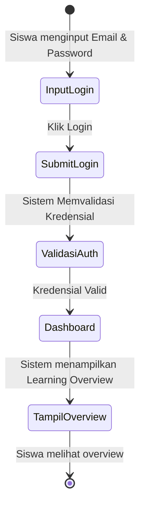

---

## 2. Activity Diagram: Lihat Learning Path

### Deskripsi
Mengakses halaman Learning Path dari sidebar dashboard untuk melihat peta jalan materi dan modul belajar.

**Precondition**: Siswa dalam status Login aktif di Halaman Dashboard.

| Aktor (Siswa) | Sistem |
|---|---|
| 1. Mengklik menu **Learning Path** di sidebar | 2. Memuat data kurikulum dan progres siswa |
| | 3. Menampilkan halaman **Learning Path** beserta daftar bab & indikator kemajuan |
| 4. Melihat alur *Learning Path* | |

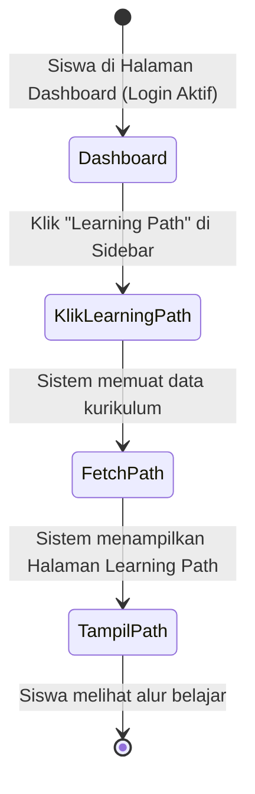

---

## 3. Activity Diagram: Mengerjakan Latihan Bab

### Deskripsi
Alur siswa mengerjakan latihan soal per bab dengan interaksi AI Tutor modular (*3 Skenario Chatbot*: Sebelum jawab, Setelah 1x Jawab, dan Setelah 2x Jawab Salah), mekanisme *2-Chance Retry*, serta percabangan navigasi di layar hasil (*Sesi Selesai!*).

**Precondition**: Siswa telah memilih Bab Latihan pada Halaman Learning Path.

| Aktor (Siswa) | Sistem | AI Tutor (Panel Kanan) |
|---|---|---|
| 1. Memilih Bab Latihan di Learning Path | 2. Menampilkan lembar soal & AI Tutor Panel | 3. Siap berinteraksi (Modular Chat) |
| **[Skenario AI Chatbot 1: Sebelum Memilih Jawaban]** | | |
| 4a. (Opsional) Tanya/Chat di AI Panel sebelum menjawab | | 4b. Merespons dengan petunjuk konsep (*Hint*) tanpa membocorkan kunci |
| 5. Membaca soal, memilih opsi jawaban, & klik **Jawab** | 6. Memeriksa kebenaran jawaban | |
| | **[Kondisi: Jawaban Salah - Percobaan 1]** | |
| | 7a. Menampilkan banner warning: *"Kesempatan Terakhir Aktif"* | 7b. Otomatis mengirim pesan: *"Hai! Jawabanmu (...) masih belum tepat. Kamu masih punya 1 kesempatan lagi untuk mencoba. Coba perhatikan baik-baik pertanyaan dan informasinya. Butuh petunjuk (hint)? Tanya saja di sini!"* |
| **[Skenario AI Chatbot 2: Pilihan Aksi Setelah 1x Jawab]** | | |
| ──> **Pilihan A: Langsung Jawab Lagi** | 8a. Memeriksa jawaban ke-2 | |
| ──> **Pilihan B: Diskusi via Chat AI** | | 8b. Berdiskusi interaktif menganalisis miskonsepsi |
| | **[Kondisi: Jawaban Salah - Percobaan 2]** | |
| | 9a. Menampilkan status *"Dilewati - Batas percobaan habis"* | 9b. Otomatis mengirim pesan: *"Sayang sekali, jawabanmu (...) masih salah. Kesempatanmu sudah habis untuk soal ini. Mari kita bedah kenapa bisa salah. Coba jelaskan konsep yang kamu pakai untuk menjawab tadi, biar aku bantu koreksi!"* |
| **[Skenario AI Chatbot 3: Pilihan Aksi Setelah 2x Jawab Salah]** | | |
| ──> **Pilihan A: Diskusi Socratic via Chat AI** | | 10a. Membantu siswa mengoreksi pemahaman & konsep |
| ──> **Pilihan B: Langsung Lanjut (Next)** | 10b. Berpindah ke soal berikutnya | |
| | **[Kondisi: Jawaban Benar]** | |
| | 11a. Menampilkan status *"Benar!"*, tombol *Lihat Pembahasan AI*, & tombol *Lanjut* | 11b. Otomatis mengirim pesan: *"Hai! Kamu ingin membahas soal (...) Jawabanmu: (...) Jawaban benar: (...). Ceritakan kenapa kamu memilih jawaban itu. Aku akan bantu kamu memahami konsepnya!"* |
| **[Pilihan Aksi Setelah Jawaban Benar]** | | |
| ──> **Aksi Opsional 1: Diskusi Chat AI** | | 12a. AI Tutor merespons chat (Siswa tetap di soal yang sama) |
| ──> **Aksi Opsional 2: Klik "Lihat Pembahasan AI"** | | 12b. Menampilkan Pembahasan AI Lengkap (Siswa tetap di soal yang sama) |
| ──> **Aksi Wajib: Klik Lanjut (Next)** | 12c. Berpindah ke soal berikutnya | |
| 13. Melanjutkan hingga seluruh soal selesai & klik **Lihat Hasil** | 14. Menampilkan Layar **Sesi Selesai!** (Benar, Salah, Akurasi %) | |
| **[Percabangan Layar Hasil Sesi Selesai]** | | |
| ──> **Pilihan 1: Klik "Ulangi Latihan"** | 15a. Mereset data sesi $\rightarrow$ **( Connector A )** | |
| ──> **Pilihan 2: Klik "Lihat Pembahasan"** | 15b. Menampilkan Halaman Review $\rightarrow$ **( Connector B )** | |
| ──> **Pilihan 3: Klik "Pilih Subtes Lain"** | 15c. Redirect ke Learning Path $\rightarrow$ **( Connector C )** | |

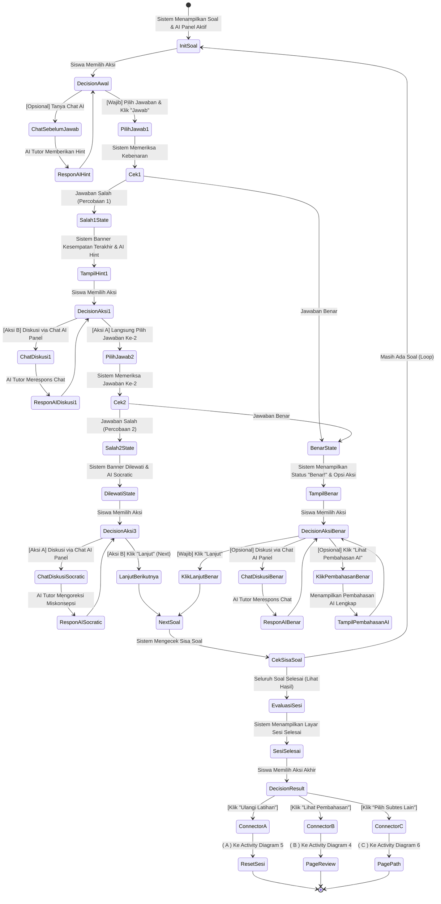

---

## 4. Activity Diagram: Lihat Pembahasan Dari Hasil Belajar

### Deskripsi
Membuka halaman evaluasi/review detail setelah menyelesaikan latihan bab untuk mempelajari kunci jawaban dan berdiskusi dengan AI Tutor.

**Precondition**: Siswa berada pada Layar Sesi Selesai latihan bab dan mengklik tombol *Lihat Pembahasan*.

| Aktor (Siswa) | Sistem | AI Tutor (Panel Kanan) |
|---|---|---|
| 1. Mengklik tombol **Lihat Pembahasan** | 2. Menampilkan Halaman Review (Navigasi Soal & Detail) | |
| 3. **[Pilihan Aksi di Halaman Review]** | | |
| ──> **Aksi A: Memilih nomor soal lain pada Navigasi** | 4a. Menampilkan detail soal & kunci jawaban terkait (Loop) | |
| ──> **Aksi B: Klik "Tanya Pembahasan AI"** | | 4b. Memberikan penjabaran konsep langkah-demi-langkah (Loop) |
| ──> **Aksi C: Kirim pesan di AI Chat Panel** | | 4c. Merespons pertanyaan siswa secara interaktif (Loop) |
| ──> **Aksi D: Keluar (Tutup Pembahasan)** | 4d. Kembali ke navigasi sebelumnya (Selesai) | |

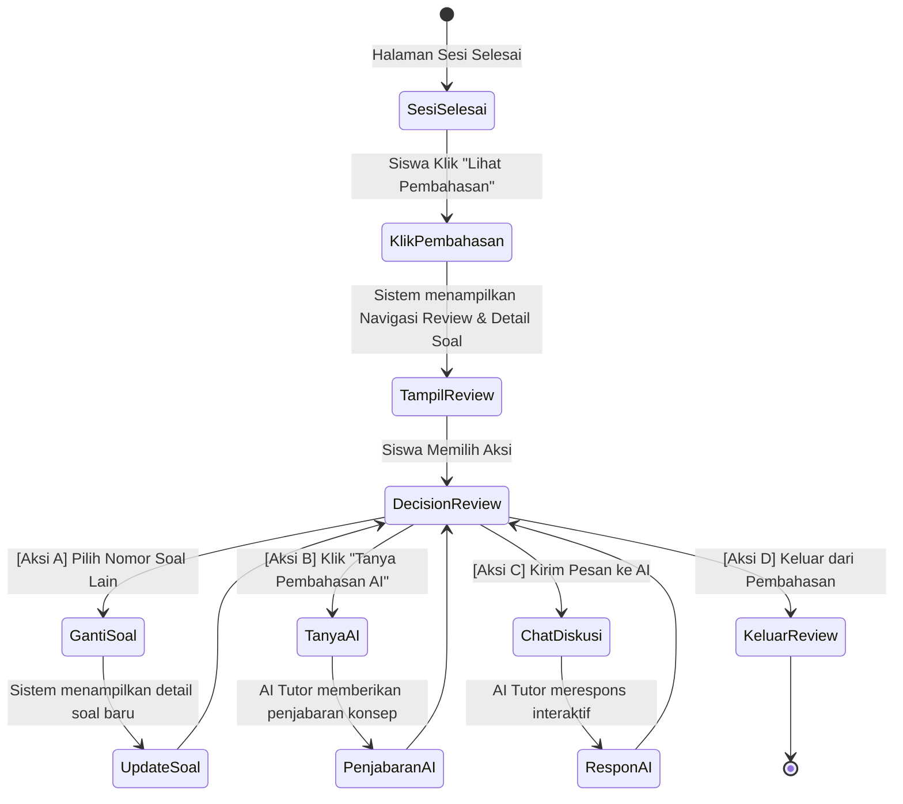

---

## 5. Activity Diagram: Ulangi Latihan

### Deskripsi
Mulai ulang sesi latihan bab dari awal setelah mencapai halaman rangkuman hasil latihan.

**Precondition**: Siswa berada pada Layar Sesi Selesai latihan bab dan mengklik tombol *Ulangi Latihan*.

| Aktor (Siswa) | Sistem |
|---|---|
| 1. Mengklik tombol **Ulangi Latihan** | 2. Mereset data sesi & memuat Soal 1 dari awal |
| | 3. Menampilkan interface latihan bab dari awal |
| 4. Mulai mengerjakan soal kembali | |

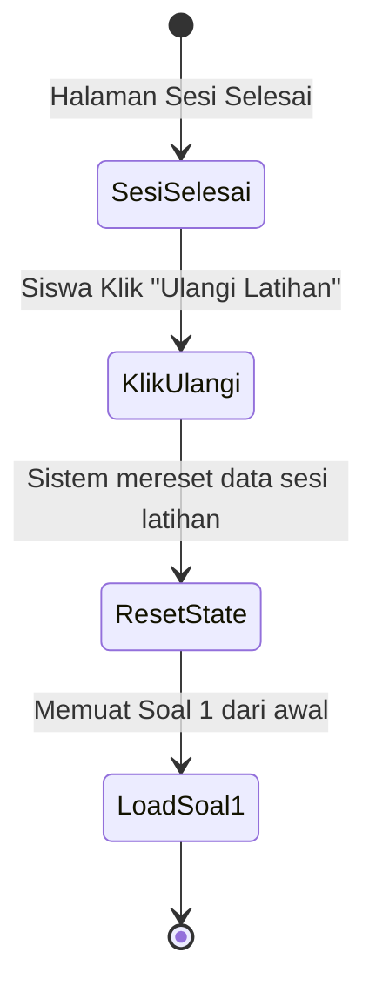

---

## 6. Activity Diagram: Pilih Subtes Lain (dari Sesi Selesai)

### Deskripsi
Mengakhiri review hasil latihan bab dan kembali ke daftar subtes / Learning Path.

**Precondition**: Siswa berada pada Layar Sesi Selesai latihan bab dan mengklik tombol *Pilih Subtes Lain*.

| Aktor (Siswa) | Sistem |
|---|---|
| 1. Mengklik tombol **Pilih Subtes Lain** | 2. Mengarahkan ke halaman **Learning Path / Mode Belajar** |
| | 3. Menampilkan daftar subtes & modul belajar |
| 4. Memilih modul/subtes baru | |

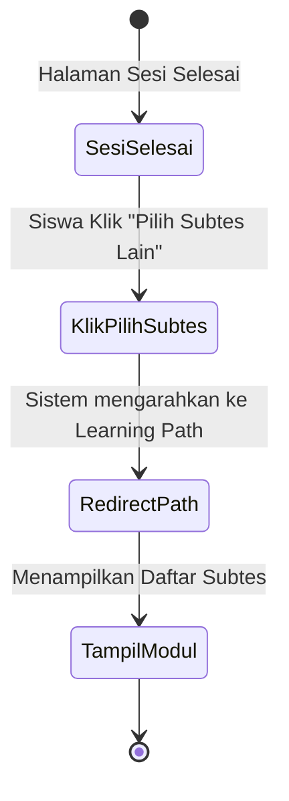

---

## 7. Activity Diagram: Lihat Paket Tryout

### Deskripsi
Mengakses daftar paket simulasi Tryout SNBT yang tersedia dari sidebar dashboard.

**Precondition**: Siswa dalam status Login aktif di Halaman Dashboard.

| Aktor (Siswa) | Sistem |
|---|---|
| 1. Mengklik menu **Try Out** di sidebar | 2. Memuat daftar paket simulasi Tryout SNBT |
| | 3. Menampilkan Halaman **Tryout List** (Daftar paket, durasi, status pengerjaan) |
| 4. Melihat daftar paket tryout | |

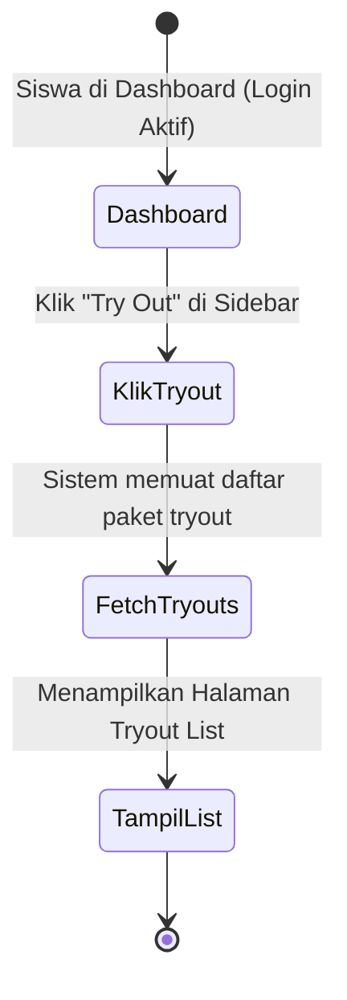

---

## 8. Activity Diagram: Mengerjakan Tryout

### Deskripsi
Pelaksanaan simulasi Tryout SNBT berbasis timer, navigasi soal, tandai ragu-ragu, kumpul ujian, dan kalkulasi skor berbasis IRT (*Item Response Theory*).

**Precondition**: Siswa memilih Paket Tryout pada Halaman Tryout List.

| Aktor (Siswa) | Sistem | AI Tutor (Panel Kanan) |
|---|---|---|
| 1. Memilih Paket Tryout & Klik **Mulai Tryout** | 2. Inisialisasi sesi ujian & jalankan Timer Countdown | |
| | 3. Menampilkan lembar kerja Tryout (Soal, Navigasi, Ragu-ragu, & Timer) | |
| 4. Membaca soal & memilih opsi jawaban | | |
| 5. (Opsional) Centang **Ragu-ragu** | 6. Update warna navigasi soal (Kuning) | |
| 7. Mengklik **Selanjutnya** untuk beralih soal | 8. Menyimpan draf jawaban secara berkesinambungan | |
| 9. Mengklik **Kumpulkan Ujian** / Timer Habis | 10. Memproses skor IRT $\theta$ (Theta) & Konversi Skor SNBT | |
| | 11. Menampilkan layar **Ujian Selesai** (Skor SNBT, IRT $\theta$, Benar/Salah) | |
| **[Percabangan Layar Hasil Ujian Selesai]** | | |
| ──> **Pilihan 1: Klik "Lihat Review Jawaban"** | 12a. Menampilkan Halaman Review $\rightarrow$ **( Connector A )** | |
| ──> **Pilihan 2: Klik "Bahas dengan AI Tutor"** | 12b. Membuka AI Chat Panel $\rightarrow$ **( Connector B )** | 12c. Inisialisasi Mode Socratic |

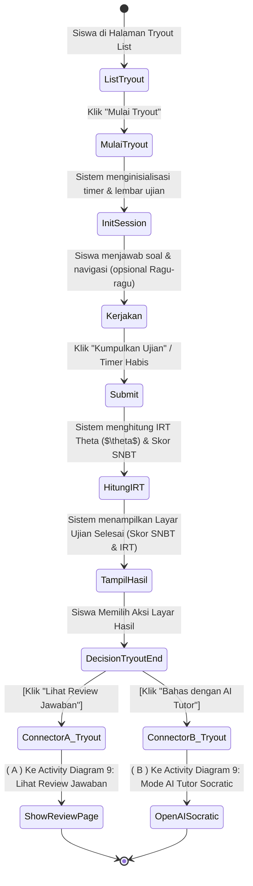

---

## 9. Activity Diagram: Lihat Review Jawaban & Bahas dengan AI Tutor (Tryout)

### Deskripsi
Melihat hasil pengerjaan Tryout secara detail dan membuka diskusi mendalam dengan AI Tutor (Mode Socratic) per nomor soal.

**Precondition**: Siswa berada pada Layar Ujian Selesai Tryout dan memilih opsi review/bahas AI.

| Aktor (Siswa) | Sistem | AI Tutor (Panel Kanan) |
|---|---|---|
| 1. Mengklik tombol **Lihat Review Jawaban** | 2. Menampilkan Halaman Review (Navigasi Soal, Status Jawaban, Kunci Jawaban) | |
| 3. Mengklik nomor soal pada Navigasi | 4. Menampilkan detail soal & status jawaban siswa | |
| 5. Mengklik **Minta Penjelasan AI Tutor** | | 6. Menampilkan popup Bantuan AI (Socratic) |
| 7. Mengklik **Lanjutkan Diskusi di Chat Panel** | 8. Membuka AI Chat Panel kanan | 9. Mengirim salam pembuka & data konteks soal |
| 10. Mengirim tanggapan & berdiskusi interaktif | | 11. Menganalisis miskonsepsi & memberikan panduan reflektif |

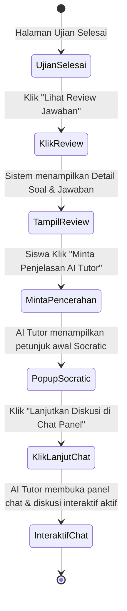

---

## 10A. Activity Diagram Induk: Navigasi Fleksibel Modul Rapor & Evaluasi (/analytics)

### Deskripsi
Diagram utama (Parent Activity Diagram) yang menggambarkan alur navigasi fleksibel siswa saat berada di modul **Rapor & Evaluasi** (`/analytics`), di mana siswa dapat secara bebas berpindah antar 3 sub-page / tab utama (**Rapor & Tren**, **Evaluasi Soal**, dan **Peluang Lolos**) melalui percabangan *Decision Node* maupun rujukan *Connector*.

**Precondition**: Siswa dalam status Login aktif di Halaman Dashboard.

| Aktor (Siswa) | Sistem |
|---|---|
| 1. Mengklik menu **Rapor & Evaluasi** di sidebar | 2. Memuat modul `/analytics` (Default Active Tab: **Rapor & Tren**) |
| 3. **[Percabangan Decision Node - Pilihan Sub-Page / Tab]** | |
| ──> **Pilihan A: Tab "Rapor & Tren"** (`/analytics/radar`) | 4a. Menampilkan Radar Kemampuan & Tren IRT $\rightarrow$ **( Connector A )** |
| ──> **Pilihan B: Tab "Evaluasi Soal"** (`/analytics/evaluation`) | 4b. Menampilkan Top 3 Bab Salah & Bank Soal Salah $\rightarrow$ **( Connector B )** |
| ──> **Pilihan C: Tab "Peluang Lolos"** (`/analytics/chancing`) | 4c. Menampilkan Chancing Engine & % Peluang $\rightarrow$ **( Connector C )** |
| 5. Mengklik tab lain kapan saja untuk berpindah tampilan fleksibel | 6. Memuat konten sub-page / tab yang dipilih sesuai keputusan pengguna |

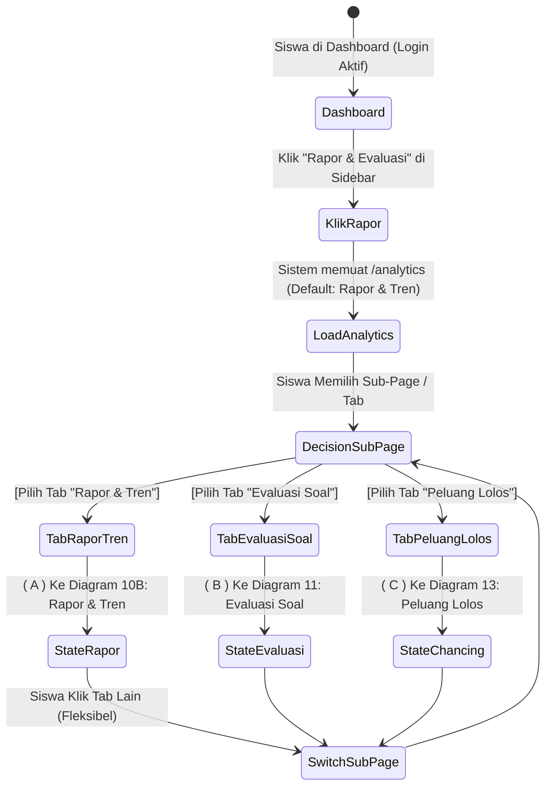

---

## 10B. Activity Diagram: Lihat Analisis Kemampuan (Rapor & Tren)

### Deskripsi
Melihat analitik perkembangan skor IRT, grafik tren SNBT, diagram radar kemampuan vs target PTN, dan tabel performa per subtes.

**Precondition**: Siswa berada di Halaman Analitik & Evaluasi pada Tab *Rapor & Tren* (`/analytics/radar`).

| Aktor (Siswa) | Sistem |
|---|---|
| 1. Membuka Tab **Rapor & Tren** | 2. Mengkalkulasi Insight Cerdas, selisih skor target, & rata-rata IRT |
| | 3. Menampilkan Halaman Analisis Kemampuan: <br>- *Insight Analisis Cerdas* <br>- *Radar Kemampuan vs Target PTN* <br>- *Grafik Tren Skor SNBT* <br>- *Tabel Detail Per Subtes (Skor, Target, Selisih, Status)* |
| 4. Membaca analitik & evaluasi diri | |

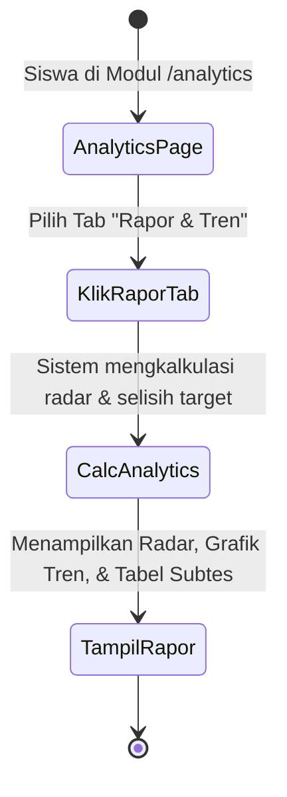

---

## 11. Activity Diagram: Lihat Bank Soal Salah (Evaluasi Soal)

### Deskripsi
Mengevaluasi daftar seluruh soal yang pernah dijawab salah atau ditandai selama latihan maupun tryout.

**Precondition**: Siswa berada di Halaman Analitik & Evaluasi pada Tab *Evaluasi Soal* (`/analytics/evaluation`).

| Aktor (Siswa) | Sistem |
|---|---|
| 1. Mengklik tab **Evaluasi Soal** | 2. Memuat riwayat soal-soal yang dijawab salah atau ditandai |
| | 3. Menampilkan Halaman **Bank Soal Salah**: <br>- *Top 3 Bab Paling Banyak Salah* <br>- *Daftar Card Soal Salah per Subtes* |
| 4. Meninjau daftar soal salah | |

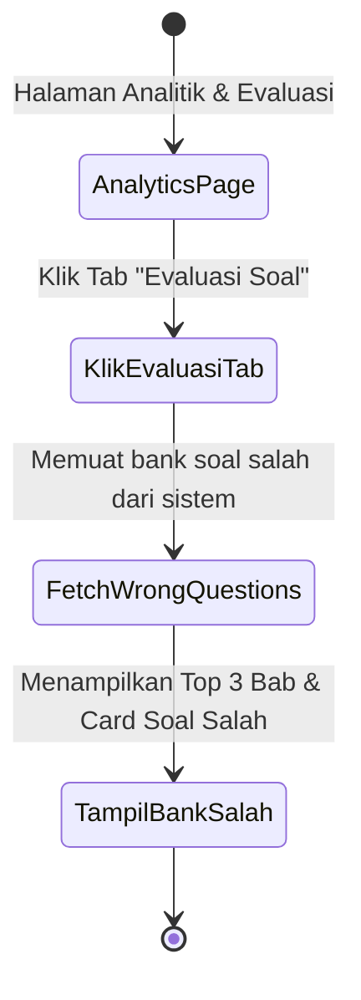

---

## 12. Activity Diagram: Lihat Bahas Soal dari Bank Soal Salah

### Deskripsi
Menginisialisasi pembahasan otomatis dengan AI Tutor langsung dari card soal pada halaman Bank Soal Salah.

**Precondition**: Siswa berada pada Halaman Bank Soal Salah (`/analytics/evaluation`).

| Aktor (Siswa) | Sistem | AI Tutor (Panel Kanan) |
|---|---|---|
| 1. Mengklik tombol **Bahas AI** pada card soal | 2. Membuka AI Tutor Panel di bagian kanan | 3. Menyapa siswa & memuat data konteks soal |
| 4. Mengklik **Tanya Pembahasan** / ketik pertanyaan | | 5. Menjabarkan konsep solusi & merespons chat |

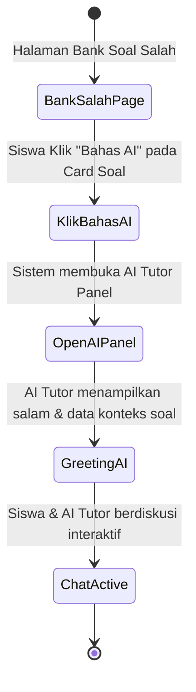

---

## 13. Activity Diagram: Lihat Peluang Lolos (Chancing Engine)

### Deskripsi
Melihat analisis estimasi peluang kelulusan (*Chancing*) ke jurusan target berdasarkan skor SNBT dan tingkat keketatan PTN.

**Precondition**: Siswa berada di Halaman Analitik & Evaluasi pada Tab *Peluang Lolos* (`/analytics/chancing`).

| Aktor (Siswa) | Sistem | AI Tutor (Panel Kanan) |
|---|---|---|
| 1. Mengklik tab **Peluang Lolos** | 2. Menjalankan *Chancing Engine* (Membandingkan skor SNBT dengan passing grade aman PTN) | |
| | | 3. Menggenerasi Rekomendasi AI Jurusan Alternatif (Tantangan) |
| | 4. Menampilkan Halaman **Chancing Engine**: <br>- *Skor SNBT Saat Ini* <br>- *Card Peluang Lolos Target Utama* <br>- *Rekomendasi AI Jurusan Alternatif* | |
| 5. Meninjau peluang & rekomendasi jurusan | | |

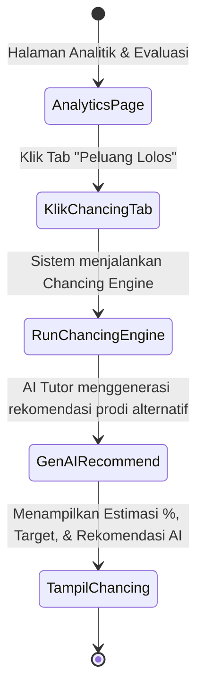

---

## 14. Activity Diagram: Lihat Detail Salah Satu Jurusan Target

### Deskripsi
Melihat rincian prioritas subtes (bobot TPS/LITERASI), daya tampung, jumlah peminat, dan strategi rekomendasi belajar untuk jurusan target tertentu.

**Precondition**: Siswa berada pada Halaman Peluang Lolos (`/analytics/chancing`).

| Aktor (Siswa) | Sistem | AI Tutor (Panel Kanan) |
|---|---|---|
| 1. Mengklik Card Jurusan Target (misal: *STEI ITB*) | 2. Menampilkan Modal Detail Jurusan: <br>- *Statistik Kuota & Keketatan* <br>- *Urutan Prioritas Subtes* | |
| | | 3. Menampilkan Rekomendasi Belajar AI khusus prodi |
| 4. Mempelajari prioritas subtes & rekomendasi AI | | |

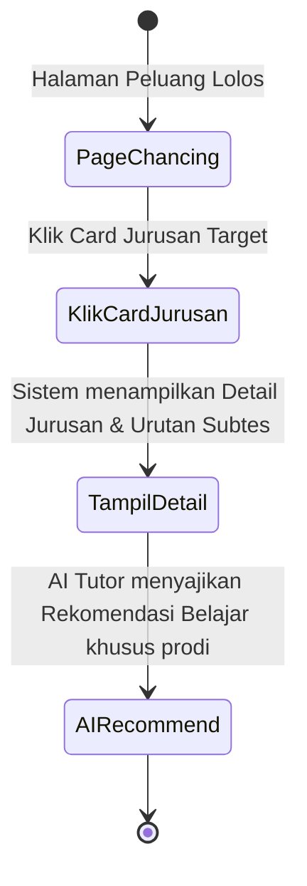

---

## 15. Activity Diagram: Bahas Soal Dalam Aplikasi (Ruang Tutor AI - Bank Soal Lexica)

### Deskripsi
Membahas arsip soal terstruktur yang tersedia di platform Lexica melalui modul interaktif Ruang Tutor AI.

**Precondition**: Siswa mengklik menu *Ruang Tutor AI* di sidebar (`/tutor`).

| Aktor (Siswa) | Sistem | AI Tutor (Panel Kanan) |
|---|---|---|
| 1. Mengklik menu **Ruang Tutor AI** di sidebar | 2. Menampilkan Halaman **Ruang Tutor AI** & daftar card soal per kategori | |
| 3. Memilih kategori & klik **Bahas** pada card soal | 4. Menampilkan interface soal utama | 5. Mengirim salam & siap berdiskusi |
| 6. Menjawab/berdiskusi di chat panel AI | | 7. Memberikan penjabaran pembahasan & jawaban |

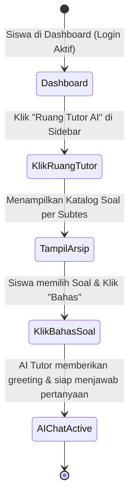

---

## 16. Activity Diagram: Bahas Soal Luar Aplikasi (Ruang Tutor AI - Custom Input)

### Deskripsi
Mengajukan pertanyaan atau memasukkan (copy-paste) teks soal dari luar aplikasi (bimbel/sekolah) langsung ke dalam AI Tutor Chat Panel.

**Precondition**: Siswa berada pada Halaman Ruang Tutor AI (`/tutor`).

| Aktor (Siswa) | AI Tutor (Panel Kanan) |
|---|---|
| 1. Melakukan Paste / Input teks soal luar pada chat box | |
| 2. Mengklik tombol **Kirim** | 3. Menganalisis teks soal, konsep, & pilihan jawaban |
| | 4. Menampilkan langkah penyelesaian terstruktur & jawaban benar di chat panel |
| 5. Membaca penjelasan & berdiskusi interaktif | |

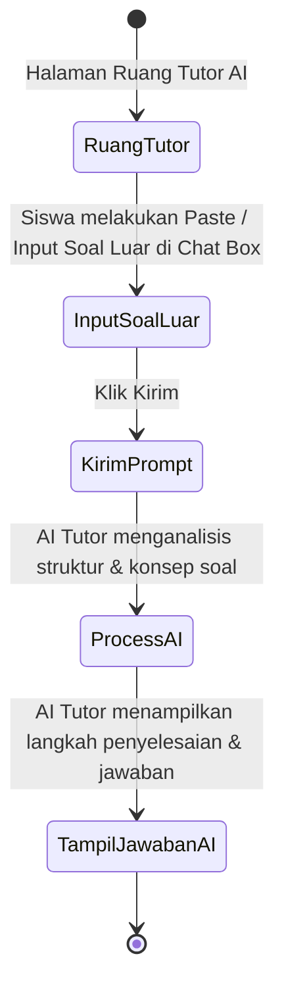

---

## 17. Activity Diagram: Mengubah Pengaturan Profil & Target

### Deskripsi
Mengubah data profil akun, informasi sekolah, target jurusan UTBK, serta preferensi persona AI Tutor.

**Precondition**: Siswa mengklik menu *Pengaturan Profil & Target* di sidebar (`/settings`).

| Aktor (Siswa) | Sistem |
|---|---|
| 1. Mengklik **Pengaturan Profil & Target** di sidebar | 2. Menampilkan Form Pengaturan (Profil, Target UTBK Pilihan 1 & 2, Preferensi AI Tutor) |
| 3. Mengubah data profil / target / gaya interaksi AI | |
| 4. Mengklik tombol **Simpan Perubahan** | 5. Memvalidasi & menyimpan perubahan data |
| | 6. Menampilkan toast notification: *"Profil berhasil disimpan!"* |

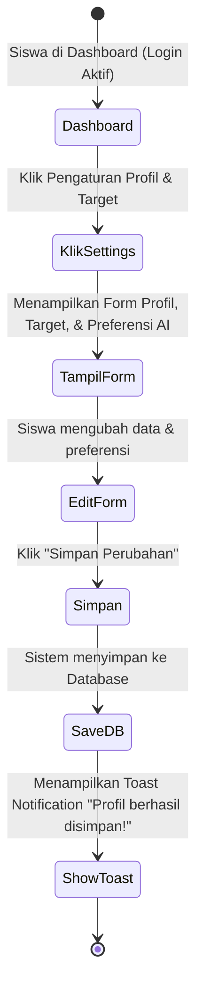

---

## 18. Activity Diagram: Lihat Subtes (Practice / Quick Drill)

### Deskripsi
Mengakses halaman Practice Mode untuk memilih subtes latihan acak (Quick Drill).

**Precondition**: Siswa mengklik menu *Practice* di sidebar (`/practice`).

| Aktor (Siswa) | Sistem |
|---|---|
| 1. Mengklik menu **Practice** di sidebar | 2. Memuat data daftar subtes & mode latihan acak |
| | 3. Menampilkan Halaman **Practice** (Informasi Quick Drill, Tips Latihan, & Cards Subtes) |
| 4. Meninjau pilihan subtes drill | |

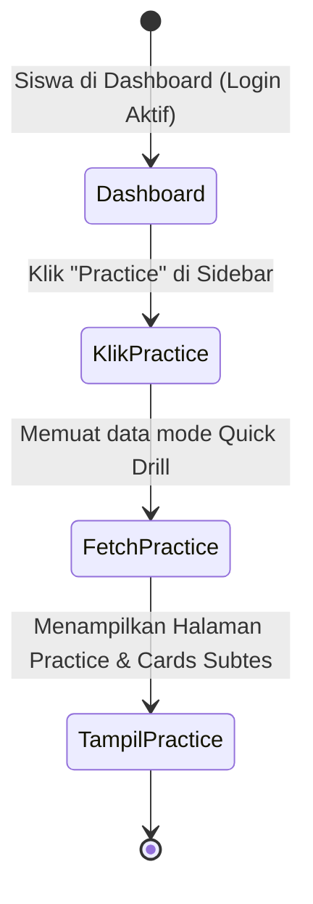

---

## 19. Activity Diagram: Mengerjakan Subtes (Practice / Quick Drill)

### Deskripsi
Pengerjaan latihan soal acak pada subtes pilihan dengan evaluasi real-time dari AI Tutor dan pembongkaran konsep otomatis.

**Precondition**: Siswa berada pada Halaman Practice (`/practice`) dan memilih salah satu subtes.

| Aktor (Siswa) | Sistem | AI Tutor (Panel Kanan) |
|---|---|---|
| 1. Mengklik **Drill Sekarang** pada subtes | 2. Menampilkan lembar Quick Drill | 3. Siap berinteraksi |
| 4. Membaca soal, memilih opsi, & klik **Jawab** | 5. Memeriksa kebenaran jawaban | |
| | **[Kondisi 1: Jawaban Salah - Percobaan 1]** | |
| | 6a. Menampilkan banner *"Kesempatan Terakhir"* | 6b. Otomatis mengirim pesan Hint |
| 7. Memilih opsi jawaban ke-2 | 8. Memeriksa jawaban ke-2 | |
| | **[Kondisi 2: Jawaban Salah - Percobaan 2]** | |
| | 9a. Menampilkan status *"Dilewati"* | |
| | **[Kondisi 3: Jawaban Benar]** | |
| | 10a. Menampilkan status *"Benar!"* & tombol Pembahasan AI | 10b. Menyapa di chat panel |
| 11. (Opsional) Klik **Lihat Pembahasan Lengkap AI** | | 12. Menampilkan struktur pembahasan lengkap (Konsep, Langkah, & Koneksi Target) |
| 13. Menyelesaikan seluruh soal drill | 14. Menampilkan Layar **Sesi Selesai!** | |

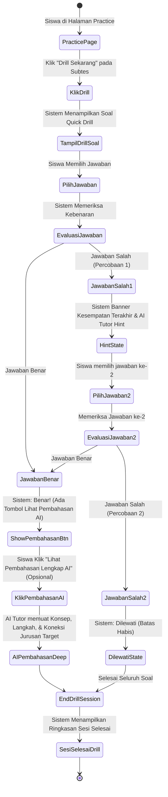

---
---

# BAGIAN 2: ACTIVITY DIAGRAM ADMIN

---

## 1. Activity Diagram: Login & Lihat Learning Overview (Admin Dashboard)

### Deskripsi
Autentikasi akun administrator dan menampilkan metrik global platform, statistik pengguna, bank soal, dan ringkasan simulasi tryout.

**Precondition**: Admin berada pada halaman Login Admin (`/login`).

| Aktor (Admin) | Sistem |
|---|---|
| 1. Input Email & Password Admin | |
| 2. Mengklik **Login** | 3. Memvalidasi kredensial role `ADMIN` |
| | 4. Mengarahkan ke **Panel Kontrol Admin** |
| | 5. Menampilkan Panel Kontrol Admin & Metrik Platform (Total Siswa, Soal, PTN, Tryout) |
| 6. Meninjau metrik sistem | |

```mermaid
stateDiagram-v2
    [*] --> AdminLogin: Admin Input Email & Password
    AdminLogin --> ValidasiAdmin: Memvalidasi Role ADMIN
    ValidasiAdmin --> DashboardAdmin: Sistem menampilkan Panel Kontrol Admin & Metrik Global
    DashboardAdmin --> [*]
```

---

## 2. Activity Diagram: Lihat User (Manajemen User)

### Deskripsi
Mengelola akun pengguna, memantau distribusi role (Student/Admin), status keaktifan, dan rata-rata skor ability IRT ($\theta$).

**Precondition**: Admin dalam status Login aktif di Panel Kontrol Admin (`/admin`).

| Aktor (Admin) | Sistem |
|---|---|
| 1. Mengklik menu **Kelola Pengguna** di sidebar | 2. Memuat data seluruh pengguna & statistik IRT |
| | 3. Menampilkan Halaman **Manajemen User** & Tabel Pengguna |
| 4. Mengamati data daftar pengguna | |

```mermaid
stateDiagram-v2
    [*] --> DashboardAdmin: Admin di Dashboard (Login Aktif)
    DashboardAdmin --> KlikKelolaUser: Klik "Kelola Pengguna"
    KlikKelolaUser --> FetchUsers: Sistem memuat daftar user & IRT ability
    FetchUsers --> TampilUserTable: Menampilkan Halaman Manajemen User & Tabel
    TampilUserTable --> [*]
```

---

## 3. Activity Diagram: Lihat Daftar Soal (Bank Soal & Kurikulum - Soal)

### Deskripsi
Menampilkan daftar bank soal UTBK lengkap dengan kriteria bobot IRT ($b$), tipe soal, pilihan jawaban, dan format LaTeX/Markdown.

**Precondition**: Admin dalam status Login aktif di Panel Kontrol Admin.

| Aktor (Admin) | Sistem |
|---|---|
| 1. Mengklik menu **Kelola Soal** di sidebar | 2. Memuat data bank soal & kurikulum |
| | 3. Menampilkan Halaman **Daftar Soal** (Search, Filter, List Soal) |
| 4. Memeriksa daftar soal | |

```mermaid
stateDiagram-v2
    [*] --> DashboardAdmin: Admin di Dashboard (Login Aktif)
    DashboardAdmin --> KlikKelolaSoal: Klik "Kelola Soal"
    KlikKelolaSoal --> FetchQuestions: Memuat bank soal & bobot IRT
    FetchQuestions --> TampilQuestions: Menampilkan Tab Daftar Soal & Filter
    TampilQuestions --> [*]
```

---

## 4. Activity Diagram: Lihat Daftar Bab (Bank Soal & Kurikulum - Chapters)

### Deskripsi
Menampilkan daftar bab materi belajar yang dikelompokkan berdasarkan mata pelajaran.

**Precondition**: Admin berada di Halaman Kelola Soal (`/admin/questions`).

| Aktor (Admin) | Sistem |
|---|---|
| 1. Mengklik tab **Daftar Bab (Chapters)** | 2. Memuat data bab dan asosiasi mata pelajarannya |
| | 3. Menampilkan Halaman **Daftar Bab** & Tabel Bab |
| 4. Meninjau daftar bab | |

```mermaid
stateDiagram-v2
    [*] --> KelolaSoalPage: Halaman Kelola Soal
    KelolaSoalPage --> KlikTabBab: Klik Tab "Daftar Bab (Chapters)"
    KlikTabBab --> FetchChapters: Memuat data bab
    FetchChapters --> TampilBabTable: Menampilkan Tabel Daftar Bab
    TampilBabTable --> [*]
```

---

## 5. Activity Diagram: Lihat Daftar Mata Pelajaran (Bank Soal & Kurikulum - Mapel)

### Deskripsi
Menampilkan daftar seluruh mata pelajaran ujian SNBT yang dikelola dalam sistem.

**Precondition**: Admin berada di Halaman Kelola Soal (`/admin/questions`).

| Aktor (Admin) | Sistem |
|---|---|
| 1. Mengklik tab **Mata Pelajaran** | 2. Memuat data daftar mata pelajaran |
| | 3. Menampilkan Halaman **Mata Pelajaran** & Tabel Mapel |
| 4. Meninjau daftar mata pelajaran | |

```mermaid
stateDiagram-v2
    [*] --> KelolaSoalPage: Halaman Kelola Soal
    KelolaSoalPage --> KlikTabMapel: Klik Tab "Mata Pelajaran"
    KlikTabMapel --> FetchSubjects: Memuat data mata pelajaran
    FetchSubjects --> TampilMapelTable: Menampilkan Tabel Mata Pelajaran
    TampilMapelTable --> [*]
```

---

## 6. Activity Diagram: Tambah Soal

### Deskripsi
Menambahkan butir soal baru ke dalam bank soal beserta opsi jawaban, jawaban benar, bobot IRT, dan pembahasan.

**Precondition**: Admin berada pada Halaman Daftar Soal (`/admin/questions`).

| Aktor (Admin) | Sistem |
|---|---|
| 1. Mengklik tombol **Tambah Soal** | 2. Membuka Form Input Soal di sisi kanan |
| 3. Mengisi Form Soal (Mapel, Bab, Pertanyaan LaTeX, Bobot IRT $b$, Opsi A-E, Kunci, Pembahasan) | |
| 4. Mengklik tombol **Simpan Soal** | 5. Memvalidasi & menyimpan record soal baru ke Database |
| | 6. Memperbarui tabel daftar soal & notifikasi sukses |

```mermaid
stateDiagram-v2
    [*] --> DaftarSoalPage: Halaman Daftar Soal
    DaftarSoalPage --> KlikTambahSoal: Klik "Tambah Soal"
    KlikTambahSoal --> OpenFormSoal: Membuka Form Input Soal
    OpenFormSoal --> FillFormSoal: Admin mengisi detail soal & opsi
    FillFormSoal --> SubmitSoal: Klik "Simpan Soal"
    SubmitSoal --> SaveQuestionDB: Sistem menyimpan record soal ke Database
    SaveQuestionDB --> RefreshSoalList: Perbarui daftar soal & tampilkan notifikasi
    RefreshSoalList --> [*]
```

---

## 7. Activity Diagram: Tambah Bab

### Deskripsi
Menambahkan bab kurikulum baru di bawah mata pelajaran tertentu.

**Precondition**: Admin berada pada Tab Daftar Bab (`/admin/questions`).

| Aktor (Admin) | Sistem |
|---|---|
| 1. Mengklik tombol **Tambah Bab** | 2. Membuka Form Input Bab |
| 3. Pilih Mapel, Mengisi Nama Bab & Deskripsi | |
| 4. Mengklik tombol **Simpan Bab** | 5. Memvalidasi & menyimpan record bab baru ke Database |
| | 6. Memperbarui tabel bab & notifikasi sukses |

```mermaid
stateDiagram-v2
    [*] --> TabBabPage: Halaman Daftar Bab
    TabBabPage --> KlikTambahBab: Klik "Tambah Bab"
    KlikTambahBab --> OpenFormBab: Membuka Form Input Bab
    OpenFormBab --> FillFormBab: Admin mengisi data Bab & Mapel
    FillFormBab --> SubmitBab: Klik "Simpan Bab"
    SubmitBab --> SaveBabDB: Sistem menyimpan data Bab ke Database
    SaveBabDB --> RefreshBabList: Perbarui tabel bab
    RefreshBabList --> [*]
```

---

## 8. Activity Diagram: Tambah Mata Pelajaran

### Deskripsi
Menambahkan kategori mata pelajaran baru dalam kurikulum UTBK.

**Precondition**: Admin berada pada Tab Mata Pelajaran (`/admin/questions`).

| Aktor (Admin) | Sistem |
|---|---|
| 1. Mengklik tombol **Tambah Mata Pelajaran** | 2. Membuka Form Input Mapel |
| 3. Mengisi Nama Mapel & Rumpun (TPS/LITERASI/PENALARAN) | |
| 4. Mengklik tombol **Simpan Mata Pelajaran** | 5. Memvalidasi & menyimpan data mapel ke Database |
| | 6. Memperbarui tabel mapel & notifikasi sukses |

```mermaid
stateDiagram-v2
    [*] --> TabMapelPage: Halaman Mata Pelajaran
    TabMapelPage --> KlikTambahMapel: Klik "Tambah Mata Pelajaran"
    KlikTambahMapel --> OpenFormMapel: Membuka Form Input Mapel
    OpenFormMapel --> FillFormMapel: Admin mengisi data Mata Pelajaran
    FillFormMapel --> SubmitMapel: Klik "Simpan Mata Pelajaran"
    SubmitMapel --> SaveMapelDB: Sistem menyimpan data Mapel ke Database
    SaveMapelDB --> RefreshMapelList: Perbarui tabel mata pelajaran
    RefreshMapelList --> [*]
```

---

## 9. Activity Diagram: Edit Soal

### Deskripsi
Memperbarui konten, kunci jawaban, atau parameter IRT pada soal yang sudah ada.

**Precondition**: Admin berada pada Halaman Daftar Soal (`/admin/questions`).

| Aktor (Admin) | Sistem |
|---|---|
| 1. Mengklik **Edit** pada salah satu soal | 2. Memuat data detail soal ke Form Edit |
| 3. Mengubah informasi yang diperlukan | |
| 4. Mengklik tombol **Simpan Perubahan** | 5. Memvalidasi & memperbarui record soal di Database |
| | 6. Memperbarui tampilan daftar soal & notifikasi |

```mermaid
stateDiagram-v2
    [*] --> DaftarSoalPage: Halaman Daftar Soal
    DaftarSoalPage --> KlikEditSoal: Klik "Edit" pada Soal
    KlikEditSoal --> LoadDataSoal: Sistem memuat data soal ke Form Edit
    LoadDataSoal --> UpdateFormSoal: Admin mengubah data soal
    UpdateFormSoal --> SaveEditSoal: Klik "Simpan Perubahan"
    SaveEditSoal --> UpdateDBSoal: Sistem memperbarui data di Database
    UpdateDBSoal --> RefreshSoalList: Refresh daftar & tampilkan notifikasi
    RefreshSoalList --> [*]
```

---

## 10. Activity Diagram: Edit Bab

### Deskripsi
Mengubah nama atau penugasan mata pelajaran dari suatu bab.

**Precondition**: Admin berada pada Tab Daftar Bab (`/admin/questions`).

| Aktor (Admin) | Sistem |
|---|---|
| 1. Mengklik **Edit** pada salah satu bab | 2. Memuat data bab ke Form Edit |
| 3. Mengubah nama bab / pilihan mapel | |
| 4. Mengklik **Simpan Perubahan** | 5. Memperbarui record bab di Database |
| | 6. Memperbarui tabel bab & notifikasi |

```mermaid
stateDiagram-v2
    [*] --> TabBabPage: Halaman Daftar Bab
    TabBabPage --> KlikEditBab: Klik "Edit" pada Bab
    KlikEditBab --> FormEditBab: Memuat data bab ke Form Edit
    FormEditBab --> ModifyBab: Admin mengubah informasi bab
    ModifyBab --> SaveEditBab: Klik "Simpan Perubahan"
    SaveEditBab --> UpdateDBBab: Sistem memperbarui data bab di Database
    UpdateDBBab --> RefreshBabList: Perbarui tabel bab
    RefreshBabList --> [*]
```

---

## 11. Activity Diagram: Edit Mata Pelajaran

### Deskripsi
Mengubah data mata pelajaran (nama atau rumpun).

**Precondition**: Admin berada pada Tab Mata Pelajaran (`/admin/questions`).

| Aktor (Admin) | Sistem |
|---|---|
| 1. Mengklik **Edit** pada salah satu mapel | 2. Memuat data mapel ke Form Edit |
| 3. Mengubah data mata pelajaran | |
| 4. Mengklik **Simpan Perubahan** | 5. Memperbarui record mapel di Database |
| | 6. Memperbarui tabel mapel & notifikasi |

```mermaid
stateDiagram-v2
    [*] --> TabMapelPage: Halaman Mata Pelajaran
    TabMapelPage --> KlikEditMapel: Klik "Edit" pada Mapel
    KlikEditMapel --> FormEditMapel: Memuat data mapel ke Form Edit
    FormEditMapel --> ModifyMapel: Admin mengubah informasi mapel
    ModifyMapel --> SaveEditMapel: Klik "Simpan Perubahan"
    SaveEditMapel --> UpdateDBMapel: Sistem memperbarui data di Database
    UpdateDBMapel --> RefreshMapelList: Perbarui tabel mapel
    RefreshMapelList --> [*]
```

---

## 12. Activity Diagram: Hapus Soal

### Deskripsi
Menghapus butir soal dari bank soal sistem.

**Precondition**: Admin berada pada Halaman Daftar Soal (`/admin/questions`).

| Aktor (Admin) | Sistem |
|---|---|
| 1. Mengklik **Hapus** pada salah satu soal | 2. Menampilkan dialog konfirmasi: *"Hapus soal ini?"* |
| 3. Mengklik **OK / Ya, Hapus** | 4. Menghapus record soal dari Database |
| | 5. Memperbarui tabel daftar soal & notifikasi hapus |

```mermaid
stateDiagram-v2
    [*] --> DaftarSoalPage: Halaman Daftar Soal
    DaftarSoalPage --> KlikHapusSoal: Klik "Hapus" pada Soal
    KlikHapusSoal --> ConfirmDeleteSoal: Dialog Konfirmasi "Hapus soal ini?"
    ConfirmDeleteSoal --> ProcessDeleteSoal: Admin Klik "OK"
    ProcessDeleteSoal --> DeleteDBSoal: Sistem menghapus record dari Database
    DeleteDBSoal --> RefreshSoalList: Perbarui daftar soal & notifikasi
    RefreshSoalList --> [*]
```

---

## 13. Activity Diagram: Hapus Bab

### Deskripsi
Menghapus bab dari struktur kurikulum.

**Precondition**: Admin berada pada Tab Daftar Bab (`/admin/questions`).

| Aktor (Admin) | Sistem |
|---|---|
| 1. Mengklik **Hapus** pada salah satu bab | 2. Menampilkan dialog konfirmasi: *"Hapus bab ini?"* |
| 3. Mengklik **OK** | 4. Menghapus record bab dari Database |
| | 5. Memperbarui tabel bab & notifikasi hapus |

```mermaid
stateDiagram-v2
    [*] --> TabBabPage: Halaman Daftar Bab
    TabBabPage --> KlikHapusBab: Klik "Hapus" pada Bab
    KlikHapusBab --> ConfirmDeleteBab: Dialog Konfirmasi "Hapus bab ini?"
    ConfirmDeleteBab --> ProcessDeleteBab: Admin Klik "OK"
    ProcessDeleteBab --> DeleteDBBab: Sistem menghapus record bab dari Database
    DeleteDBBab --> RefreshBabList: Perbarui tabel bab
    RefreshBabList --> [*]
```

---

## 14. Activity Diagram: Hapus Mata Pelajaran

### Deskripsi
Menghapus mata pelajaran dari kurikulum.

**Precondition**: Admin berada pada Tab Mata Pelajaran (`/admin/questions`).

| Aktor (Admin) | Sistem |
|---|---|
| 1. Mengklik **Hapus** pada salah satu mapel | 2. Menampilkan dialog konfirmasi: *"Hapus mata pelajaran ini?"* |
| 3. Mengklik **OK** | 4. Menghapus record mapel dari Database |
| | 5. Memperbarui tabel mapel & notifikasi hapus |

```mermaid
stateDiagram-v2
    [*] --> TabMapelPage: Halaman Mata Pelajaran
    TabMapelPage --> KlikHapusMapel: Klik "Hapus" pada Mapel
    KlikHapusMapel --> ConfirmDeleteMapel: Dialog Konfirmasi "Hapus mata pelajaran ini?"
    ConfirmDeleteMapel --> ProcessDeleteMapel: Admin Klik "OK"
    ProcessDeleteMapel --> DeleteDBMapel: Sistem menghapus record mapel dari Database
    DeleteDBMapel --> RefreshMapelList: Perbarui tabel mapel
    RefreshMapelList --> [*]
```

---

## 15. Activity Diagram: Lihat Daftar Universitas (Kelola PTN/Prodi)

### Deskripsi
Menampilkan daftar Perguruan Tinggi Negeri (PTN) yang terdaftar dalam sistem data Chancing.

**Precondition**: Admin dalam status Login aktif di sidebar (`/admin/scraper`).

| Aktor (Admin) | Sistem |
|---|---|
| 1. Mengklik menu **Kelola PTN/Prodi** di sidebar | 2. Memuat data universitas & jumlah prodi |
| | 3. Menampilkan Halaman **Kelola PTN/Prodi** & Tabel PTN |
| 4. Meninjau daftar PTN | |

```mermaid
stateDiagram-v2
    [*] --> DashboardAdmin: Admin di Dashboard (Login Aktif)
    DashboardAdmin --> KlikKelolaPTN: Klik "Kelola PTN/Prodi"
    KlikKelolaPTN --> FetchUniversitas: Memuat daftar universitas dari Database
    FetchUniversitas --> TampilPTNTable: Menampilkan Tabel Daftar Universitas
    TampilPTNTable --> [*]
```

---

## 16. Activity Diagram: Lihat Daftar Prodi (Kelola PTN/Prodi)

### Deskripsi
Menampilkan daftar Program Studi (Prodi) beserta parameter passing grade aman, kuota daya tampung, dan peminat.

**Precondition**: Admin berada pada Halaman Kelola PTN/Prodi (`/admin/scraper`).

| Aktor (Admin) | Sistem |
|---|---|
| 1. Mengklik tab **Daftar Program Studi (Prodi)** | 2. Memuat data prodi, passing grade, & kuota |
| | 3. Menampilkan Halaman **Daftar Program Studi** & Tabel Prodi |
| 4. Meninjau daftar prodi | |

```mermaid
stateDiagram-v2
    [*] --> PagePTN: Halaman Kelola PTN/Prodi
    PagePTN --> KlikTabProdi: Klik Tab "Daftar Program Studi (Prodi)"
    KlikTabProdi --> FetchProdi: Memuat data prodi & target skor dari Database
    FetchProdi --> TampilProdiTable: Menampilkan Tabel Daftar Prodi
    TampilProdiTable --> [*]
```

---

## 17. Activity Diagram: Tambah Universitas

### Deskripsi
Menambahkan data perguruan tinggi negeri baru.

**Precondition**: Admin berada pada Tab Universitas (`/admin/scraper`).

| Aktor (Admin) | Sistem |
|---|---|
| 1. Mengklik tombol **Tambah Universitas** | 2. Membuka Form Input PTN |
| 3. Mengisi Nama PTN, Kode PTN, Singkatan, & URL Logo | |
| 4. Mengklik **Simpan Universitas** | 5. Memvalidasi & menyimpan record PTN ke Database |
| | 6. Memperbarui tabel universitas & notifikasi |

```mermaid
stateDiagram-v2
    [*] --> TabPTNPage: Halaman Universitas
    TabPTNPage --> KlikTambahPTN: Klik "Tambah Universitas"
    KlikTambahPTN --> OpenFormPTN: Membuka Form Input PTN
    OpenFormPTN --> FillFormPTN: Admin mengisi data Universitas
    FillFormPTN --> SubmitPTN: Klik "Simpan Universitas"
    SubmitPTN --> SavePTNDB: Sistem menyimpan record PTN ke Database
    SavePTNDB --> RefreshPTNList: Perbarui tabel universitas
    RefreshPTNList --> [*]
```

---

## 18. Activity Diagram: Tambah Prodi

### Deskripsi
Menambahkan program studi baru pada universitas tertentu beserta target skor aman IRT dan kuota.

**Precondition**: Admin berada pada Tab Daftar Program Studi (`/admin/scraper`).

| Aktor (Admin) | Sistem |
|---|---|
| 1. Mengklik tombol **Tambah Prodi** | 2. Membuka Form Input Prodi |
| 3. Pilih PTN, Mengisi Nama Prodi, Rumpun, Target Skor Aman, Daya Tampung, & Total Peminat | |
| 4. Mengklik **Simpan Prodi** | 5. Memvalidasi & menyimpan record prodi ke Database |
| | 6. Memperbarui tabel prodi & notifikasi |

```mermaid
stateDiagram-v2
    [*] --> TabProdiPage: Halaman Daftar Program Studi
    TabProdiPage --> KlikTambahProdi: Klik "Tambah Prodi"
    KlikTambahProdi --> OpenFormProdi: Membuka Form Input Prodi
    OpenFormProdi --> FillFormProdi: Admin mengisi data Prodi, Target Skor, & Kuota
    FillFormProdi --> SubmitProdi: Klik "Simpan Prodi"
    SubmitProdi --> SaveProdiDB: Sistem menyimpan record Prodi ke Database
    SaveProdiDB --> RefreshProdiList: Perbarui tabel prodi
    RefreshProdiList --> [*]
```

---

## 19. Activity Diagram: Edit Universitas

### Deskripsi
Memperbarui informasi universitas.

**Precondition**: Admin berada pada Tab Universitas (`/admin/scraper`).

| Aktor (Admin) | Sistem |
|---|---|
| 1. Mengklik **Edit** pada PTN yang dipilih | 2. Memuat data PTN ke Form Edit |
| 3. Mengubah data universitas | |
| 4. Mengklik **Simpan Perubahan** | 5. Memperbarui record PTN di Database |
| | 6. Memperbarui tabel universitas & notifikasi |

```mermaid
stateDiagram-v2
    [*] --> TabPTNPage: Halaman Universitas
    TabPTNPage --> KlikEditPTN: Klik "Edit" pada PTN
    KlikEditPTN --> FormEditPTN: Memuat data PTN ke Form Edit
    FormEditPTN --> ModifyPTN: Admin mengubah data PTN
    ModifyPTN --> SaveEditPTN: Klik "Simpan Perubahan"
    SaveEditPTN --> UpdateDBPTN: Sistem memperbarui record PTN di Database
    UpdateDBPTN --> RefreshPTNList: Perbarui tabel universitas
    RefreshPTNList --> [*]
```

---

## 20. Activity Diagram: Edit Prodi

### Deskripsi
Memperbarui data program studi, passing grade, atau kuota daya tampung.

**Precondition**: Admin berada pada Tab Daftar Program Studi (`/admin/scraper`).

| Aktor (Admin) | Sistem |
|---|---|
| 1. Mengklik **Edit** pada prodi yang dipilih | 2. Memuat data prodi ke Form Edit |
| 3. Mengubah data prodi / target skor / kuota | |
| 4. Mengklik **Simpan Perubahan** | 5. Memperbarui record prodi di Database |
| | 6. Memperbarui tabel prodi & notifikasi |

```mermaid
stateDiagram-v2
    [*] --> TabProdiPage: Halaman Daftar Program Studi
    TabProdiPage --> KlikEditProdi: Klik "Edit" pada Prodi
    KlikEditProdi --> FormEditProdi: Memuat data prodi ke Form Edit
    FormEditProdi --> ModifyProdi: Admin mengubah data prodi/kuota/skor
    ModifyProdi --> SaveEditProdi: Klik "Simpan Perubahan"
    SaveEditProdi --> UpdateDBProdi: Sistem memperbarui record prodi di Database
    UpdateDBProdi --> RefreshProdiList: Perbarui tabel prodi
    RefreshProdiList --> [*]
```

---

## 21. Activity Diagram: Hapus Universitas

### Deskripsi
Menghapus universitas dari sistem.

**Precondition**: Admin berada pada Tab Universitas (`/admin/scraper`).

| Aktor (Admin) | Sistem |
|---|---|
| 1. Mengklik **Hapus** pada salah satu PTN | 2. Menampilkan dialog konfirmasi: *"Hapus universitas ini?"* |
| 3. Mengklik **OK** | 4. Menghapus record PTN dari Database |
| | 5. Memperbarui tabel universitas & notifikasi |

```mermaid
stateDiagram-v2
    [*] --> TabPTNPage: Halaman Universitas
    TabPTNPage --> KlikHapusPTN: Klik "Hapus" pada PTN
    KlikHapusPTN --> ConfirmDeletePTN: Dialog Konfirmasi "Hapus universitas ini?"
    ConfirmDeletePTN --> ProcessDeletePTN: Admin Klik "OK"
    ProcessDeletePTN --> DeleteDBPTN: Sistem menghapus record PTN dari Database
    DeleteDBPTN --> RefreshPTNList: Perbarui tabel universitas
    RefreshPTNList --> [*]
```

---

## 22. Activity Diagram: Hapus Prodi

### Deskripsi
Menghapus program studi dari sistem.

**Precondition**: Admin berada pada Tab Daftar Program Studi (`/admin/scraper`).

| Aktor (Admin) | Sistem |
|---|---|
| 1. Mengklik **Hapus** pada salah satu prodi | 2. Menampilkan dialog konfirmasi: *"Hapus prodi ini?"* |
| 3. Mengklik **OK** | 4. Menghapus record prodi dari Database |
| | 5. Memperbarui tabel prodi & notifikasi |

```mermaid
stateDiagram-v2
    [*] --> TabProdiPage: Halaman Daftar Program Studi
    TabProdiPage --> KlikHapusProdi: Klik "Hapus" pada Prodi
    KlikHapusProdi --> ConfirmDeleteProdi: Dialog Konfirmasi "Hapus prodi ini?"
    ConfirmDeleteProdi --> ProcessDeleteProdi: Admin Klik "OK"
    ProcessDeleteProdi --> DeleteDBProdi: Sistem menghapus record prodi dari Database
    DeleteDBProdi --> RefreshProdiList: Perbarui tabel prodi
    RefreshProdiList --> [*]
```

---

## 23. Activity Diagram: Lihat Daftar Tryout

### Deskripsi
Menampilkan paket ujian Tryout SNBT linear beserta seksi subtes dan durasi waktunya.

**Precondition**: Admin dalam status Login aktif di sidebar (`/admin/tryouts`).

| Aktor (Admin) | Sistem |
|---|---|
| 1. Mengklik menu **Kelola Tryout** di sidebar | 2. Memuat daftar tryout, seksi subtes, & partisipan |
| | 3. Menampilkan Halaman **Manajemen Tryout** & Tabel Paket |
| 4. Meninjau daftar tryout | |

```mermaid
stateDiagram-v2
    [*] --> DashboardAdmin: Admin di Dashboard (Login Aktif)
    DashboardAdmin --> KlikKelolaTryout: Klik "Kelola Tryout"
    KlikKelolaTryout --> FetchTryoutAdmin: Memuat daftar paket tryout dari Database
    FetchTryoutAdmin --> TampilTryoutTable: Menampilkan Tabel Manajemen Tryout
    TampilTryoutTable --> [*]
```

---

## 24. Activity Diagram: Tambah Tryout

### Deskripsi
Membuat paket Tryout SNBT baru.

**Precondition**: Admin berada pada Halaman Manajemen Tryout (`/admin/tryouts`).

| Aktor (Admin) | Sistem |
|---|---|
| 1. Mengklik tombol **Tambah Tryout** | 2. Membuka Form Input Paket Tryout |
| 3. Mengisi Judul, Deskripsi, Jadwal Mulai/Selesai, & Status | |
| 4. Mengklik **Simpan Tryout** | 5. Memvalidasi & menyimpan record tryout ke Database |
| | 6. Memperbarui daftar tryout & notifikasi |

```mermaid
stateDiagram-v2
    [*] --> PageTryoutAdmin: Halaman Manajemen Tryout
    PageTryoutAdmin --> KlikTambahTryout: Klik "Tambah Tryout"
    KlikTambahTryout --> OpenFormTryout: Membuka Form Input Tryout
    OpenFormTryout --> FillFormTryout: Admin mengisi Judul, Deskripsi, & Jadwal
    FillFormTryout --> SubmitTryout: Klik "Simpan Tryout"
    SubmitTryout --> SaveTryoutDB: Sistem menyimpan paket tryout ke Database
    SaveTryoutDB --> RefreshTryoutList: Perbarui tabel tryout
    RefreshTryoutList --> [*]
```

---

## 25. Activity Diagram: Tambah Subtes Tryout

### Deskripsi
Menambahkan seksi subtes (misal: Penalaran Matematika, Durasi 30 Menit, 20 Soal) ke dalam paket tryout tertentu.

**Precondition**: Admin berada pada Halaman Detail Paket Tryout (`/admin/tryouts`).

| Aktor (Admin) | Sistem |
|---|---|
| 1. Memilih Paket Tryout & Klik **Tambah Subtes** | 2. Membuka Form Input Subtes Tryout |
| 3. Pilih Mapel, Atur Durasi Waktu, Urutan Seksi, & Alokasi Soal | |
| 4. Mengklik **Simpan Subtes** | 5. Memvalidasi & menyimpan seksi subtes ke Database |
| | 6. Memperbarui daftar seksi subtes & notifikasi |

```mermaid
stateDiagram-v2
    [*] --> PageTryoutAdmin: Halaman Manajemen Tryout
    PageTryoutAdmin --> KlikTryoutDetail: Pilih Paket Tryout
    KlikTryoutDetail --> KlikTambahSubtes: Klik "Tambah Subtes"
    KlikTambahSubtes --> FormSubtesTryout: Membuka Form Subtes Tryout
    FormSubtesTryout --> FillSubtesTryout: Admin mengatur Subtes, Durasi, & Soal
    FillSubtesTryout --> SaveSubtesTryout: Klik "Simpan Subtes"
    SaveSubtesTryout --> UpdateSubtesDB: Sistem menyimpan seksi subtes ke Database
    UpdateSubtesDB --> RefreshSubtesList: Perbarui daftar seksi subtes
    RefreshSubtesList --> [*]
```

---

## 26. Activity Diagram: Edit Tryout

### Deskripsi
Mengubah informasi paket tryout.

**Precondition**: Admin berada pada Halaman Manajemen Tryout (`/admin/tryouts`).

| Aktor (Admin) | Sistem |
|---|---|
| 1. Mengklik **Edit Tryout** pada paket terpilih | 2. Memuat data paket tryout ke Form Edit |
| 3. Mengubah Judul / Deskripsi / Jadwal Paket | |
| 4. Mengklik **Simpan Perubahan** | 5. Memperbarui record tryout di Database |
| | 6. Memperbarui daftar tryout & notifikasi |

```mermaid
stateDiagram-v2
    [*] --> PageTryoutAdmin: Halaman Manajemen Tryout
    PageTryoutAdmin --> KlikEditTryout: Klik "Edit Tryout"
    KlikEditTryout --> FormEditTryout: Memuat data tryout ke Form Edit
    FormEditTryout --> ModifyTryout: Admin mengubah informasi paket tryout
    ModifyTryout --> SaveEditTryout: Klik "Simpan Perubahan"
    SaveEditTryout --> UpdateDBTryout: Sistem memperbarui record tryout di Database
    UpdateDBTryout --> RefreshTryoutList: Perbarui tabel tryout
    RefreshTryoutList --> [*]
```

---

## 27. Activity Diagram: Edit Subtes Tryout

### Deskripsi
Mengubah durasi waktu atau alokasi soal pada seksi subtes tryout.

**Precondition**: Admin berada pada Halaman Detail Paket Tryout (`/admin/tryouts`).

| Aktor (Admin) | Sistem |
|---|---|
| 1. Mengklik **Edit Subtes** pada salah satu seksi | 2. Memuat data subtes ke Form Edit |
| 3. Mengubah durasi atau susunan soal subtes | |
| 4. Mengklik **Simpan Perubahan** | 5. Memperbarui record subtes di Database |
| | 6. Memperbarui daftar subtes & notifikasi |

```mermaid
stateDiagram-v2
    [*] --> DetailTryoutAdmin: Detail Paket Tryout
    DetailTryoutAdmin --> KlikEditSubtes: Klik "Edit Subtes"
    KlikEditSubtes --> FormEditSubtes: Memuat data subtes ke Form Edit
    FormEditSubtes --> ModifySubtes: Admin mengubah durasi / alokasi soal
    ModifySubtes --> SaveEditSubtes: Klik "Simpan Perubahan"
    SaveEditSubtes --> UpdateDBSubtes: Sistem memperbarui record subtes di Database
    UpdateDBSubtes --> RefreshSubtesList: Perbarui daftar subtes
    RefreshSubtesList --> [*]
```

---

## 28. Activity Diagram: Hapus Tryout

### Deskripsi
Menghapus paket tryout dari sistem.

**Precondition**: Admin berada pada Halaman Manajemen Tryout (`/admin/tryouts`).

| Aktor (Admin) | Sistem |
|---|---|
| 1. Mengklik **Hapus** pada salah satu paket tryout | 2. Menampilkan dialog konfirmasi: *"Hapus tryout ini?"* |
| 3. Mengklik **OK** | 4. Menghapus record tryout dari Database |
| | 5. Memperbarui daftar tryout & notifikasi |

```mermaid
stateDiagram-v2
    [*] --> PageTryoutAdmin: Halaman Manajemen Tryout
    PageTryoutAdmin --> KlikHapusTryout: Klik "Hapus" pada Tryout
    KlikHapusTryout --> ConfirmDeleteTryout: Dialog Konfirmasi "Hapus tryout ini?"
    ConfirmDeleteTryout --> ProcessDeleteTryout: Admin Klik "OK"
    ProcessDeleteTryout --> DeleteDBTryout: Sistem menghapus paket tryout dari Database
    DeleteDBTryout --> RefreshTryoutList: Perbarui tabel tryout
    RefreshTryoutList --> [*]
```

---

## 29. Activity Diagram: Hapus Subtes Tryout

### Deskripsi
Menghapus seksi subtes tertentu dari paket tryout.

**Precondition**: Admin berada pada Halaman Detail Paket Tryout (`/admin/tryouts`).

| Aktor (Admin) | Sistem |
|---|---|
| 1. Mengklik **Hapus Subtes** pada salah satu seksi | 2. Menampilkan dialog konfirmasi: *"Hapus subtes ini?"* |
| 3. Mengklik **OK** | 4. Menghapus record seksi subtes dari Database |
| | 5. Memperbarui daftar subtes tryout & notifikasi |

```mermaid
stateDiagram-v2
    [*] --> DetailTryoutAdmin: Detail Paket Tryout
    DetailTryoutAdmin --> KlikHapusSubtes: Klik "Hapus Subtes"
    KlikHapusSubtes --> ConfirmDeleteSubtes: Dialog Konfirmasi "Hapus subtes ini?"
    ConfirmDeleteSubtes --> ProcessDeleteSubtes: Admin Klik "OK"
    ProcessDeleteSubtes --> DeleteDBSubtes: Sistem menghapus seksi subtes dari Database
    DeleteDBSubtes --> RefreshSubtesList: Perbarui daftar subtes
    RefreshSubtesList --> [*]
```

---

## 30. Activity Diagram: Lihat Statistik Ringkasan Platform

### Deskripsi
Meninjau metrik umum kondisi platform, partisipasi siswa, dan analitik agregat ujian SNBT.

**Precondition**: Admin dalam status Login aktif di sidebar (`/admin/stats`).

| Aktor (Admin) | Sistem |
|---|---|
| 1. Mengklik menu **Statistik** di sidebar | 2. Memuat data agregat pertumbuhan siswa & tryout |
| | 3. Menampilkan Halaman **Statistik Platform** (Tab Ringkasan) |
| 4. Meninjau analitik platform | |

```mermaid
stateDiagram-v2
    [*] --> DashboardAdmin: Admin di Dashboard (Login Aktif)
    DashboardAdmin --> KlikStatistik: Klik "Statistik" di Sidebar
    KlikStatistik --> FetchStatsSummary: Sistem memuat data agregat platform
    FetchStatsSummary --> TampilStatsSummary: Menampilkan Tab Ringkasan Platform
    TampilStatsSummary --> [*]
```

---

## 31. Activity Diagram: Lihat Statistik Evaluasi Ujian

### Deskripsi
Meninjau analitik tingkat kesulitan soal, persentase jawaban benar per subtes, dan validasi parameter IRT ($b$).

**Precondition**: Admin berada pada Halaman Statistik (`/admin/stats`).

| Aktor (Admin) | Sistem |
|---|---|
| 1. Mengklik tab **Evaluasi Ujian** | 2. Memuat statistik kesukaran soal & sebaran IRT $\theta$ |
| | 3. Menampilkan Halaman **Evaluasi Ujian** (Grafik & Tabel Kesukaran Soal) |
| 4. Meninjau statistik evaluasi ujian | |

```mermaid
stateDiagram-v2
    [*] --> PageStatsAdmin: Halaman Statistik
    PageStatsAdmin --> KlikTabEvalUjian: Klik Tab "Evaluasi Ujian"
    KlikTabEvalUjian --> FetchEvalData: Memuat analitik butir soal dari sistem
    FetchEvalData --> TampilEvalUjian: Menampilkan Grafik & Tabel Evaluasi Ujian
    TampilEvalUjian --> [*]
```

---

## 32. Activity Diagram: Lihat Statistik Target Siswa

### Deskripsi
Meninjau pemetaan universitas dan program studi yang paling banyak dipilih sebagai target utama oleh para siswa.

**Precondition**: Admin berada pada Halaman Statistik (`/admin/stats`).

| Aktor (Admin) | Sistem |
|---|---|
| 1. Mengklik tab **Target Siswa** | 2. Query top target PTN & prodi dari seluruh akun siswa |
| | 3. Menampilkan Halaman **Target Siswa** (Top 10 PTN & Prodi Favorit) |
| 4. Meninjau statistik target siswa | |

```mermaid
stateDiagram-v2
    [*] --> PageStatsAdmin: Halaman Statistik
    PageStatsAdmin --> KlikTabTargetSiswa: Klik Tab "Target Siswa"
    KlikTabTargetSiswa --> FetchTopTargets: Memuat agregasi target PTN/Prodi dari sistem
    FetchTopTargets --> TampilTargetSiswa: Menampilkan Top 10 PTN & Prodi Favorit
    TampilTargetSiswa --> [*]
```

---

## 33. Activity Diagram: Lihat Statistik Token & AI

### Deskripsi
Memantau penggunaan token LLM AI Tutor, rata-rata durasi respons AI, dan performa interaksi tutor virtual.

**Precondition**: Admin berada pada Halaman Statistik (`/admin/stats`).

| Aktor (Admin) | Sistem |
|---|---|
| 1. Mengklik tab **Token & AI** | 2. Memuat log penggunaan API LLM & durasi latensi |
| | 3. Menampilkan Halaman **Token & AI** (Total Konsumsi Token & Latensi) |
| 4. Meninjau statistik penggunaan AI | |

```mermaid
stateDiagram-v2
    [*] --> PageStatsAdmin: Halaman Statistik
    PageStatsAdmin --> KlikTabTokenAI: Klik Tab "Token & AI"
    KlikTabTokenAI --> FetchAITokenStats: Memuat log token & latensi LLM dari sistem
    FetchAITokenStats --> TampilTokenAI: Menampilkan Konsumsi Token & Metrik AI
    TampilTokenAI --> [*]
```

---

## 34. Activity Diagram: Lihat Pengaturan System Admin

### Deskripsi
Menampilkan halaman konfigurasi parameter global platform, batas scoring IRT, dan pengaturan Tryout UTBK.

**Precondition**: Admin dalam status Login aktif di sidebar (`/admin/settings`).

| Aktor (Admin) | Sistem |
|---|---|
| 1. Mengklik menu **Pengaturan** di sidebar | 2. Memuat parameter IRT scoring & aturan tryout |
| | 3. Menampilkan Form **Pengaturan Sistem** (IRT Parameter & Rules) |
| 4. Meninjau konfigurasi pengaturan sistem | |

```mermaid
stateDiagram-v2
    [*] --> DashboardAdmin: Admin di Dashboard (Login Aktif)
    DashboardAdmin --> KlikSettingsAdmin: Klik "Pengaturan" di Sidebar
    KlikSettingsAdmin --> FetchSystemSettings: Sistem memuat konfigurasi global
    FetchSystemSettings --> TampilSettingsAdmin: Menampilkan Form Pengaturan System & Scoring IRT
    TampilSettingsAdmin --> [*]
```

---

## 35. Activity Diagram: Ubah Pengaturan System Admin

### Deskripsi
Memperbarui parameter global scoring IRT dan aturan simulasi ujian Tryout SNBT.

**Precondition**: Admin berada pada Halaman Pengaturan Sistem Admin (`/admin/settings`).

| Aktor (Admin) | Sistem |
|---|---|
| 1. Mengubah parameter pada form (Scaling Factor $D=1.7$, Mean, StdDev, strict timer) | |
| 2. Mengklik tombol **Simpan Pengaturan** | 3. Memvalidasi & menyimpan perubahan ke Database |
| | 4. Menampilkan toast: *"Pengaturan sistem berhasil disimpan!"* |

```mermaid
stateDiagram-v2
    [*] --> PageSettingsAdmin: Halaman Pengaturan Sistem
    PageSettingsAdmin --> EditSystemConfig: Admin mengubah parameter form
    EditSystemConfig --> SaveSystemConfig: Klik "Simpan Pengaturan"
    SaveSystemConfig --> UpdateDBSettings: Sistem memperbarui konfigurasi di Database
    UpdateDBSettings --> ShowAdminToast: Menampilkan Toast "Pengaturan sistem berhasil disimpan!"
    ShowAdminToast --> [*]
```
