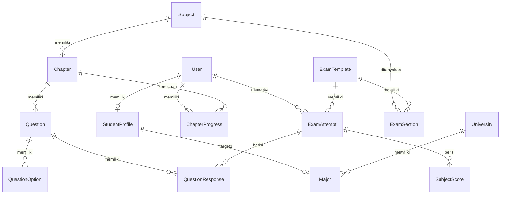

# BAB III. METODOLOGI PENELITIAN

## 3.1 Kerangka Pemikiran Sistem

Metodologi pengembangan Lexica mengacu pada pendekatan **Design Science Research (DSR)** yang bertujuan menghasilkan artefak (platform perangkat lunak) yang dapat menyelesaikan masalah nyata. Kerangka pemikiran sistem terdiri dari tiga lapisan utama:

### 3.1.1 Lapisan Masalah & Kebutuhan
- Identifikasi *feedback gap* pada platform TryOut konvensional
- Kebutuhan akan penilaian yang adil (IRT-based scoring)
- Permintaan estimasi peluang kelulusan yang terukur
- Rute belajar personal berbasis mastery learning

### 3.1.2 Lapisan Solusi & Arsitektur
- **AI Tutor Layer**: LLM Llama-3.3 melalui Groq API dengan scaffolding bertingkat
- **Assessment Layer**: IRT 1-PL untuk estimasi kemampuan (θ)
- **Analytics Layer**: Dashboard terintegrasi dengan radar chart, tren, dan chancing
- **Learning Layer**: Learning Path dengan mastery locking

### 3.1.3 Lapisan Implementasi & Evaluasi
- Pengembangan berbasis Next.js 16.2.6 (React 19) dengan App Router
- Integrasi Zustand untuk state management
- Pengujian fungsional (Black-Box Testing)
- Evaluasi kebergunaan (System Usability Scale)

---

## 3.2 Arsitektur Sistem

Arsitektur Lexica mengadopsi pola **Next.js App Router Architecture** dengan konsep file-system routing yang mendukung nested layouts dan server components.

### 3.2.1 Component-Based Architecture
```
src/
├── app/
│   ├── (app)/                 # Protected routes
│   │   ├── layout.tsx         # Main app layout with navigation
│   │   ├── dashboard/         # Dashboard page
│   │   ├── learning-path/     # Learning path page
│   │   ├── practice/[subjectId]/ # Subject practice
│   │   ├── analytics/         # Analytics dashboard (tabbed)
│   │   └── tutor/             # AI tutor page
│   └── api/
│       └── tutor/
│           └── ask/route.ts   # Groq API integration
├── lib/
│   ├── ai/scaffolding.ts      # Scaffolding prompt logic
│   ├── irt/scoring.ts         # IRT estimation algorithm
│   └── chancing/calculator.ts # Chancing engine algorithm
├── components/
│   └── ui/                    # Reusable UI components
└── stores/
    └── tutorChatStore.ts      # Zustand store for AI chat state
```

### 3.2.2 State Management Architecture
Sistem menggunakan **Zustand (v5)** dengan dua store utama:

**useTutorChatStore:**
- Mengelola `scaffoldLevel` (SOCRATIC/HINT/SOLUTION)
- Menyimpan `attemptsUsed` untuk tracking percobaan siswa
- Menyimpan riwayat pesan (`messages[]`) antara siswa dan AI
- Mengelola loading states dan error handling

**useCbtStore:**
- Mengelola `sectionTimeLeft` untuk timer subtes
- `currentQuestionIndex` dan navigasi soal
- `flaggedQuestions` untuk status ragu-ragu
- State progress ujian

---

## 3.3 Perancangan Basis Data (Database Design)

Basis data menggunakan **PostgreSQL** dengan skema Prisma yang dirancang untuk mendukung seluruh fungsionalitas sistem.

### 3.3.1 Entity Relationship Diagram


### 3.3.2 Tabel Kunci dan Relasi

**Tabel User:**
- Primary key: `id` (cuid)
- Fields: `name`, `email` (unique), `password` (hashed), `role`, `irtAbility`
- 1-1 relationship ke StudentProfile
- 1-Many relationship ke ExamAttempt dan ChapterProgress

**Tabel Question:**
- Primary key: `id` (cuid)
- Fields: `text` (with LaTeX support), `difficulty` (IRT parameter b), `discrimination`, `guessing`, `type`
- Foreign key ke Chapter
- 1-Many relationship ke QuestionOption

**Tabel TutoringSession & TutoringMessage:**
- Menyimpan percakapan AI Tutor per soal
- `level` field menyimpan level scaffolding saat ini
- `sessionId` mengarah ke questionId untuk konteks

---

## 3.4 Perancangan Antarmuka Pengguna (UI/UX Design)

### 3.4.1 Prinsip Desain Cognitive Load Theory
Antarmuka mengadopsi prinsip CLT dengan:
- **Konsolidasi Navigasi**: 5 menu utama (Dashboard, Belajar & Latihan, Try Out, Analitik & Evaluasi, Bantuan AI)
- **Zero-Friction Context Injection**: Metadata soal otomatis diinjeksi ke AI tanpa input manual
- **Nested Layout Analytics**: Tab navigasi di `/analytics` tanpa full-page reload
- **Micro-animasi**: Transisi halus dengan Framer Motion untuk menjaga fokus

### 3.4.2 Halaman Kunci

**Learning Path Page (`/(app)/learning-path/page.tsx`):**
- Grid 3 kolom kartu bab per subtes
- Status visual: COMPLETED (hijau), IN_PROGRESS (biru), NOT_STARTED (abu-abu)
- Mastery locking: bab terkunci jika bab sebelumnya belum selesai
- Tombol "Tanya AI" untuk akses Free Chat Mode

**Practice Page (`/(app)/practice/[subjectId]/page.tsx`):**
- Timer block per subtes
- Panel AI Tutor kontekstual
- Tombol aksi: "Coba Lagi", "Ragukan", "Lihat Solusi"
- Progress bar mastery level

**Analytics Dashboard (`/(app)/analytics/`):**
- Tab 1: Rapor & Tren (radar chart + line chart)
- Tab 2: Evaluasi Soal (bank soal salah)
- Tab 3: Peluang Lulus (chancing calculator)

---

## 3.5 Algoritma yang Digunakan

### 3.5.1 Estimasi Kemampuan IRT (Newton-Raphson)

```typescript
// src/lib/irt/scoring.ts
export function estimateTheta(responses: {difficulty: number, correct: boolean}[]): number {
  let theta = 0.0;
  const MAX_ITER = 50;
  const TOLERANCE = 0.001;
  
  for (let i = 0; i < MAX_ITER; i++) {
    let sumResidual = 0;
    let sumInfo = 0;
    
    for (const r of responses) {
      const p = 1 / (1 + Math.exp(-(theta - r.difficulty)));
      sumResidual += (r.correct ? 1 : 0) - p;
      sumInfo += p * (1 - p);
    }
    
    if (sumInfo === 0) break;
    const delta = sumResidual / sumInfo;
    theta += delta;
    
    if (Math.abs(delta) < TOLERANCE) break;
  }
  
  return Math.max(-3, Math.min(3, theta));
}
```

### 3.5.2 Chancing Engine Algorithm

```typescript
// src/lib/chancing/calculator.ts
export function calculateChance(
  studentScore: number,
  majorEstimated: number,
  competitiveness: number
): ChanceResult {
  const ratio = studentScore / majorEstimated;
  let percentage: number;
  let label: ChanceResult['label'];
  
  if (ratio >= 1.1) {
    percentage = Math.min(95, 80 + (ratio - 1.1) * 100);
    label = 'AMAN';
  } else if (ratio >= 1.0) {
    percentage = 60 + (ratio - 1.0) * 200;
    label = 'BERSAING';
  } else if (ratio >= 0.9) {
    percentage = 30 + (ratio - 0.9) * 300;
    label = 'SULIT';
  } else {
    percentage = Math.max(5, ratio * 30);
    label = 'SANGAT_SULIT';
  }
  
  const ketatFactor = Math.max(0.5, 1 - (competitiveness - 5) * 0.05);
  return {
    percentage: Math.round(Math.min(95, Math.max(5, percentage * ketatFactor))),
    label,
    deficit: Math.round(studentScore - majorEstimated),
    weakSubjects: [],
    recommendation: ''
  };
}
```

### 3.5.3 Scaffolding Prompt System

```typescript
// src/lib/ai/scaffolding.ts
export type ScaffoldLevel = 'SOCRATIC' | 'HINT' | 'SOLUTION'

const SCAFFOLD_PROMPTS: Record<ScaffoldLevel, string> = {
  SOCRATIC: `Kamu adalah tutor UTBK... JANGAN beri jawaban langsung. Ajukan 1-2 pertanyaan Socratic...`,
  HINT: `Kamu adalah tutor UTBK... Beri PETUNJUK PARSIAL: sebutkan konsep/rumus...`,
  SOLUTION: `Kamu adalah tutor UTBK... Berikan PENJELASAN LENGKAP...`
}
```

---

## 3.6 Metodologi Pengembangan

### 3.6.1 Pendekatan Pengembangan
- **Metode**: Iterative Development dengan pendekatan Agile
- **Platform**: Next.js 16.2.6 (React 19) dengan TypeScript
- **Version Control**: Git dengan struktur branch feature/master/main
- **Deployment Target**: Vercel atau platform cloud yang mendukung serverless

### 3.6.2 Tahapan Pengembangan
1. **Fase 1 - Foundation**: Setup Next.js, Prisma schema, autentikasi NextAuth
2. **Fase 2 - Core Features**: Implementasi CBT simulator, IRT scoring, question bank
3. **Fase 3 - AI Integration**: Integrasi Groq API, scaffolding system, free chat mode
4. **Fase 4 - Analytics**: Dashboard radar chart, chancing engine, learning path
5. **Fase 5 - Testing**: Black-box testing, SUS evaluation, bug fixes

### 3.6.3 API Endpoints
| Endpoint | Method | Fungsi |
|----------|--------|--------|
| `/api/tutor/ask` | POST | Mengirim pertanyaan ke AI Tutor (scaffolded/free chat) |
| `/api/learning-path` | GET | Mengambil data learning path personal siswa |
| `/api/analytics/*` | GET | Mengambil data analitik dan chancing |

---

## 3.7 Rencana Pengujian Sistem

### 3.7.1 Black-Box Testing
Pengujian fungsional terhadap fitur utama:
1. Autentikasi login/logout pengguna
2. Pengerjaan tryout dengan timer per subtes
3. Estimasi skor IRT dari respons jawaban
4. Scaffolding AI Tutor pada latihan soal
5. Free chat mode AI Tutor
6. Learning path generation berdasarkan skor
7. Chancing calculator dengan berbagai skenario ratio
8. Navigasi tab di dashboard analytics

### 3.7.2 System Usability Scale (SUS)
- Target skor minimum: 68 (acceptable)
- Responden: Siswa SMA, alumni, dan tutor
- Aspek yang dinilai: kegunaan, kemudahan penggunaan, kepuasan

---