# BAB III. METODE TUGAS AKHIR

## 3.1 Metode Penelitian
Pada platform Lexica ini, proses pengembangan sistem dilakukan menggunakan metode ADDIE (*Analysis, Design, Development, Implementation*, dan *Evaluation*). Metode ini dipilih karena memiliki tahapan yang sistematis sehingga memudahkan proses analisis, perancangan, pengembangan, implementasi, dan evaluasi sistem. Setiap tahapan dilakukan secara terstruktur sehingga hasil pengembangan dapat dievaluasi sebelum dilanjutkan ke tahap berikutnya. Dengan demikian, sistem yang dihasilkan diharapkan dapat berfungsi sesuai dengan tujuan penelitian.

*Gambar 3.1 Metode Penelitian ADDIE*
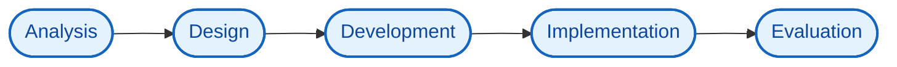
```mermaid
flowchart LR
    A([Analysis]) --> D1([Design])
    D1 --> D2([Development])
    D2 --> I([Implementation])
    I --> E([Evaluation])

    style A fill:#e3f2fd,stroke:#1565c0,stroke-width:2px,color:#0d47a1
    style D1 fill:#e3f2fd,stroke:#1565c0,stroke-width:2px,color:#0d47a1
    style D2 fill:#e3f2fd,stroke:#1565c0,stroke-width:2px,color:#0d47a1
    style I fill:#e3f2fd,stroke:#1565c0,stroke-width:2px,color:#0d47a1
    style E fill:#e3f2fd,stroke:#1565c0,stroke-width:2px,color:#0d47a1
```

Berdasarkan Gambar 3.1, tahapan yang dilakukan dalam pengembangan sistem adalah sebagai berikut:
1. **Analysis (Analisis Kebutuhan)**
   Pada tahap ini, penulis menentukan fitur-fitur pada sistem sesuai dengan rumusan masalah yang telah ditentukan. Prosesnya meliputi pengumpulan data, analisis kebutuhan pengguna, serta penentuan kebutuhan sistem, baik kebutuhan fungsional maupun kebutuhan non-fungsional. Tahapan analisis dilakukan secara menyeluruh agar sistem yang dikembangkan dapat berjalan sesuai dengan tujuan penelitian.
2. **Design System (Desain Sistem)**
   Tahapan berikutnya merancang sistem yang akan dikembangkan. Perancangan ini dibuat menggunakan *Unified Modeling Language* (UML), seperti *Use Case Diagram*, *Activity Diagram*, dan perancangan basis data. Perancangan ini dirancang untuk menggambarkan bagaimana pengguna (siswa dan superadmin) dapat berinteraksi dengan sistem. Selain itu, dalam tahap ini juga dirancang struktur basis data serta tampilan antarmuka agar platform Lexica mudah digunakan.
3. **Development (Pengembangan)**
   Pada tahapan ini, rancangan sistem yang telah dibuat sebelumnya diterapkan ke dalam bentuk kode program. Proses pengembangannya meliputi pembuatan logika di bagian *backend*, pengelolaan basis data menggunakan ORM (Prisma), serta pembuatan *frontend* yang interaktif agar sistem dapat berjalan dengan baik dan responsif menggunakan kerangka kerja Next.js.
4. **Implementation (Implementasi)**
   Pada tahapan ini, sistem yang telah dikembangkan di-*deploy* ke layanan peladen awan (*cloud serverless*) dan digunakan sesuai dengan skenario yang telah dirancang. Selanjutnya dilakukan pengujian oleh responden sesuai dengan perannya, yaitu siswa dan superadmin, untuk memastikan seluruh fitur dapat digunakan dengan baik sebelum dilakukan evaluasi.
5. **Evaluation (Evaluasi)**
   Pada tahap ini dilakukan evaluasi terhadap sistem yang telah dikembangkan melalui beberapa jenis pengujian, yaitu:
   * **Black-Box & Performance Testing:** Pengujian dilakukan untuk memastikan seluruh fungsi sistem berjalan sesuai dengan kebutuhan yang telah ditentukan. Pengujian mencakup fitur autentikasi, pengelolaan bank soal, Mode Belajar, Mode Ujian, AI Tutor, *Learning Analytics*, dan *Learning Path*. Selain itu, dilakukan *stress testing* (menggunakan Autocannon) untuk menguji ketahanan batas beban server (*throughput* dan *latency*).
   * **System Usability Scale (SUS):** Pengujian dilakukan untuk mengukur tingkat kemudahan penggunaan (*usability*) sistem berdasarkan penilaian responden yang terdiri atas siswa dan superadmin.
   * **Penetration Testing:** Pengujian keamanan dilakukan menggunakan OWASP ZAP untuk mengidentifikasi potensi kerentanan pada aplikasi *web*, seperti kesalahan konfigurasi keamanan, kelemahan autentikasi, *missing security headers*, serta potensi kerentanan lainnya. Hasil pengujian digunakan sebagai dasar evaluasi dan perbaikan keamanan sistem sebelum aplikasi digunakan.

## 3.2 Requirement Analysis (Analisis Kebutuhan)
Analisis kebutuhan sistem dilakukan melalui studi literatur dan analisis terhadap platform persiapan UTBK sejenis yang telah tersedia. Hasil analisis tersebut digunakan sebagai dasar dalam menyusun kebutuhan fungsional dan non-fungsional yang akan diimplementasikan pada aplikasi sehingga sistem yang dikembangkan sesuai dengan tujuan penelitian.

Pada tahap ini, kebutuhan sistem terbagi menjadi dua jenis, yaitu kebutuhan fungsional dan kebutuhan non-fungsional. Kebutuhan tersebut disusun berdasarkan fitur dan spesifikasi *Intelligent Tutoring System* (ITS) yang dikembangkan.

### 3.2.1 Kebutuhan Fungsional

**Aktor: Siswa**
*Tabel 3.1 Kebutuhan Fungsional Siswa*

| No. | Kebutuhan Fungsional |
|---|---|
| 1 | Siswa dapat melakukan registrasi dan *login* ke dalam sistem menggunakan kredensial email dan kata sandi. |
| 2 | Siswa dapat mengatur target jurusan Perguruan Tinggi Negeri (PTN) sebagai dasar perencanaan pembelajaran dan proyeksi peluang. |
| 3 | Siswa dapat melihat *dashboard* yang menampilkan capaian *Learning Overview*, proyeksi peluang lulus, target harian, peringkat pesaing (*leaderboard*), Top 3 kelemahan mapel, dan rekomendasi AI. |
| 4 | Siswa dapat menjelajahi *Learning Path* (Rute Belajar) yang diurutkan secara adaptif berdasarkan skor mata pelajaran terlemah dan bab dengan status "Butuh Perhatian". |
| 5 | Siswa dapat mengerjakan simulasi ujian yang terdiri dari Uji Diagnostik Awal, Try Out Standar, dan Try Out Adaptif yang dilengkapi pewaktu (*timer*), navigasi soal, dan penilaian berbasis IRT. |
| 6 | Siswa dapat memulai sesi Mode Belajar (Latihan Bab) mandiri dengan bantuan AI Tutor yang membatasi jumlah percobaan dan memberikan *hint* Socratic saat terjadi kesalahan. |
| 7 | Siswa dapat melihat analitik dan evaluasi yang mencakup Rapor & Tren Skor, daftar "Bank Soal Salah" (untuk dibahas kembali bersama AI), serta detail *Chancing Engine* (estimasi peluang kelulusan dan rekomendasi jurusan alternatif). |
| 8 | Siswa dapat mengakses *Ruang Tutor AI* untuk menanyakan soal eksternal dari sekolah/bimbel lain atau membahas kembali soal dari arsip Lexica secara interaktif. |
| 9 | Siswa dapat melihat riwayat *try out* dan mengevaluasi hasil ujian pasca-pengerjaan. |
| 10 | Siswa dapat mengelola profil dan mengubah informasi akun melalui halaman Pengaturan. |

**Aktor: Superadmin**
*Tabel 3.2 Kebutuhan Fungsional Superadmin*

| No. | Kebutuhan Fungsional |
|---|---|
| 1 | Superadmin dapat melakukan *login* ke dalam sistem. |
| 2 | Superadmin dapat melihat *dashboard* utama (Panel Kontrol Admin) yang menampilkan rekapitulasi data total siswa, soal, prodi, dan simulasi *try out* yang dikerjakan. |
| 3 | Superadmin dapat mengelola Bank Soal & Kurikulum, mencakup manajemen Mata Pelajaran, Bab (beserta Rangkuman Materi), dan Soal (termasuk bobot IRT) dengan fitur pencarian. |
| 4 | Superadmin dapat mengelola data pengguna (Manajemen User), mengubah hak akses (*role*), dan memantau estimasi kemampuan IRT ($\theta$) siswa. |
| 5 | Superadmin dapat mengelola data Universitas dan Program Studi (PTN) beserta informasi daya tampung kuota dan estimasi skor kelulusan. |
| 6 | Superadmin dapat mengelola paket ujian (Manajemen Tryout), termasuk mengatur *subtes* ujian dan durasi waktu simulasi. |
| 7 | Superadmin dapat melihat laporan Statistik Platform yang mencakup grafik aktivitas, distribusi skor, evaluasi performa subtes, dan daftar soal yang paling sering salah. |

**Kebutuhan Sistem Secara Umum**
*Tabel 3.3 Kebutuhan Fungsional Sistem*

| No. | Kebutuhan Fungsional |
|---|---|
| 1 | Sistem dapat memeriksa dan menilai jawaban ujian menggunakan algoritma pembobotan *Item Response Theory* (IRT) layaknya ujian SNBT asli untuk menghasilkan skor akhir. |
| 2 | Sistem dapat menampilkan simbol maupun rumus matematika menggunakan format LaTeX secara *real-time*. |
| 3 | Sistem dapat memberikan bantuan pembelajaran secara adaptif pada Mode Belajar, berupa AI Hint, AI Feedback, serta pembatasan jumlah percobaan menjawab (maksimal 2 kali percobaan). |
| 4 | Sistem menyediakan antarmuka *chat* AI Tutor yang bersifat modular dan global sehingga dapat diakses oleh siswa di berbagai halaman (*Dashboard*, *Learning Path*, Analitik, dll), kecuali pada saat pengerjaan Mode Ujian (*Try Out*). |
| 5 | Sistem dapat menghitung peluang kelulusan (*Chancing Engine*) secara algoritmis berdasarkan skor siswa dan tingkat keketatan prodi tujuan, serta memberikan rekomendasi prodi alternatif (sebagai tantangan atau pilihan aman). |
| 6 | Sistem dapat menyusun *Learning Path* dengan memberikan bobot ekstra pada mata pelajaran krusial sesuai rumpun jurusan (Saintek/Soshum) dan memprioritaskan bab yang berstatus "Butuh Perhatian". |
| 7 | Sistem dapat memperbarui tingkat penguasaan materi (*Mastery Tracking*) secara otomatis berdasarkan hasil pengerjaan siswa. |

### 3.2.2 Kebutuhan Non-Fungsional
Kebutuhan non-fungsional menggambarkan kualitas sistem secara keseluruhan dan tidak dikaitkan dengan aktor tertentu, antara lain:
1. Sistem dirancang menggunakan arsitektur *serverless* agar dapat melakukan penskalaan (*scaling*) otomatis dan melayani ratusan interaksi pengguna per detik (di atas 140 req/sec) tanpa kendala *timeout*.
2. Sistem memanfaatkan mekanisme *edge caching* untuk mendistribusikan data statis secara instan dengan waktu muat kurang dari 20 milidetik.
3. Sistem tetap dapat digunakan secara mandiri untuk berlatih meskipun terdapat kendala koneksi pada layanan eksternal *artificial intelligence* (melalui komponen antarmuka *Fallback Hint* pengganti *chat*).
4. Antarmuka sistem dibuat dengan memperhatikan kemudahan penggunaan (*user-friendly*) agar setiap pengguna dapat mengoperasikan sistem dengan interaktif dan efisien.
5. Keamanan data dijaga dengan menerapkan enkripsi kata sandi menggunakan pustaka `bcryptjs` dan proteksi sesi menggunakan standar Auth.js.

## 3.3 Desain Sistem
Bagian ini menjelaskan perancangan sistem yang akan dikembangkan berdasarkan hasil analisis kebutuhan yang telah dilakukan sebelumnya. Perancangan ini bertujuan untuk memberikan gambaran mengenai bagaimana sistem akan bekerja, baik dari sisi proses, pengelolaan data, maupun tampilan antarmuka yang digunakan oleh pengguna. Dalam penelitian ini, perancangan sistem dibagi menjadi beberapa pendekatan utama, yaitu:

### 3.3.1 Pemodelan Sistem dengan Unified Modeling Language (UML)
Pada tahapan perancangan, penulis menggunakan pendekatan berbasis objek dengan *Unified Modeling Language* (UML). UML dipakai untuk menggambarkan dan mendokumentasikan alur kerja *Intelligent Tutoring System* (ITS) ini berjalan. Beberapa diagram UML yang digunakan antara lain:
1. **Use Case Diagram:** digunakan untuk menggambarkan hubungan antara pengguna dengan sistem yang dibuat. Diagram ini menunjukkan fitur-fitur yang dapat digunakan oleh pengguna serta interaksi yang terjadi di dalam sistem.
2. **Activity Diagram:** digunakan untuk menjelaskan alur proses yang berjalan di dalam sistem. Diagram ini membantu menggambarkan urutan aktivitas pengguna, mulai dari awal hingga akhir proses. Dalam penelitian ini, Activity Diagram digunakan untuk menggambarkan proses *login*, proses pengerjaan soal, hingga proses sistem memberikan hasil evaluasi kepada pengguna.

### 3.3.2 Arsitektur Sistem
Arsitektur sistem digunakan untuk menggambarkan hubungan antar komponen utama yang membangun aplikasi. Pada penelitian ini, sistem dikembangkan menggunakan arsitektur berbasis *web* modern dengan **Next.js (App Router)** sebagai *framework full-stack* utama, **Prisma ORM** sebagai penghubung basis data, dan **PostgreSQL (Neon Serverless DB)** sebagai penyimpanan data utama. Layanan autentikasi menggunakan standar keamanan Auth.js dengan enkripsi bcryptjs.

Selain itu, sistem juga terintegrasi dengan layanan **Groq API** sebagai penyedia *Large Language Model* (LLM) untuk memproses logika *Socratic Scaffolding*. Pemrosesan instruksi sistem (*system prompt*) dilakukan di sisi *backend* (API Route) agar API Key Groq tetap aman dan tidak terekspos ke klien.

*Gambar 3.2 Arsitektur Sistem*
```mermaid
flowchart TD
    subgraph Client [Klien / Frontend]
        U((Siswa / Admin)) --> UI[Browser / Web UI]
        UI <--> State[(State Lokal: Zustand)]
    end

    subgraph Server [Backend / API Server]
        UI -- HTTP Request --> NextJS[Next.js App Router]
        NextJS -- Validasi & Auth --> Auth[Auth.js]
        NextJS <--> API[API Routes]
    end

    subgraph Database [Database Layer]
        API <--> Prisma[Prisma ORM]
        Prisma <--> DB[(PostgreSQL / Neon DB)]
    end

    subgraph AI [Layanan Pihak Ketiga]
        API -- "Prompt LLM" --> Groq[Groq API (llama-3.1-8b)]
        Groq -- "Socratic Response" --> API
    end

    style NextJS fill:#f9f9f9,stroke:#333,stroke-width:2px
    style Groq fill:#e1bee7,stroke:#8e24aa,stroke-width:2px
    style DB fill:#c8e6c9,stroke:#388e3c,stroke-width:2px
    style State fill:#fff9c4,stroke:#fbc02d,stroke-width:2px
```

Berdasarkan Gambar 3.2, arsitektur sistem menggambarkan alur komunikasi antar komponen utama pada platform Lexica, terutama alur pemrosesan data dari sudut pandang pengguna. Pengguna (siswa dan superadmin) berinteraksi dengan aplikasi melalui peramban web (*browser*). Pada lapisan *Frontend*, aplikasi menggunakan pengelolaan *state* lokal (Zustand) untuk mengelola data sementara secara responsif, seperti antarmuka obrolan AI, *timer*, maupun perpindahan navigasi soal.

Ketika pengguna melakukan tindakan (seperti mengirim jawaban ujian atau menyimpan pengaturan profil), permintaan (*request*) dikirimkan melalui protokol HTTP menuju server Next.js (lapisan *Backend*). Di sini, Auth.js akan memvalidasi sesi keamanan pengguna, lalu API Routes memproses logika bisnis terkait. Apabila data harus disimpan atau diambil secara permanen, API Routes berkomunikasi dengan PostgreSQL (Neon DB) secara efisien melalui Prisma ORM.

Di sisi lain, untuk pemrosesan *Intelligent Tutoring System*, API Routes di *backend* akan menyusun instruksi (*prompt*) secara tertutup agar kredensial API Key tidak terekspos ke publik. Instruksi tersebut kemudian dikirimkan secara asinkron ke Groq API. Layanan kecerdasan buatan kemudian mengembalikan respons Sokratik yang diteruskan oleh *backend* kepada antarmuka pengguna secara *real-time*. Apabila layanan Groq API mengalami gangguan, sistem akan memicu penyangga gagal-aman (*fail-safe fallback*) di *frontend* agar siswa dapat beralih ke Mode Pembahasan Mandiri.

### 3.3.3 Perancangan AI Tutor
Perancangan AI Tutor dilakukan untuk menjelaskan mekanisme kerja komponen ITS yang digunakan pada Mode Belajar. Pada bagian ini dijelaskan bagaimana AI Tutor memproses jawaban siswa, menentukan strategi bimbingan berdasarkan jumlah percobaan (*attempt count*), serta menyusun *prompt* sebelum dikirimkan ke LLM. Selain itu, bagian ini juga membahas komponen pendukung seperti *Prompt Builder*, *Rule-Based Strategy Selector*, *Zero-Friction Context Injection*, *Mastery Tracking*, dan *Learning Path* yang bekerja bersama untuk menghasilkan pengalaman belajar yang adaptif sesuai dengan kemampuan masing-masing siswa.

#### 3.3.3.1 Flowchart / Use Case AI Tutor
AI Tutor dirancang sebagai komponen utama dalam *Intelligent Tutoring System* (ITS) yang bertugas memberikan bimbingan kepada siswa selama proses pembelajaran. Mekanisme pengoperasian AI Tutor ini digambarkan melalui sebuah alur atau *flowchart* proses pengambilan keputusan. Ketika siswa mengirimkan jawaban, sistem terlebih dahulu mengevaluasi kebenaran jawaban siswa dan mengumpulkan informasi yang dibutuhkan, seperti soal, jawaban siswa, jumlah percobaan (*attempt count*), serta kunci jawaban yang benar. Selanjutnya, kondisi jawaban digunakan oleh *Rule-Based Strategy Selector* untuk menentukan alur bimbingan yang akan diberikan secara Sokratik. Setelah itu, *Prompt Builder* menyusun instruksi (*prompt*) yang dikirimkan ke LLM (Groq API). Apabila layanan Groq API terputus, sistem akan mengalihkan ke *Fallback Hint* sebagai penyangga.

*Gambar 3.3 Flowchart Proses AI Tutor*
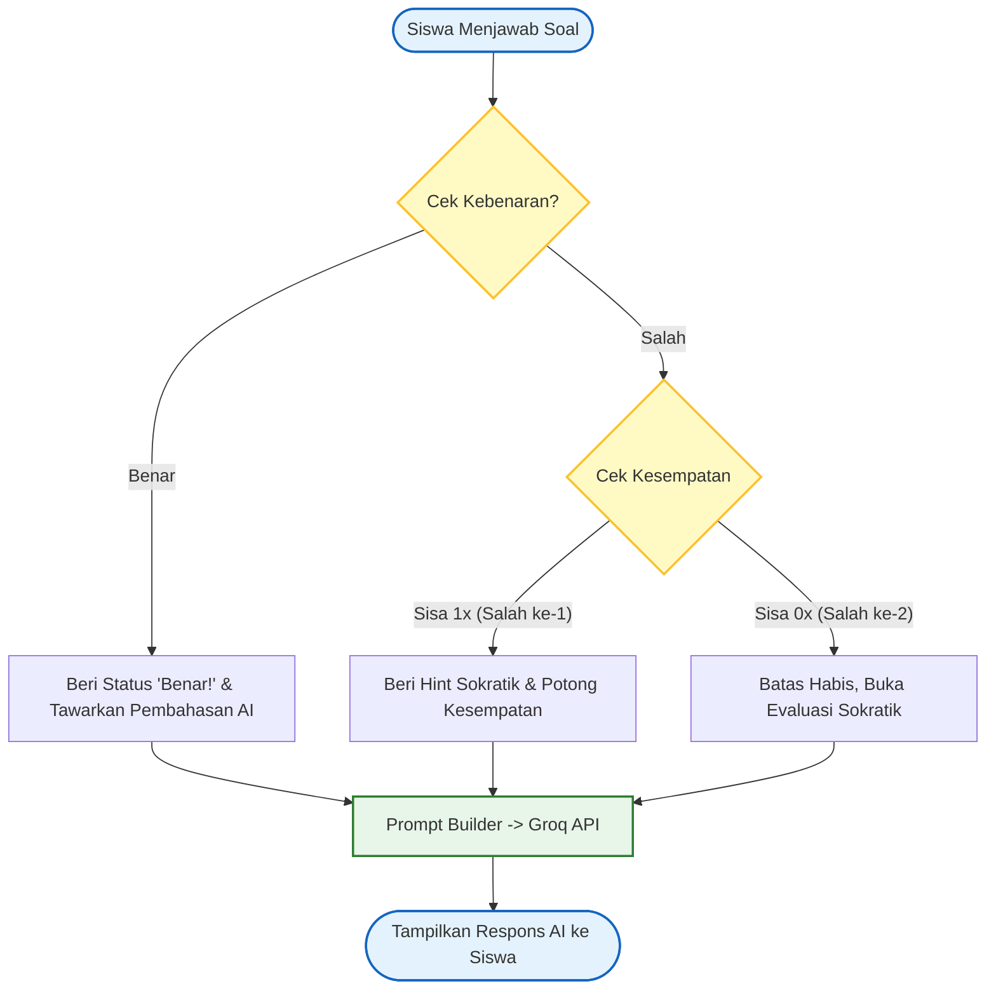
```mermaid
flowchart TD
    Start([Siswa Menjawab Soal]) --> Cek{Cek Kebenaran?}
    Cek -- Benar --> RBenar[Beri Status 'Benar!' & Tawarkan Pembahasan AI]
    Cek -- Salah --> CekAtpt{Cek Kesempatan}
    
    CekAtpt -- "Sisa 1x (Salah ke-1)" --> RHint[Beri Hint Sokratik & Potong Kesempatan]
    CekAtpt -- "Sisa 0x (Salah ke-2)" --> RLimit[Batas Habis, Buka Evaluasi Sokratik]

    RBenar --> API[Prompt Builder -> Groq API]
    RHint --> API
    RLimit --> API
    
    API --> Output([Tampilkan Respons AI ke Siswa])

    style Start fill:#e3f2fd,stroke:#1565c0,stroke-width:2px
    style Cek fill:#fff9c4,stroke:#fbc02d,stroke-width:2px
    style CekAtpt fill:#fff9c4,stroke:#fbc02d,stroke-width:2px
    style API fill:#e8f5e9,stroke:#2e7d32,stroke-width:2px
    style Output fill:#e3f2fd,stroke:#1565c0,stroke-width:2px
```

#### 3.3.3.2 Prompt Builder
*Prompt Builder* merupakan komponen yang bertugas menyusun instruksi (*prompt*) berdasarkan kondisi pembelajaran siswa. Informasi yang dimasukkan ke dalam *prompt* meliputi soal, jawaban siswa, jawaban benar, serta strategi bimbingan yang telah dipilih oleh sistem. *Prompt* kemudian dikirimkan ke LLM agar menghasilkan respons yang sesuai dengan kondisi siswa. 

Untuk mendukung proses pembelajaran yang berpusat pada siswa, *Prompt Builder* menerapkan mekanisme **Zero-Friction Context Injection**. Pada mekanisme ini, kunci jawaban yang benar dikirimkan ke LLM di sisi *backend* agar AI mampu memberikan umpan balik yang sangat kontekstual dan spesifik. Namun, di sisi antarmuka (UI) klien, kunci jawaban tersebut di-*masking* menjadi `???` sehingga siswa tidak pernah melihat kunci jawaban secara langsung sebelum batas percobaan habis. Mekanisme ini mengeliminasi *extraneous cognitive load* karena siswa tidak perlu mengetik ulang soal untuk berdiskusi dengan AI.

Selain itu, *Prompt Builder* juga menerima data program studi tujuan utama siswa (`targetMajor1`) dan menyisipkannya ke dalam konteks *prompt* sebagai motivasi makro, agar AI sesekali menghubungkan relevansi soal dengan cita-cita jurusan siswa.

#### 3.3.3.3 Rule-Based Strategy Selector
*Rule-Based Strategy Selector* merupakan komponen pada AI Tutor yang berfungsi menentukan strategi bimbingan bertingkat (dikelola melalui *state* `useTutorChatStore`) sebelum permintaan dikirimkan ke LLM. Komponen ini menerapkan pendekatan *rule-based system* dengan menggunakan jumlah percobaan sebagai dasar pengambilan keputusan.

*Tabel 3.4 Aturan Pemilihan Strategi Bimbingan AI Tutor*

| Jumlah Percobaan | Level Scaffold | Strategi Bimbingan |
|---|---|---|
| **Salah 1x** | SOCRATIC | AI memberikan pertanyaan pemandu (*Socratic question*) untuk memicu pemikiran kritis. Jawaban akhir tidak diberikan. |
| **Salah 2x** (Batas percobaan habis) | SOLUTION | AI mengakhiri sesi pertanyaan karena batas percobaan habis, dan memberikan opsi pembahasan komprehensif yang terstruktur beserta kunci jawaban dibuka. |

Berdasarkan Tabel 3.4, sistem menentukan strategi bimbingan berdasarkan jumlah percobaan yang dilakukan siswa. Apabila siswa melakukan kesalahan pada percobaan pertama, AI Tutor memberikan SOCRATIC (pertanyaan pemandu) sebagai petunjuk awal tanpa langsung memberikan jawaban. Jika siswa masih belum berhasil menjawab dengan benar setelah percobaan kedua (batas percobaan habis), AI Tutor akan mengakhiri sesi pengerjaan dan mempersilakan siswa mengakses pembahasan lengkap (SOLUTION). Pergantian level ini merupakan penerapan *instructional scaffolding*, yaitu pemberian bantuan yang disesuaikan dengan kondisi belajar siswa.

#### 3.3.3.4 Struktur Penjelasan Level SOLUTION
Untuk menjamin kualitas pemahaman, LLM diinstruksikan melalui *Prompt Builder* agar memberikan respons terstruktur pada level SOLUTION dalam format berikut:
1. **Konsep yang Diuji** — identifikasi konsep atau teori inti di balik soal.
2. **Langkah Penyelesaian** — penjelasan langkah demi langkah pemecahan soal secara logis.
3. **Kesalahan Umum** — mengidentifikasi jebakan soal yang sering mengecoh siswa.
4. **Soal Latihan Serupa** — satu soal buatan AI yang serupa untuk memperkuat pemahaman (*active recall*).

#### 3.3.3.5 AI Hint dan AI Feedback
AI Tutor menghasilkan dua jenis keluaran yang digunakan untuk mendukung proses pembelajaran, yaitu AI Hint dan AI Feedback. AI Hint diberikan ketika siswa masih mengalami kesulitan dalam menjawab soal pada Mode Belajar. Bentuk bantuan yang diberikan disesuaikan dengan level *scaffold* yang telah dipilih oleh *Rule-Based Strategy Selector*, yaitu berupa pertanyaan pemandu (SOCRATIC), petunjuk parsial (HINT), atau pembahasan lengkap (SOLUTION).

AI Feedback diberikan setelah siswa menyelesaikan suatu soal. Umpan balik ini berisi penjelasan mengenai jawaban siswa, konsep yang digunakan, serta alasan mengapa jawaban tersebut benar atau kurang tepat sehingga siswa dapat memahami letak kesalahannya.

#### 3.3.3.6 Modularitas Antarmuka AI Tutor (Global Chat Panel)
Antarmuka *chat* AI Tutor dirancang sebagai komponen modular dan global yang dikelola menggunakan pustaka *state management* (seperti Zustand). Pendekatan ini memungkinkan panel *chat* AI untuk tetap aktif dan dapat diakses dari hampir seluruh halaman aplikasi (seperti *Dashboard*, *Learning Path*, Analitik, maupun Ruang Tutor AI) tanpa terputus ketika pengguna berpindah halaman. Fleksibilitas ini memastikan bahwa siswa dapat kapan saja berkonsultasi mengenai materi, strategi belajar, maupun evaluasi soal. Satu-satunya pengecualian adalah pada halaman pengerjaan ujian (*Try Out*), di mana komponen AI Tutor akan dikunci secara otomatis untuk menjaga integritas dan objektivitas evaluasi penilaian mandiri siswa.

#### 3.3.3.7 Mastery Tracking
*Mastery Tracking* merupakan komponen pada sistem yang berfungsi memantau tingkat penguasaan materi setiap siswa secara spesifik per bab. Sistem menggunakan tabel `ChapterProgress` pada basis data untuk mencatat status penguasaan tiap bab dengan label: Dikuasai (*mastery* ≥ 70%), Sedang Dipelajari (*mastery* > 0% tetapi < 70%), dan Belum Mulai (belum ada aktivitas). Nilai *mastery* dihitung berdasarkan akumulasi hasil pengerjaan siswa dengan persamaan berikut:

$$ Mastery = \left( \frac{\text{Total Jawaban Benar}}{\text{Total Soal}} \right) \times 100\% $$

Nilai *mastery* diperbarui secara otomatis setelah siswa menyelesaikan sesi latihan bab, sehingga nilai yang digunakan pada sesi berikutnya merupakan hasil akumulasi pembelajaran sebelumnya. Fitur ini terintegrasi langsung dengan *Learning Path* untuk menyusun prioritas belajar.

#### 3.3.3.8 Learning Path (Rute Belajar Personal)
*Learning Path* merupakan fitur yang memberikan rekomendasi rute materi belajar yang disesuaikan secara personal berdasarkan hasil Uji Diagnostik dan *Try Out* siswa. Tujuan dari fitur ini adalah membantu siswa menambal kekurangan pada materi yang paling lemah agar pembelajaran lebih terarah dan efisien.

Untuk menentukan urutan prioritas bab, sistem menerapkan algoritma pengurutan multi-tingkat:
1. **Pembobotan Rumpun Jurusan:** Sistem mengidentifikasi target jurusan siswa (misalnya Soshum atau Saintek) dan memberikan bobot ekstra (contoh: 1.5x) pada mata pelajaran krusial seperti Literasi Bahasa Indonesia dan Literasi Bahasa Inggris, sehingga mata pelajaran ini mendapat penekanan lebih.
2. **Prioritas Kelemahan Mata Pelajaran:** Mata pelajaran dengan skor asli (skor ujian terkalibrasi) terendah akan ditarik secara otomatis ke urutan paling atas dari struktur *Learning Path* agar siswa fokus memperbaiki nilai terlemahnya terlebih dahulu.
3. **Klasifikasi Status Bab:** Di dalam setiap mata pelajaran, bab diklasifikasikan dan diurutkan berdasarkan status prioritas berikut:
   - **Butuh Perhatian (Prioritas 1):** Bab-bab yang sering dijawab salah oleh siswa pada sesi *Try Out* sebelumnya.
   - **Belum Mulai (Prioritas 2):** Bab-bab yang belum pernah dieksplorasi atau dilatih oleh siswa.
   - **Sedang Dipelajari / Selesai (Prioritas 3):** Bab yang sedang atau sudah dikerjakan dan mencapai ketuntasan tertentu.
   - **Terkunci:** Bab lanjutan yang belum dapat diakses sebelum siswa menyelesaikan fondasi bab sebelumnya.

Dengan mekanisme tersebut, materi yang paling menjadi kelemahan siswa (*Butuh Perhatian*) akan selalu direkomendasikan di urutan teratas, menghilangkan kebingungan siswa dalam menentukan prioritas belajar.

#### 3.3.3.9 Logging dan Pemantauan Pemrosesan AI
Sebagai langkah pengawasan sistematis, seluruh proses eksekusi agen AI (mulai dari *Prompt Builder*, penyesuaian level strategi, injeksi variabel *Zero-Friction Context*, pengiriman parameter ke Groq API, hingga *output* respons Sokratik dan latensi waktu *generate*) didokumentasikan sepenuhnya ke dalam bentuk **Log Proses AI yang tertampil secara lengkap di *Terminal Server*** (untuk kebutuhan pengembangan lokal). Selain di terminal lokal, **log web** ini juga direkam dan dapat dipantau langsung pada lingkungan *production* melalui antarmuka **Runtime Logs pada *dashboard cloud hosting*** (misalnya Vercel Logs). Keberadaan *log* di *backend server* maupun *dashboard cloud* ini memfasilitasi pihak pengembang (atau superadmin teknis) untuk melakukan pelacakan rekam jejak yang mendetail guna keperluan *debugging*, optimisasi efisiensi token, serta memastikan transparansi alur kognisi yang diproses oleh AI Tutor sebelum disajikan kepada pengguna.

### 3.3.4 Use Case Diagram
*Gambar 3.4 Use Case Diagram Sistem*
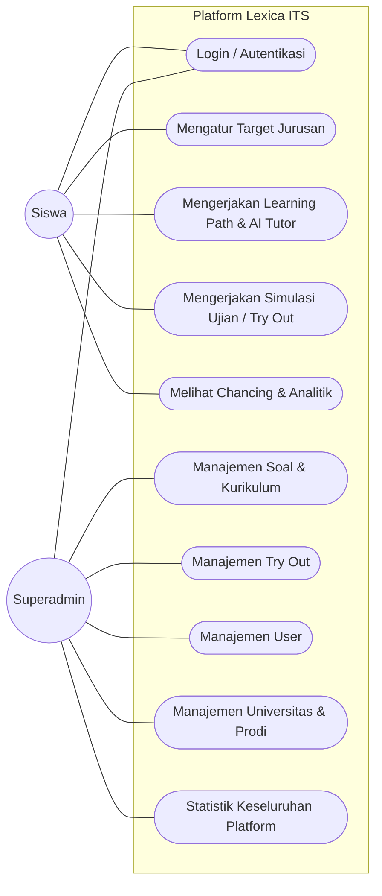
```mermaid
flowchart LR
    Siswa((Siswa))
    Admin((Superadmin))

    subgraph Platform Lexica ITS
        UC1([Login / Autentikasi])
        UC2([Mengatur Target Jurusan])
        UC3([Mengerjakan Learning Path & AI Tutor])
        UC4([Mengerjakan Simulasi Ujian / Try Out])
        UC5([Melihat Chancing & Analitik])
        
        UC6([Manajemen Soal & Kurikulum])
        UC7([Manajemen Try Out])
        UC8([Manajemen User])
        UC9([Manajemen Universitas & Prodi])
        UC10([Statistik Keseluruhan Platform])
    end

    Siswa --- UC1
    Siswa --- UC2
    Siswa --- UC3
    Siswa --- UC4
    Siswa --- UC5

    Admin --- UC1
    Admin --- UC6
    Admin --- UC7
    Admin --- UC8
    Admin --- UC9
    Admin --- UC10
```

Berdasarkan Gambar 3.4, dijelaskan *Use Case Diagram* yang menggambarkan fungsionalitas pada platform Lexica berbasis *Intelligent Tutoring System* (ITS). Diagram ini menunjukkan aktor yang berinteraksi dengan sistem beserta fungsi-fungsi yang dapat diakses sesuai dengan hak akses masing-masing.

**1. Aktor Utama (Pengguna Sistem)**
Terdapat 2 aktor utama yang berinteraksi dengan sistem:
* **Siswa** — Siswa dapat melakukan autentikasi, mengatur profil dan target jurusan, mengerjakan simulasi pada Mode Belajar (didampingi AI Tutor) maupun Mode Ujian (tanpa AI), mengakses halaman analitik personal (radar, tren, evaluasi, chancing), serta mengakses halaman riwayat pembelajaran dan *Learning Path*.
* **Superadmin** — Superadmin memiliki kendali penuh terhadap manajemen seluruh mata pelajaran, bank soal global, monitoring aktivitas seluruh pengguna, serta pengelolaan data universitas, jurusan, dan hak akses akun.

**2. Relasi Include dan Extend**
* **Relasi include:** Sebagian besar *use case* memiliki relasi *include* terhadap Login. Hal ini menunjukkan bahwa pengguna harus melakukan autentikasi terlebih dahulu sebelum dapat mengakses seluruh fitur yang tersedia pada sistem.
* **Relasi extend:** *Use case* Logout memiliki relasi *extend* terhadap Login, yang menunjukkan bahwa pengguna dapat mengakhiri sesi penggunaan sistem setelah berhasil melakukan *login*.

**3. Fungsionalitas Berdasarkan Aktor**
Fungsionalitas Siswa:
* Mengatur target belajar dan memilih target jurusan PTN impian.
* Melihat *dashboard* ringkasan yang mencakup *Learning Overview*, peringkat pesaing, dan top 3 kelemahan.
* Memulai Mode Belajar (Latihan Soal per Bab) melalui *Learning Path* yang didampingi AI Tutor.
* Mengerjakan Mode Ujian yang mencakup Uji Diagnostik Awal, Try Out Standar, dan Try Out Adaptif.
* Melihat Analitik & Evaluasi yang mencakup fitur *Chancing Engine* (Peluang Lulus) dan Bank Soal Salah.
* Mengakses Ruang Tutor AI untuk melakukan konsultasi mandiri terkait soal dari luar sistem atau membahas kembali soal yang sudah berlalu.
* Mengubah informasi akun melalui fitur Pengaturan.

Fungsionalitas Superadmin:
* Melihat *dashboard* utama (Panel Kontrol Admin).
* Mengelola Bank Soal & Kurikulum (Mata Pelajaran, Bab beserta Rangkuman Materi, dan Rincian Soal).
* Mengelola data pengguna (Manajemen User) dan memantau nilai kemampuan IRT siswa.
* Mengelola data Universitas & Jurusan (PTN).
* Mengelola paket ujian (Manajemen Tryout) beserta *subtes* dan alokasi waktu.
* Melihat laporan Statistik Platform (grafik aktivitas, distribusi skor, dan soal paling sering salah).

### 3.3.5 Activity Diagram

#### 3.3.5.1 Activity Diagram Umum

**1. Daftar Akun Baru (Register)**
*Gambar 3.4a Activity Diagram Register*
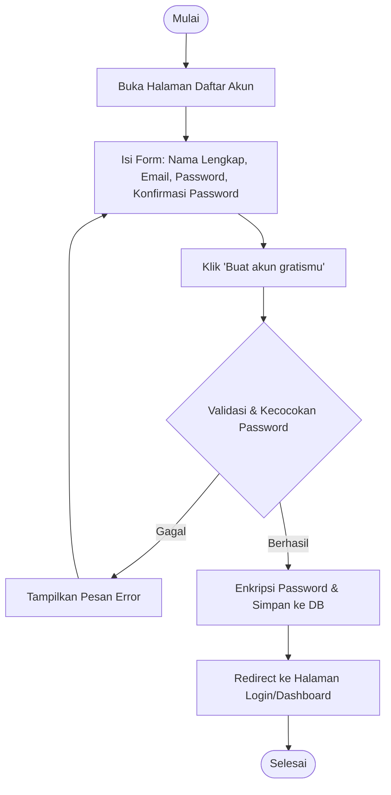
```mermaid
flowchart TD
    A([Mulai]) --> B[Buka Halaman Daftar Akun]
    B --> C[Isi Form: Nama Lengkap, Email, Password, Konfirmasi Password]
    C --> D[Klik 'Buat akun gratismu']
    D --> E{Validasi & Kecocokan Password}
    E -- Gagal --> F[Tampilkan Pesan Error]
    F --> C
    E -- Berhasil --> G[Enkripsi Password & Simpan ke DB]
    G --> H[Redirect ke Halaman Login/Dashboard]
    H --> I([Selesai])
```
Proses pendaftaran dimulai ketika calon pengguna membuka halaman Daftar Akun Baru. Pengguna harus mengisi informasi esensial berupa Nama Lengkap, Email, Password, dan mengulang konfirmasi Password. Sistem akan memvalidasi kesesuaian sandi dan mengecek apakah email sudah terdaftar. Jika berhasil, sistem melakukan enkripsi dan menyimpan akun baru ke basis data.

**2. Login**
*Gambar 3.5 Activity Diagram Login*
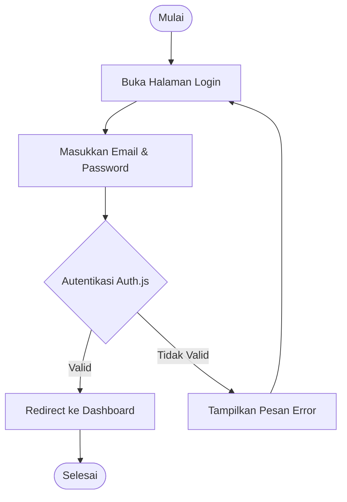
```mermaid
flowchart TD
    A([Mulai]) --> B[Buka Halaman Login]
    B --> C[Masukkan Email & Password]
    C --> D{Autentikasi Auth.js}
    D -- Valid --> E[Redirect ke Dashboard]
    D -- Tidak Valid --> F[Tampilkan Pesan Error]
    F --> B
    E --> G([Selesai])
```
Gambar 3.5 menjelaskan proses *login* pengguna ke dalam sistem. Proses dimulai ketika pengguna membuka halaman *login*, kemudian memasukkan email dan kata sandi untuk proses autentikasi. Sistem akan memverifikasi data yang dimasukkan menggunakan Auth.js. Apabila proses autentikasi berhasil, sistem akan mengarahkan pengguna ke *dashboard* sesuai dengan peran (*role*). Jika gagal, sistem akan menampilkan pesan kesalahan dan mengarahkan kembali ke halaman *login*.

**2. Memperbarui Profil**
*Gambar 3.6 Activity Diagram Memperbarui Profil*
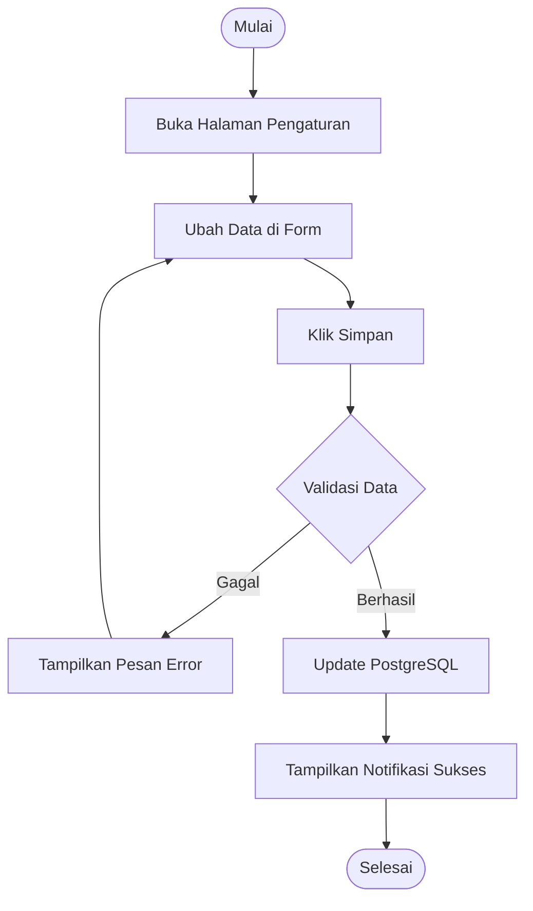
```mermaid
flowchart TD
    A([Mulai]) --> B[Buka Halaman Pengaturan]
    B --> C[Ubah Data di Form]
    C --> D[Klik Simpan]
    D --> E{Validasi Data}
    E -- Gagal --> F[Tampilkan Pesan Error]
    F --> C
    E -- Berhasil --> G[Update PostgreSQL]
    G --> H[Tampilkan Notifikasi Sukses]
    H --> I([Selesai])
```
Menggambarkan proses pengguna dalam memperbarui informasi akun melalui halaman Pengaturan. Sistem menyimpan data yang telah diperbarui ke dalam basis data PostgreSQL sehingga informasi profil pengguna berhasil diperbarui.

#### 3.3.5.2 Activity Diagram Siswa
Berikut adalah rincian fungsionalitas dan alur interaksi terperinci berdasarkan aktivitas aktor Siswa:

**1. Activity Diagram Lihat Learning Overview**
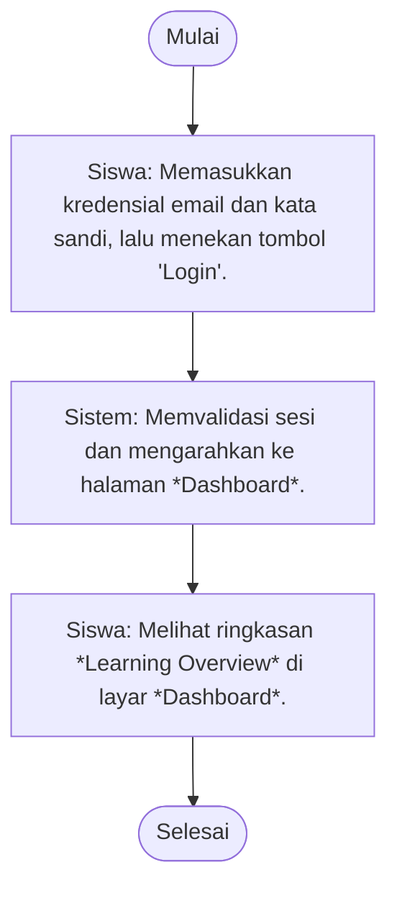
```mermaid
flowchart TD
    Start([Mulai]) --> A
    A[Siswa: Memasukkan kredensial email dan kata sandi, lalu menekan tombol 'Login'.]
    B[Sistem: Memvalidasi sesi dan mengarahkan ke halaman *Dashboard*.]
    A --> B
    C[Siswa: Melihat ringkasan *Learning Overview* di layar *Dashboard*.]
    B --> C
    C --> End([Selesai])
```

**2. Activity Diagram Lihat Learning Path**
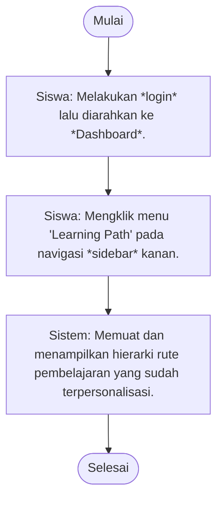
```mermaid
flowchart TD
    Start([Mulai]) --> A
    A[Siswa: Melakukan *login* lalu diarahkan ke *Dashboard*.]
    B[Siswa: Mengklik menu 'Learning Path' pada navigasi *sidebar* kanan.]
    A --> B
    C[Sistem: Memuat dan menampilkan hierarki rute pembelajaran yang sudah terpersonalisasi.]
    B --> C
    C --> End([Selesai])
```

**3. Activity Diagram Mengerjakan Latihan Bab**
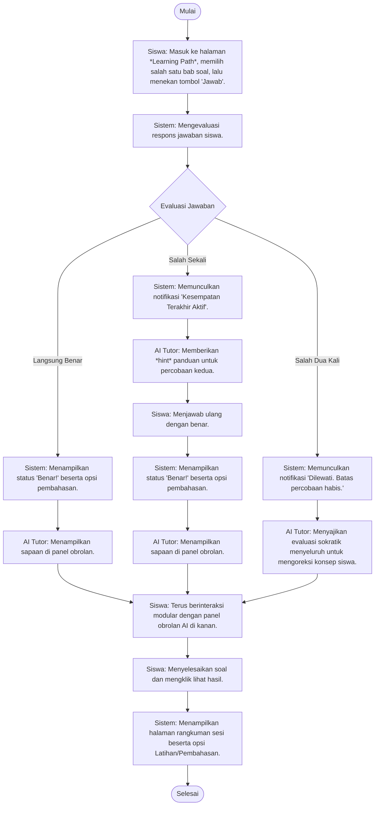
```mermaid
flowchart TD
    Start([Mulai]) --> A[Siswa: Masuk ke halaman *Learning Path*, memilih salah satu bab soal, lalu menekan tombol 'Jawab'.]
    A --> B[Sistem: Mengevaluasi respons jawaban siswa.]
    B --> C{Evaluasi Jawaban}
    
    C -- "Langsung Benar" --> D1[Sistem: Menampilkan status 'Benar!' beserta opsi pembahasan.]
    D1 --> D2[AI Tutor: Menampilkan sapaan di panel obrolan.]
    
    C -- "Salah Sekali" --> E1[Sistem: Memunculkan notifikasi 'Kesempatan Terakhir Aktif'.]
    E1 --> E2[AI Tutor: Memberikan *hint* panduan untuk percobaan kedua.]
    E2 --> E3[Siswa: Menjawab ulang dengan benar.]
    E3 --> E4[Sistem: Menampilkan status 'Benar!' beserta opsi pembahasan.]
    E4 --> E5[AI Tutor: Menampilkan sapaan di panel obrolan.]
    
    C -- "Salah Dua Kali" --> F1[Sistem: Memunculkan notifikasi 'Dilewati. Batas percobaan habis.']
    F1 --> F2[AI Tutor: Menyajikan evaluasi sokratik menyeluruh untuk mengoreksi konsep siswa.]
    
    D2 --> G[Siswa: Terus berinteraksi modular dengan panel obrolan AI di kanan.]
    E5 --> G
    F2 --> G
    
    G --> H[Siswa: Menyelesaikan soal dan mengklik lihat hasil.]
    H --> I[Sistem: Menampilkan halaman rangkuman sesi beserta opsi Latihan/Pembahasan.]
    I --> End([Selesai])
```

**4. Activity Diagram Lihat Pembahasan Dari Hasil Belajar**
```mermaid
flowchart TD
    Start([Mulai]) --> A
    A[Siswa: (Melanjutkan dari rekapitulasi 'Sesi Selesai!') Mengklik tombol 'Lihat Pembahasan'.]
    B[Sistem: Menampilkan panel navigasi evaluasi soal (Review Mode).]
    A --> B
    C[Siswa: Dapat mengklik tombol untuk menanyakan pembahasan lebih lanjut ke AI Tutor secara modular jika diperlukan.]
    B --> C
    C --> End([Selesai])
```

**5. Activity Diagram Ulangi Latihan**
```mermaid
flowchart TD
    Start([Mulai]) --> A
    A[Siswa: (Dari laman 'Sesi Selesai!') Mengklik tombol 'Ulangi Latihan'.]
    B[Sistem: Mengatur ulang sesi dan mengembalikan siswa untuk mengerjakan set *Latihan Bab* yang sama dari awal.]
    A --> B
    B --> End([Selesai])
```

**6. Activity Diagram Pilih Subtes Lain**
```mermaid
flowchart TD
    Start([Mulai]) --> A
    A[Siswa: (Dari laman 'Sesi Selesai!') Mengklik 'Pilih Subtes Lain'.]
    B[Sistem: Mengarahkan siswa kembali ke beranda Mode Belajar untuk menelusuri mapel baru.]
    A --> B
    B --> End([Selesai])
```

**7. Activity Diagram Lihat Paket Tryout**
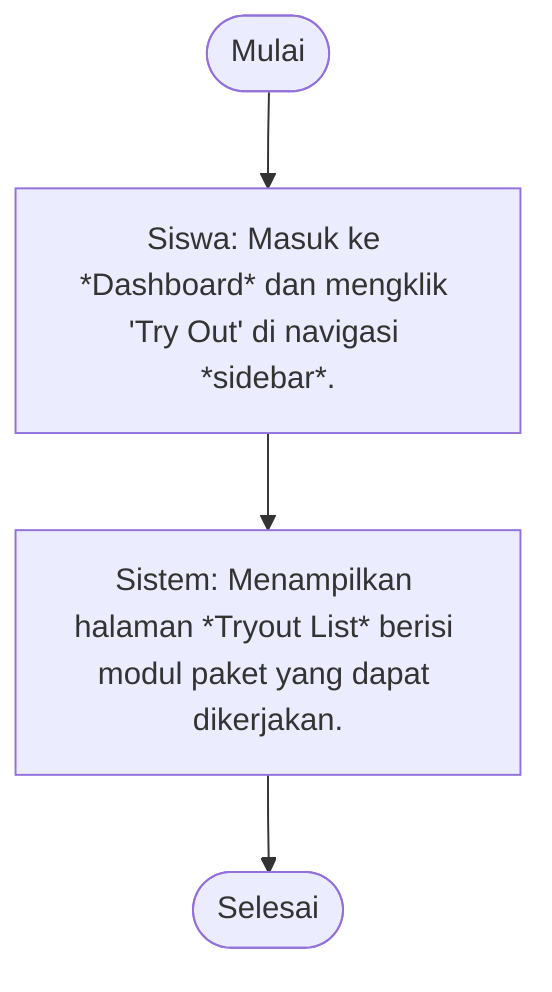
```mermaid
flowchart TD
    Start([Mulai]) --> A
    A[Siswa: Masuk ke *Dashboard* dan mengklik 'Try Out' di navigasi *sidebar*.]
    B[Sistem: Menampilkan halaman *Tryout List* berisi modul paket yang dapat dikerjakan.]
    A --> B
    B --> End([Selesai])
```

**8. Activity Diagram Mengerjakan Tryout**
```mermaid
flowchart TD
    Start([Mulai]) --> A
    A[Siswa: Memilih dan mengklik sebuah paket ujian dari *Tryout List*.]
    B[Sistem: Menginisiasi antarmuka ujian lengkap dengan blok pewaktu (*timer*).]
    A --> B
    C[Siswa: Membaca soal, memilih opsi, menandai (opsional) 'ragu-ragu', dan menekan navigasi 'Selanjutnya'.]
    B --> C
    D[Siswa: Menyelesaikan seluruh subtes lalu menekan 'Kumpulkan Ujian'.]
    C --> D
    E[Sistem: Menjalankan kalkulasi IRT dan menampilkan hasil instan ('Ujian Selesai' dengan parameter Theta dan Skor SNBT).]
    D --> E
    E --> End([Selesai])
```

**9. Activity Diagram Lihat Review Jawaban Bahas dengan AI Tutor**
```mermaid
flowchart TD
    Start([Mulai]) --> A
    A[Siswa: Mengklik opsi 'Lihat Review Jawaban' dari hasil Try Out.]
    B[Sistem: Membuka navigasi daftar soal yang salah dan benar.]
    A --> B
    C[Siswa: Memilih soal salah dan menekan 'Minta Penjelasan AI Tutor'.]
    B --> C
    D[AI Tutor: Memberi respons pancingan awal secara sokratik terkait logika jawaban tersebut.]
    C --> D
    E[Siswa: Memilih 'Lanjutkan Diskusi di Chat Panel'.]
    D --> E
    F[AI Tutor: Menyambut siswa secara mendalam (*'Hai! Kamu ingin membahas soal...'*) di *side-panel*.]
    E --> F
    G[Siswa: Meneruskan interaksi untuk memperbaiki konsepsi.]
    F --> G
    G --> End([Selesai])
```

**10. Activity Diagram Lihat Analisis Kemampuan**
```mermaid
flowchart TD
    Start([Mulai]) --> A
    A[Siswa: Membuka navigasi 'Rapor & Evaluasi' di *sidebar* kanan.]
    B[Sistem: Mengeksekusi *rendering default* pada *tab* 'Rapor & Tren'. Menampilkan *Insight Analisis Cerdas*, *Radar Kemampuan vs Target*, dan jarak selisih poin per subtes (*Detail Per Subtes*).]
    A --> B
    B --> End([Selesai])
```

**11. Activity Diagram Lihat Bank Soal Salah**
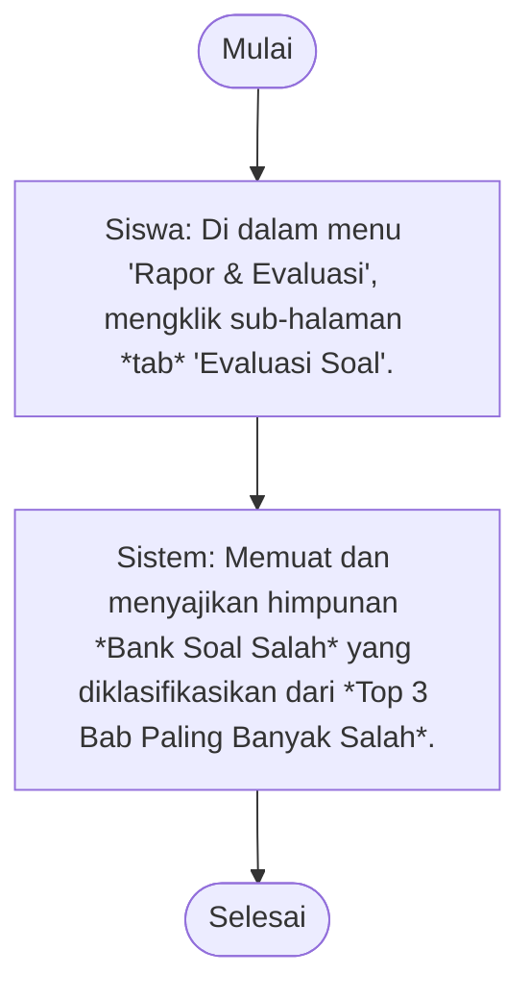
```mermaid
flowchart TD
    Start([Mulai]) --> A
    A[Siswa: Di dalam menu 'Rapor & Evaluasi', mengklik sub-halaman *tab* 'Evaluasi Soal'.]
    B[Sistem: Memuat dan menyajikan himpunan *Bank Soal Salah* yang diklasifikasikan dari *Top 3 Bab Paling Banyak Salah*.]
    A --> B
    B --> End([Selesai])
```

**12. Activity Diagram Lihat Bahas Soal dari Bank Soal Salah**
```mermaid
flowchart TD
    Start([Mulai]) --> A
    A[Siswa: Pada *tab* 'Evaluasi Soal', menekan eksekutor aksi 'Bahas AI' di salah satu entri soal.]
    B[AI Tutor: Menginterupsi dan mengambil alih konteks ke *panel obrolan*, menampilkan riwayat kesalahan siswa (*'Jawabanmu: Tidak menjawab, Jawaban benar: C'*).]
    A --> B
    C[Siswa: Melakukan interaksi konseptual lanjutan via obrolan modular.]
    B --> C
    C --> End([Selesai])
```

**13. Activity Diagram Lihat Peluang Lolos**
```mermaid
flowchart TD
    Start([Mulai]) --> A
    A[Siswa: Di dalam menu 'Rapor & Evaluasi', mengklik sub-halaman *tab* 'Peluang Lolos'.]
    B[Sistem: Merender modul *Chancing Engine*, memproyeksikan rasio ketetapan lulus (misal: *5% SANGAT SULIT*) terhadap PTN idaman beserta rekomendasi AI komparatif untuk fakultas setara yang lebih 'aman'.]
    A --> B
    B --> End([Selesai])
```

**14. Activity Diagram Lihat Detail Salah Satu Jurusan**
```mermaid
flowchart TD
    Start([Mulai]) --> A
    A[Siswa: Dari daftar *Peluang Lolos*, melakukan klik pada salah satu *card* jurusan (misal: *STEI - Komputasi*).]
    B[Sistem: Menampilkan laporan diagnostik jurusan (*Daya Tampung*, *Total Peminat*, rasio *Keketatan*) beserta pilar Prioritas Subtes dari terlemah hingga terkuat.]
    A --> B
    B --> End([Selesai])
```

**15. Activity Diagram Bahas Soal Dalam Aplikasi**
```mermaid
flowchart TD
    Start([Mulai]) --> A
    A[Siswa: Melalui *sidebar*, mengklik 'Ruang Tutor AI'.]
    B[Sistem: Menampilkan modul arsip, siswa menelusuri kategori (Saintek/Soshum).]
    A --> B
    C[Siswa: Mengklik pemicu 'Bahas' pada salah satu soal spesifik di galeri Arsip Soal Lexica.]
    B --> C
    D[Sistem: Mengisolasi tampilan soal.]
    C --> D
    E[AI Tutor: Secara otomatis membuka diskusi relevan (*'Hai! Kita sedang membahas soal ini...'*).]
    D --> E
    F[Siswa: Melakukan transisi interaksi.]
    E --> F
    F --> End([Selesai])
```

**16. Activity Diagram Bahas Soal Luar Aplikasi**
```mermaid
flowchart TD
    Start([Mulai]) --> A
    A[Siswa: Mengakses 'Ruang Tutor AI'.]
    B[Siswa: Tidak memilih galeri arsip, melainkan secara manual *copy-paste* soal di luar kurikulum ke formulir input pesan AI.]
    A --> B
    C[AI Tutor: Menganalisis *prompts*, membangun alur nalar parsial (*'Sendok digunakan untuk...'*), dan perlahan menuntun pengguna menuju konklusi secara logis.]
    B --> C
    D[Siswa: Merespons kognitif *feedback* dari agen AI.]
    C --> D
    D --> End([Selesai])
```

**17. Activity Diagram Mengubah Pengaturan**
```mermaid
flowchart TD
    Start([Mulai]) --> A
    A[Siswa: Mengklik navigasi 'Pengaturan' via *sidebar*.]
    B[Sistem: Memuat preferensi *state* saat ini (*Profil Akun*, *Target UTBK*, *Persona Interaksi AI*).]
    A --> B
    C[Siswa: Menyesuaikan variabel bebas dan menyentuh 'Simpan Perubahan'.]
    B --> C
    D[Sistem: Melakukan validasi POST dan menembakkan *toast message* konfirmasi sukses.]
    C --> D
    D --> End([Selesai])
```

**18. Activity Diagram Lihat subtes**
```mermaid
flowchart TD
    Start([Mulai]) --> A
    A[Siswa: Melakukan klik pada navigasi *sidebar* 'Practice'.]
    B[Sistem: Mengembalikan antarmuka beranda mode *Quick Drill* yang menyoroti deret kardus (*cards*) 7 subtes mapel acak.]
    A --> B
    B --> End([Selesai])
```

**19. Activity Diagram Mengerjakan subtes**
```mermaid
flowchart TD
    Start([Mulai]) --> A[Siswa: Menekan 'Drill Sekarang' pada salah satu subtes di halaman 'Practice'.]
    A --> B[Sistem: Menyodorkan representasi soal dan mengunci waktu evaluasi.]
    B --> C[Siswa: Menjawab soal.]
    C --> D{Evaluasi Jawaban}
    
    D -- "Langsung Benar" --> E1[Sistem: Mengembalikan status 'Benar!' beserta opsi pembahasan.]
    E1 --> E2[AI Tutor: Menampilkan sapaan diskusi.]
    
    D -- "Salah Sekali" --> F1[Sistem: Memotong jatah percobaan. AI Tutor menyisipkan *hint* peringatan dini.]
    F1 --> F2[Siswa: Menjawab ulang dan berhasil memilih jawaban yang benar.]
    F2 --> F3[Sistem: Menampilkan status 'Benar!' beserta opsi pembahasan.]
    F3 --> F4[AI Tutor: Menampilkan sapaan diskusi.]
    
    D -- "Salah Dua Kali" --> G1[Sistem: Menampilkan 'Dilewati. Batas percobaan habis.' dan AI Tutor mengoreksi konsep secara sokratik.]
    
    E2 --> H[Siswa: Menuntaskan kuota repetisi soal dan menerima *summary* metrik.]
    F4 --> H
    G1 --> H
    H --> End([Selesai])
```

#### 3.3.5.3 Activity Diagram Superadmin
Aktivitas aktor Superadmin difokuskan pada pengelolaan entitas CMS tingkat lanjut, dijabarkan ke dalam daftar spesifik sebagai berikut:

**1. Activity Diagram Lihat Learning Overview (Admin)**
```mermaid
flowchart TD
    Start([Mulai]) --> A
    A[Admin: Memasukkan kredensial dan kata sandi otorisasi.]
    B[Sistem: Menampilkan *Panel Kontrol Admin* utama yang menampilkan kompilasi dasbor *Statistik Sistem* agregat secara global.]
    A --> B
    B --> End([Selesai])
```

**2. Activity Diagram Lihat User**
```mermaid
flowchart TD
    Start([Mulai]) --> A
    A[Admin: Menyasar navigasi 'Kelola Pengguna' pada *sidebar* sebelah kiri.]
    B[Sistem: Mendistribusikan senarai pengguna (*Manajemen User*), mencakup identitas, peruntukan *role*, kemampuan IRT ($\theta$), dan total riwayat *try out*.]
    A --> B
    B --> End([Selesai])
```

**3. Activity Diagram Lihat Daftar Soal**
```mermaid
flowchart TD
    Start([Mulai]) --> A
    A[Admin: Mengklik tombol pelatuk navigasi 'Kelola Soal' di *sidebar*.]
    B[Sistem: Merender modul Bank Soal berserta fitur fungsional penyaring taksonomi teks/subtes.]
    A --> B
    B --> End([Selesai])
```

**4. Activity Diagram Lihat Daftar Bab**
```mermaid
flowchart TD
    Start([Mulai]) --> A
    A[Admin: Pada modul 'Kelola Soal', menyeleksi antarmuka *tab* sub-halaman 'Daftar Bab (Chapters)'.]
    B[Sistem: Memuat senarai pemetaan materi tematik kurikulum UTBK.]
    A --> B
    B --> End([Selesai])
```

**5. Activity Diagram Lihat Daftar Mata Pelajaran**
```mermaid
flowchart TD
    Start([Mulai]) --> A
    A[Admin: Pada modul 'Kelola Soal', menyeleksi *tab* 'Mata Pelajaran'.]
    B[Sistem: Menyuguhkan susunan inti kategorisasi subtes ujian (e.g., Literasi Bahasa, Penalaran Matematika).]
    A --> B
    B --> End([Selesai])
```

**6. Activity Diagram Tambah Soal**
```mermaid
flowchart TD
    Start([Mulai]) --> A
    A[Admin: Berada di menu 'Kelola Soal', menyentuh ikon aksi 'Tambah Soal'.]
    B[Sistem: Menarik ekstensi layar panel pengisian (*slide-out*) dari pilar kanan.]
    A --> B
    C[Admin: Menginjeksi konten variabel (LaTeX, bobot $b$) dan menyimpan.]
    B --> C
    D[Sistem: Mengeksekusi penambahan di dalam blok basis data.]
    C --> D
    D --> End([Selesai])
```

**7. Activity Diagram Tambah Bab**
```mermaid
flowchart TD
    Start([Mulai]) --> A
    A[Admin: Mengalihkan tampilan ke *tab* 'Daftar Bab', lalu mengklik 'Tambah Bab'.]
    B[Sistem: Menarik *form* kanan interaktif untuk pendaftaran metadata.]
    A --> B
    C[Admin: Menyelesaikan borang (*form*) dan menyetujui mutasi.]
    B --> C
    D[Sistem: Memetakan entitas bab baru ke tabel relasional.]
    C --> D
    D --> End([Selesai])
```

**8. Activity Diagram Tambah Mata Pelajaran**
```mermaid
flowchart TD
    Start([Mulai]) --> A
    A[Admin: Masuk ke antarmuka *tab* 'Mata Pelajaran' dan menekan 'Tambah Mapel'.]
    B[Sistem: Mengekstrak kerangka formulir. Admin menuntaskan isian lalu mematenkan operasi simpan.]
    A --> B
    C[Sistem: Mewujudkan modul mata pelajaran turunan yang definitif.]
    B --> C
    C --> End([Selesai])
```

**9. Activity Diagram Edit Soal**
```mermaid
flowchart TD
    Start([Mulai]) --> A
    A[Admin: Melakukan komando klik navigasi 'Edit' pada entitas tabel item *Daftar Soal*.]
    B[Sistem: Menghamparkan antarmuka *slide-out panel* eksklusif yang memuat status terkini item referensi.]
    A --> B
    C[Admin: Merevisi detail parameter kemudian menekan 'Simpan'. Sistem mencetak penulisan *update* data.]
    B --> C
    C --> End([Selesai])
```

**10. Activity Diagram Edit Bab**
```mermaid
flowchart TD
    Start([Mulai]) --> A
    A[Admin: Menembakkan klik ke aksi 'Edit' di indeks sub-*tab* 'Daftar Bab'.]
    B[Sistem: Melanjutkan instruksi manipulasi *form*.]
    A --> B
    C[Sistem: Melakukan pengikatan mutlak di repositori PostgreSQL terhadap bab terkait.]
    B --> C
    C --> End([Selesai])
```

**11. Activity Diagram Edit Mata Pelajaran**
```mermaid
flowchart TD
    Start([Mulai]) --> A
    A[Admin: Mengeksekusi navigasi pembaruan ('Edit') dari koleksi *tab* 'Mata Pelajaran'.]
    B[Sistem: Memfasilitasi kanvas pengisian asimetris (*right panel*) dan mendokumentasikan modifikasi ketika tersimpan.]
    A --> B
    B --> End([Selesai])
```

**12. Activity Diagram Hapus Soal**
```mermaid
flowchart TD
    Start([Mulai]) --> A
    A[Admin: Memantik pelatuk bahaya ('Hapus') di *Daftar Soal*.]
    B[Sistem: Merilis *interceptor box* 'Hapus soal ini?'.]
    A --> B
    C[Admin: Menekan konfirmasi persetujuan 'Ok'. Sistem melakukan pemusnahan dokumen yang diklasifikasi.]
    B --> C
    C --> End([Selesai])
```

**13. Activity Diagram Hapus Bab**
```mermaid
flowchart TD
    Start([Mulai]) --> A
    A[Admin: Memicu perintah eliminasi di antarmuka tabel 'Daftar Bab'.]
    B[Sistem: Mengemisikan *prompt* kepastian, dan menghancurkan referensi entitas hierarkis usai divalidasi otoritas.]
    A --> B
    B --> End([Selesai])
```

**14. Activity Diagram Hapus Mata Pelajaran**
```mermaid
flowchart TD
    Start([Mulai]) --> A
    A[Admin: Mengeksekusi skenario identik melalui *tab* 'Mata Pelajaran' untuk meruntuhkan kerangka kategori utama dari kurikulum setelah verifikasi konfirmasi 'Ok'.]
    A --> End([Selesai])
```

**15. Activity Diagram Lihat Daftar Universitas**
```mermaid
flowchart TD
    Start([Mulai]) --> A
    A[Admin: Mengklik ruas 'Kelola PTN/Prodi' di panel *sidebar* vertikal.]
    B[Sistem: Mengalihkan penayangan kepada senarai rincian basis data Universitas yang berpartisipasi dalam UTBK-SNBT.]
    A --> B
    B --> End([Selesai])
```

**16. Activity Diagram Lihat Daftar Prodi**
```mermaid
flowchart TD
    Start([Mulai]) --> A
    A[Admin: Menavigasi arah menuju sub-halaman *tab* 'Daftar Program Studi (Prodi)'.]
    B[Sistem: Menyajikan antarmuka tabular inventaris spesialisasi prodi lintas universitas.]
    A --> B
    B --> End([Selesai])
```

**17. Activity Diagram Tambah Universitas**
```mermaid
flowchart TD
    Start([Mulai]) --> A
    A[Admin: Mengetuk kontrol interaktif utama 'Tambah Universitas'.]
    B[Sistem: Menjulurkan pilar form samping. Admin memasukkan properti universitas dasar. Sistem memproses validasi pendaftaran dan menyegarkan hierarki *grid*.]
    A --> B
    B --> End([Selesai])
```

**18. Activity Diagram Tambah Prodi**
```mermaid
flowchart TD
    Start([Mulai]) --> A
    A[Admin: Membuka sub-halaman daftar prodi dan menekan 'Tambah Prodi'.]
    B[Sistem: Menuntut variabel vital (*Estimasi Aman/Passing Grade*, Keketatan, Daya Tampung). Admin menyanggupi *input* dan menyimpan ke kerangka mesin *Chancing*.]
    A --> B
    B --> End([Selesai])
```

**19. Activity Diagram Edit Universitas**
```mermaid
flowchart TD
    Start([Mulai]) --> A
    A[Admin: Mengaktifkan perintah 'Edit Universitas' dari elemen baris target.]
    B[Sistem: Memperlihatkan parameter lampau. Admin menyunting dan memperbarui status referensi di basis data.]
    A --> B
    B --> End([Selesai])
```

**20. Activity Diagram Edit Prodi**
```mermaid
flowchart TD
    Start([Mulai]) --> A
    A[Admin: Memanggil fungsionalitas pembaruan melalui 'Edit Prodi'.]
    B[Sistem: Menyediakan wadah modifikasi parameter keketatan/kapasitas, dan segera mematri perubahan saat 'Simpan' ditekan.]
    A --> B
    B --> End([Selesai])
```

**21. Activity Diagram Hapus Universitas**
```mermaid
flowchart TD
    Start([Mulai]) --> A
    A[Admin: Melancarkan perintah penghancuran di tombol 'Hapus' barisan Universitas.]
    B[Sistem: Menagih verifikasi lapis dua (*'Hapus universitas ini?'*). Admin menyetujui, entri dihapus secara rekursif (termasuk *child prodi* miliknya).]
    A --> B
    B --> End([Selesai])
```

**22. Activity Diagram Hapus Prodi**
```mermaid
flowchart TD
    Start([Mulai]) --> A
    A[Admin: Melakukan intervensi di dalam *tab* Daftar Program Studi dan menekan 'Hapus' pada prodi spesifik.]
    B[Sistem: Menyodorkan pertanyaan mitigasi (*'Hapus prodi ini?'*). Usai konfirmasi 'Ok', komponen tersebut dicabut dari eksistensi referensi mesin rekayasa rekomendasi siswa.]
    A --> B
    B --> End([Selesai])
```

**23. Activity Diagram Lihat Daftar Tryout**
```mermaid
flowchart TD
    Start([Mulai]) --> A
    A[Admin: Mengarahkan *pointer* dan mengeklik 'Kelola Tryout' di *sidebar* navigasi.]
    B[Sistem: Menayangkan modul eksekutif Manajemen Tryout, memuat indeks arsitektur paket ujian.]
    A --> B
    B --> End([Selesai])
```

**24. Activity Diagram Tambah Tryout**
```mermaid
flowchart TD
    Start([Mulai]) --> A
    A[Admin: Memicu komando 'Tambah Tryout'.]
    B[Sistem: Meluncurkan jendela ekstensi kanan. Admin meramu properti nama modul simulasi dan mengonfirmasi peluncurannya.]
    A --> B
    B --> End([Selesai])
```

**25. Activity Diagram Tambah Subtes Tryout**
```mermaid
flowchart TD
    Start([Mulai]) --> A
    A[Admin: Menyelam ke relung internal paket *try out* rintisan, lalu mengklik 'Tambah Subtes'.]
    B[Sistem: Membuka layar modifikasi durasi temporal dan pemetaan tipe soal spesifik. Sistem menyimpan partisi seksi secara struktural ke dalam *parent* Tryout.]
    A --> B
    B --> End([Selesai])
```

**26. Activity Diagram Edit Tryout**
```mermaid
flowchart TD
    Start([Mulai]) --> A
    A[Admin: Menemukan utilitas 'Edit Tryout' di barisan modul paket utama.]
    B[Sistem: Menyiapkan pembedahan data sekunder. Pengubahan ditangkap dan diresmikan ke sistem *backend*.]
    A --> B
    B --> End([Selesai])
```

**27. Activity Diagram Edit Subtes Tryout**
```mermaid
flowchart TD
    Start([Mulai]) --> A
    A[Admin: Mendeteksi barisan *section* / subtes tertentu di bagian dalam paket makro ujian, lalu memantik 'Edit Subtes'.]
    B[Sistem: Membuka keran revisi jumlah dan waktu alokasi, mematri pembaruan setelah persetujuan admin.]
    A --> B
    B --> End([Selesai])
```

**28. Activity Diagram Hapus Tryout**
```mermaid
flowchart TD
    Start([Mulai]) --> A
    A[Admin: Mendesak pelatuk eliminasi radikal ('Hapus') di pilar paket ujian sentral.]
    B[Sistem: Mengevakuasi *prompt* *interceptor* ('Hapus paket ini?'). Admin melakukan otorisasi 'Ok', dan sistem menyapu jejak eksistensi paket secara bersih (*cascading deletion*).]
    A --> B
    B --> End([Selesai])
```

**29. Activity Diagram Hapus Subtes Tryout**
```mermaid
flowchart TD
    Start([Mulai]) --> A
    A[Admin: Mendorong utilitas fungsional 'Hapus Subtes' di anatomi internal paket ujian simulasi.]
    B[Sistem: Melontarkan validasi peredam kelalaian. Setelah afirmatif 'Ok', sistem melucuti seksi tersebut dari cetak biru paket ujian utama.]
    A --> B
    B --> End([Selesai])
```

**30. Activity Diagram Lihat Statistik Ringkasan Platform**
```mermaid
flowchart TD
    Start([Mulai]) --> A
    A[Admin: Berpindah orientasi ke menu 'Statistik' pada *sidebar* navigasi.]
    B[Sistem: Membuka pemandangan komprehensif metrik evaluasi makro dari arsitektur platform secara serempak.]
    A --> B
    B --> End([Selesai])
```

**31. Activity Diagram Lihat Statistik Evaluasi Ujian**
```mermaid
flowchart TD
    Start([Mulai]) --> A
    A[Admin: Berada di klaster menu 'Statistik', mengalihkan titik api observasi ke tautan sub-halaman 'Evaluasi Ujian'.]
    B[Sistem: Menyingkap indikator distribusi kurva peserta dan klasifikasi *Item Response Theory* tingkat kesulitan tes secara bergelombang.]
    A --> B
    B --> End([Selesai])
```

**32. Activity Diagram Lihat Statistik Target Siswa**
```mermaid
flowchart TD
    Start([Mulai]) --> A
    A[Admin: Memfokuskan penglihatan pada sub-halaman *tab* 'Target Siswa'.]
    B[Sistem: Meracik visualisasi agregat sentimen peminatan jurusan yang mendominasi ambisi populasi pelajar Lexica.]
    A --> B
    B --> End([Selesai])
```

**33. Activity Diagram Lihat Statistik Token & AI**
```mermaid
flowchart TD
    Start([Mulai]) --> A
    A[Admin: Melemparkan perhatian pada segmen terakhir sub-halaman 'Token & AI'.]
    B[Sistem: Menyediakan laporan transparansi beban kerja inferensi model LLM dan biaya utilitas *bandwidth* kecerdasan buatan.]
    A --> B
    B --> End([Selesai])
```

**34. Activity Diagram Lihat Pengaturan**
```mermaid
flowchart TD
    Start([Mulai]) --> A
    A[Admin: Mendaratkan interaksi pada tautan murni 'Pengaturan' di dasar menu *sidebar*.]
    B[Sistem: Memuat cetak biru panel instrumen kontrol tertinggi (*superadmin configuration plane*).]
    A --> B
    B --> End([Selesai])
```

**35. Activity Diagram Ubah Pengaturan**
```mermaid
flowchart TD
    Start([Mulai]) --> A
    A[Admin: Berinteraksi leluasa dengan nilai tetapan yang mengkalibrasi parameter suhu obrolan AI atau koefisien pembobotan IRT platform.]
    B[Admin: Mengetuk segel pengunci 'Simpan Pengaturan'.]
    A --> B
    C[Sistem: Mengabsorbsi modifikasi dan mengesahkan parameter fungsional ke ranah implementasi *real-time*.]
    B --> C
    C --> End([Selesai])
```

### 3.3.6 Database Entity Relationship Diagram
*Gambar 3.12 Entity Relationship Diagram (ERD)*
```mermaid
erDiagram
    User ||--o{ StudentProfile : "has"
    User ||--o{ ExamAttempt : "takes"
    User ||--o{ TutoringSession : "starts"
    User ||--o{ ChapterProgress : "tracks"
    
    Subject ||--o{ Chapter : "contains"
    Chapter ||--o{ Question : "has"
    Chapter ||--o{ ChapterProgress : "monitored_by"
    
    Question ||--o{ QuestionOption : "provides"
    Question ||--o{ QuestionResponse : "answered_in"
    
    ExamTemplate ||--o{ ExamSection : "divided_into"
    ExamSection ||--o{ Question : "includes"
    ExamTemplate ||--o{ ExamAttempt : "attempted_by"
    
    ExamAttempt ||--o{ QuestionResponse : "records"
    
    QuestionResponse ||--o{ TutoringSession : "discussed_in"
    TutoringSession ||--o{ TutoringMessage : "contains_messages"
    
    University ||--o{ Major : "offers"
    StudentProfile ||--o{ Major : "targets"
```

Berdasarkan Gambar 3.12, digambarkan struktur basis data PostgreSQL beserta hubungan antar entitasnya yang dikelola menggunakan Prisma ORM. Relasi tersebut mencakup data pengguna (`User`, `StudentProfile`), bank soal (`Subject`, `Chapter`, `Question`, `QuestionOption`), proses pengerjaan ujian (`ExamTemplate`, `ExamSection`, `ExamAttempt`, `QuestionResponse`), sesi bimbingan AI (`TutoringSession`, `TutoringMessage`), perkembangan *mastery learning* (`ChapterProgress`), serta data target studi (`University`, `Major`). 

## 3.4 Alat dan Bahan Tugas Akhir
Alat dan bahan yang digunakan dalam proses pengembangan platform Lexica ini dapat dilihat pada bagian berikut:

### 3.4.1 Perangkat Keras (Hardware)
*Tabel 3.5 Spesifikasi Perangkat Keras Pengembangan*

| Komponen | Spesifikasi yang Digunakan |
|---|---|
| **Jenis Perangkat** | Laptop ASUS TUF Gaming F15 |
| **Sistem Operasi** | Windows 11 (64-bit) |
| **Processor** | Intel Core i5-10300H @2.50GHz |
| **RAM** | 16GB DDR4 |
| **Penyimpanan** | 512GB SSD |

### 3.4.2 Perangkat Lunak (Software)
1. **Visual Studio Code:** sebagai *Integrated Development Environment* (IDE).
2. **Node.js & npm:** *runtime environment* dan pengelola paket.
3. **Next.js (App Router):** *framework full-stack* utama pembangun aplikasi.
4. **Prisma ORM:** sebagai *Object-Relational Mapper* untuk efisiensi *query* basis data.
5. **PostgreSQL (Neon DB):** sebagai sistem manajemen basis data relasional berarsitektur *serverless*.
6. **Vercel:** sebagai platform *cloud hosting* dan *Edge Network*.
7. **Zustand:** sebagai pustaka *state management* di klien untuk mengelola konteks soal, *timer*, dan riwayat *chat* AI secara reaktif.
8. **KaTeX:** sebagai *library* untuk me-*render* rumus matematika berformat LaTeX secara *real-time* di sisi antarmuka.

### 3.4.3 Layanan Kecerdasan Buatan (AI)
Layanan kecerdasan buatan (AI) yang diintegrasikan adalah **Groq API** dengan memanfaatkan model inferensi `llama-3.1-8b-instant` yang berfungsi sebagai *engine* AI utama. Groq API dipilih karena kemampuannya menghasilkan pemrosesan bahasa alami menggunakan LPU dengan latensi yang sangat rendah (*real-time*), yang esensial untuk membimbing interaksi *chat* siswa tanpa jeda yang panjang pada mode latihan. Untuk memitigasi kegagalan jaringan API atau masalah limit akses, antarmuka menyediakan komponen statis *Fallback Hint* agar siswa tetap bisa melanjutkan evaluasi.

### 3.4.4 Dataset Pihak Ketiga & Pertama
**Dataset Pihak Ketiga:**
Dataset dari pihak eksternal yang digunakan dalam tugas akhir ini berupa kumpulan soal latihan UTBK-SNBT dari tahun sebelumnya yang dikurasi dari literatur pendidikan dan sumber publik. Selain itu, digunakan pula dataset publik resmi mengenai daftar Perguruan Tinggi Negeri (PTN), program studi, daya tampung, jumlah peminat, dan rasio keketatan. Dataset PTN ini berperan krusial sebagai referensi utama yang diolah oleh fitur *Chancing Engine* untuk mengestimasi peluang lolos seleksi.

**Dataset Pihak Pertama:**
Sebagai pelengkap, penulis menyusun dataset soal simulasi mandiri. Kumpulan soal ini distrukturisasi ke dalam format *spreadsheet* Excel (`.xlsx`) agar kompatibel dengan sistem pendaftaran terpusat. Format ini memungkinkan soal dan kunci jawabannya dibaca, divalidasi, dan dimasukkan ke dalam basis data PostgreSQL secara masal melalui fungsi *Bulk Import* yang ada pada dasbor Superadmin.