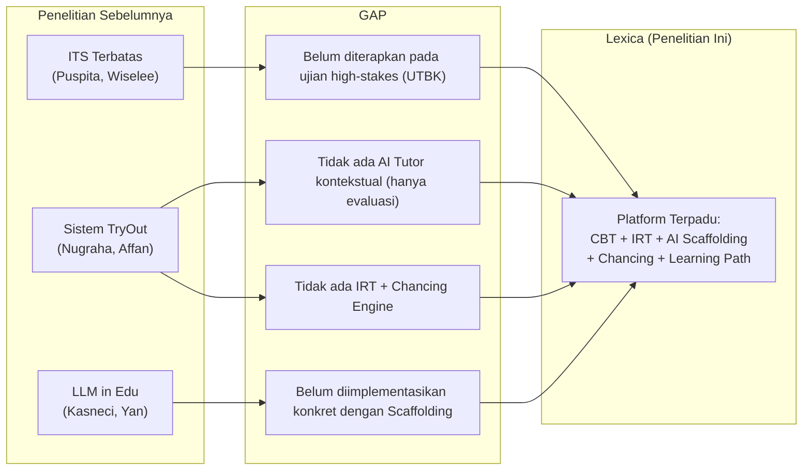

# Tinjauan Pustaka & Penelitian Terdahulu (Related Work)

Dokumen ini merangkum kajian literatur dan penelitian terdahulu yang menjadi landasan teori serta pembanding bagi pengembangan platform Lexica UTBK-SNBT.

---

## BAGIAN I: LANDASAN TEORI UTAMA

### 1. Item Response Theory (IRT)
**Referensi Utama:** Hambleton, R. K., Swaminathan, H., & Rogers, H. J. (1991). *Fundamentals of Item Response Theory*. Sage Publications.

- IRT adalah paradigma pengukuran psikometris yang memodelkan hubungan antara kemampuan laten siswa ($\theta$) dan probabilitas menjawab benar suatu butir soal.
- Berbeda dengan *Classical Test Theory* (CTT) yang menghitung skor mentah (jumlah benar / jumlah soal), IRT memberikan estimasi yang **invariant terhadap populasi tes** — artinya skor kemampuan siswa tidak bergantung pada seberapa mudah atau sulit soal yang diberikan.
- **Relevansi untuk Lexica:** UTBK menggunakan prinsip serupa dalam penskorannya. Lexica mengadopsi IRT 1-PL (Rasch Model) untuk memberikan skor yang lebih adil, di mana siswa yang berhasil menjawab soal sulit mendapat kredit lebih tinggi.

### 2. Cognitive Load Theory (CLT)
**Referensi Utama:** Sweller, J. (1988). Cognitive load during problem solving: Effects on learning. *Cognitive Science*, 12(2), 257–285.

- CLT membagi beban kognitif menjadi tiga jenis:
  - **Intrinsic load:** Kompleksitas inheren materi (tidak bisa dikurangi).
  - **Extraneous load:** Beban akibat desain instruksional yang buruk (harus diminimalkan).
  - **Germane load:** Usaha mental yang berkontribusi pada pembentukan skema pengetahuan (harus dimaksimalkan).
- **Relevansi untuk Lexica:** Seluruh desain UX Lexica difokuskan pada minimalisasi *extraneous load* — mulai dari *zero-friction context injection* (siswa tidak perlu mengetik ulang soal ke AI), navigasi 5-menu (mengurangi *decision fatigue*), hingga auto-trigger pembahasan AI saat batas frustrasi tercapai.

### 3. Socratic Method & Scaffolding
**Referensi Utama:**
- Paul, R., & Elder, L. (2007). *Critical Thinking: The Art of Socratic Questioning*. Journal of Developmental Education, 31(1).
- Vygotsky, L. S. (1978). *Mind in Society: The Development of Higher Psychological Processes*. Harvard University Press.

- **Socratic Method** menggunakan pertanyaan terarah untuk memandu siswa menemukan jawaban sendiri, alih-alih memberikan jawaban langsung. Ini terbukti meningkatkan *deep learning* dan retensi jangka panjang.
- **Scaffolding** (Vygotsky) adalah pemberian dukungan belajar bertingkat yang dikurangi secara progresif seiring meningkatnya kemampuan siswa (*Zone of Proximal Development*).
- **Relevansi untuk Lexica:** AI Tutor menerapkan tiga level scaffolding (SOCRATIC → HINT → SOLUTION) yang masing-masing memiliki tingkat bantuan berbeda — dari pertanyaan pemandu hingga pembahasan lengkap.

### 4. Large Language Models (LLM) untuk Pendidikan
**Referensi Utama:**
- Kasneci, E., et al. (2023). ChatGPT for Good? On Opportunities and Challenges of Large Language Models for Education. *Learning and Individual Differences*, 103, 102274.
- Mollick, E. R., & Mollick, L. (2023). Using AI to Implement Effective Teaching Strategies in Classrooms: Five Strategies, Including Prompting. *SSRN Working Paper*.

- LLM seperti GPT-4, Llama-3, dan Claude telah menunjukkan kemampuan signifikan sebagai tutor virtual yang mampu memberikan penjelasan kontekstual, menghasilkan soal latihan, dan melakukan *assessment* formatif.
- **Tantangan utama:** Risiko *hallucination* (informasi salah), ketergantungan berlebih (*over-reliance*), dan potensi membuat siswa malas berpikir jika langsung memberikan jawaban.
- **Relevansi untuk Lexica:** Lexica memitigasi risiko ini dengan *scaffolding* bertingkat — AI tidak langsung memberikan jawaban pada percobaan pertama, melainkan mengajukan pertanyaan pemandu terlebih dahulu.

---

## BAGIAN II: PENELITIAN TERDAHULU

### Tabel Komparasi Penelitian Terdahulu

| No | Peneliti (Tahun) | Judul | Metode | Hasil | Gap yang Diisi Lexica |
|----|------------------|-------|--------|-------|----------------------|
| 1 | Puspita dkk. (2025) | Perancangan *Website* ITS Berbasis *Rule-Based Reasoning* menggunakan Gemini AI... | SDLC, ITS, Gemini AI | Sistem memberikan penjelasan otomatis. | Belum diterapkan pada sistem TryOut UTBK; belum ada scaffolding bertingkat maupun IRT. |
| 2 | Wiselee dkk. (2025) | *Empowering Independent Learning in Web Development Using ITS* | SDLC, ITS | Membantu pembelajaran mandiri secara interaktif. | Terbatas pada web development; belum menggunakan LLM dan belum ada fitur TryOut. |
| 3 | Nugraha & Hardiyanti (2025) | Rancang Bangun Sistem Tryout UTBK SNBT... | *Waterfall*, Web CBT | Tryout & rekomendasi jurusan. | Belum memiliki fitur ITS, scaffolding AI, maupun IRT. |
| 4 | Affan & Elhanafi (2025) | Perancangan Aplikasi Tryout *Online* Berbasis Web... | *Waterfall*, Web CBT | Manajemen tryout terpusat. | Fokus administrasi; belum mendukung pembelajaran adaptif. |
| 5 | Kasneci dkk. (2023) | *ChatGPT for good? On opportunities and challenges...* | Literature Review | LLM mendukung pembelajaran adaptif. | Belum ada implementasi spesifik pada TryOut UTBK. |
| 6 | Yan dkk. (2023) | *Practical and Ethical Challenges of Large Language Models...* | Systematic Review | Tantangan akurasi dan kontrol LLM. | Lexica mewujudkan kontrol lewat scaffolding bertingkat. |
| 7 | Peláez-Sánchez dkk. (2024)| *The impact of large language models on higher education* | Literature Review | LLM meningkatkan interaksi. | Belum membahas integrasi LLM pada TryOut UTBK & Chancing Engine. |

### Analisis Gap Research

### Novelty (Kebaruan) Penelitian Ini

Berdasarkan analisis gap di atas, **kebaruan** yang ditawarkan Lexica adalah:

1. **Integrasi End-to-End:** Menggabungkan CBT Simulator, IRT Scoring, AI Tutor (Socratic Scaffolding), Chancing Engine, dan Learning Path dalam satu platform terpadu — sesuatu yang belum ada pada penelitian terdahulu.
2. **Context-Aware AI Tutoring:** Implementasi konkret *zero-friction context injection* di mana AI menerima konteks soal secara otomatis tanpa intervensi pengguna, dengan masking kunci jawaban (`???`) untuk mencegah kebocoran.
3. **Cognitive Load-Aware UX Design:** Desain antarmuka yang secara eksplisit mengaplikasikan prinsip *Cognitive Load Theory* — mulai dari konsolidasi 9 menu menjadi 5, hingga *auto-trigger* pembahasan AI berdasarkan batas percobaan (2-Attempt Rule).
4. **Lokalisasi Konteks UTBK Indonesia:** Seluruh fitur dirancang khusus untuk ekosistem UTBK-SNBT Indonesia, termasuk database PTN/prodi, kluster Saintek/Soshum, dan skala skor 200–800.

---

## BAGIAN III: DAFTAR PUSTAKA SEMENTARA

1. Hambleton, R. K., Swaminathan, H., & Rogers, H. J. (1991). *Fundamentals of Item Response Theory*. Sage Publications.
2. Sweller, J. (1988). Cognitive load during problem solving: Effects on learning. *Cognitive Science*, 12(2), 257–285.
3. Vygotsky, L. S. (1978). *Mind in Society: The Development of Higher Psychological Processes*. Harvard University Press.
4. Paul, R., & Elder, L. (2007). Critical Thinking: The Art of Socratic Questioning. *Journal of Developmental Education*, 31(1).
5. Kasneci, E., et al. (2023). ChatGPT for Good? On Opportunities and Challenges of Large Language Models for Education. *Learning and Individual Differences*, 103, 102274.
6. Mollick, E. R., & Mollick, L. (2023). Using AI to Implement Effective Teaching Strategies in Classrooms. *SSRN Working Paper* (Catatan: Meskipun berupa *working paper*, referensi ini luas diakui sebagai rujukan otoritatif awal dalam penerapan Generative AI untuk *scaffolding* pendidikan).
7. Brooke, J. (1996). SUS: A 'Quick and Dirty' Usability Scale. *Usability Evaluation in Industry*, 189–194.
8. De Ayala, R. J. (2009). *The Theory and Practice of Item Response Theory*. Guilford Press.
9. BP3 SNPMB. (2024). *Panduan UTBK-SNBT 2024*. Badan Pengelolaan Pengujian Pendidikan.
10. Puspita, D. D., Eugie, A. N., Isnaeny, S. N., & Yasin, M. (2025). Perancangan Website Intelligent Tutoring Systems (ITS) Berbasis Rule-Based Reasoning Menggunakan Gemini AI untuk Pembelajaran Kombinatorika pada Siswa SMA Kelas 12. *Preprint, Universitas Negeri Malang*.
11. Wiselee, D., Yanto, A., Warnars, L. S., Warnars, H. L. H., & Razak, F. H. A. (2025). Empowering Independent Learning in Web Development Using Intelligent Tutoring Systems. *2025 4th International Conference on Creative Communication and Innovative Technology (ICCIT)*.
12. Nugraha, R. A., & Hardiyanti, M. (2025). Rancang Bangun Sistem Tryout UTBK SNBT Berbasis Web dengan Fitur Rekomendasi Jurusan (Studi Kasus: Integral Education). *Journal of Internet and Software Engineering (JISE)*, 6(2).
13. Affan, M. I., & Elhanafi, A. M. (2025). Perancangan dan Implementasi Aplikasi Tryout Online Berbasis Web dengan Fitur Manajemen Soal dan Pendaftaran Terintegrasi. *Jurnal Kecerdasan Buatan dan Teknologi Informasi (JKBTI)*, 4(3).
14. Yan, L., Sha, L., Zhao, L., dkk. (2023). Practical and Ethical Challenges of Large Language Models in Education: A Systematic Scoping Review. *British Journal of Educational Technology*, 54(6), 2258–2278.
15. Peláez-Sánchez, I. C., Velarde-Camaqui, D., & Glasserman-Morales, L. D. (2024). The impact of large language models on higher education: exploring the connection between AI and Education 4.0. *Frontiers in Education*, 9.

---

*Dokumen ini mencerminkan kajian pustaka per 22 Juni 2026. Referensi akan diperkaya seiring penulisan BAB II skripsi.*
