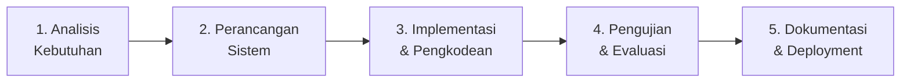
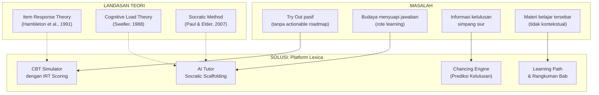

# Kerangka Penelitian Skripsi — Lexica UTBK-SNBT

> **Judul Penelitian:**
> Pengembangan Platform Persiapan UTBK-SNBT untuk Siswa SMA dengan Metode Socratic Scaffolding Berbasis Large Language Model

---

## 1. Rumusan Masalah (Research Questions)

| Kode | Rumusan Masalah |
|------|----------------|
| **RQ-1** | Bagaimana merancang dan membangun platform persiapan UTBK-SNBT berbasis web yang mengintegrasikan *AI Tutor* dengan metode *Socratic Scaffolding* bertingkat? |
| **RQ-2** | Bagaimana menerapkan algoritma *Item Response Theory* (IRT) 1-Parameter Logistic untuk memberikan estimasi kemampuan siswa ($\theta$) yang lebih adil dibandingkan skor persentase mentah? |
| **RQ-3** | Bagaimana merancang arsitektur *User Experience* (UX) yang meminimalkan *extraneous cognitive load* pada siswa yang bersifat *performance-oriented* dalam persiapan ujian *high-stakes*? |
| **RQ-4** | Bagaimana merancang Chancing Engine yang mampu memberikan estimasi peluang kelulusan berbasis skor IRT dan data kompetisi program studi? |

---

## 2. Tujuan Penelitian (Research Objectives)

| Kode | Tujuan |
|------|--------|
| **RO-1** | Mengembangkan *platform* persiapan UTBK-SNBT berbasis *website* yang mengimplementasikan *Large Language Model* (LLM) sebagai *Intelligent Tutoring System* (ITS) dengan metode *Socratic Scaffolding* bertingkat untuk memberikan bimbingan pembelajaran secara kontekstual dan bertahap. |
| **RO-2** | Mengimplementasikan algoritma *Item Response Theory* (IRT) 1-Parameter Logistic (Rasch Model) untuk memberikan estimasi kemampuan siswa (θ) yang lebih adil dibandingkan skor persentase mentah, serta mengonversinya ke skala skor UTBK (200–800). |
| **RO-3** | Mengembangkan *Chancing Engine* yang mampu memberikan estimasi peluang kelulusan pada program studi target berdasarkan skor IRT siswa, rasio keketatan, dan data daya tampung. |
| **RO-4** | Merancang antarmuka pengguna yang meminimalkan *extraneous cognitive load* berdasarkan prinsip *Cognitive Load Theory* melalui konsolidasi navigasi, *zero-friction context injection*, dan mekanisme *auto-trigger* pembahasan AI. |

---

## 3. Batasan Masalah (Scope & Limitations)

### 3.1 Ruang Lingkup (In-Scope)
1. Platform dibangun sebagai **aplikasi web** menggunakan Next.js 16 (App Router), bukan aplikasi mobile native.
2. Soal-soal UTBK yang digunakan dalam *bank soal* mencakup **7 subtes** resmi: Penalaran Umum, Pengetahuan Kuantitatif, Pemahaman Bacaan & Menulis, Pengetahuan & Pemahaman Umum, Literasi Bahasa Indonesia, Literasi Bahasa Inggris, dan Penalaran Matematika.
3. *AI Tutor* menggunakan model LLM **llama-3.3-70b-versatile** yang diakses melalui Groq API (cloud inference).
4. Penilaian menggunakan model **IRT 1-PL (Rasch Model)** dengan parameter kesulitan ($b$) yang ditentukan berdasarkan *expert judgment*.
5. Data program studi dan estimasi skor aman bersumber dari **data sekunder publik** (arsip alumni, platform bimbel, dan laporan LTMPT).
6. Evaluasi kebergunaan dilakukan menggunakan kuesioner **System Usability Scale (SUS)**.

### 3.2 Di Luar Ruang Lingkup (Out-of-Scope)
1. **Computerized Adaptive Testing (CAT):** Pemilihan butir soal secara adaptif tidak diimplementasikan; tryout bersifat linear.
2. **Kalibrasi IRT Empiris:** Parameter kesulitan soal ($b$) tidak dikalibrasi melalui uji coba lapangan berskala besar; menggunakan penilaian ahli (*expert judgment*).
3. **Data Resmi SNPMB:** Batas nilai kelulusan resmi tidak tersedia secara publik; menggunakan estimasi.
4. **Fitur Kolaboratif:** Tidak ada ruang diskusi siswa, fitur peer-review, atau fitur sosial.
5. **Perbandingan Eksperimental:** Penelitian ini bersifat *development research*, bukan eksperimen komparatif dengan kelompok kontrol.

---

## 4. Metode Penelitian

### 4.1 Model Pengembangan: SDLC Waterfall (Modifikasi)
Penelitian ini menggunakan model *Software Development Life Cycle* (SDLC) **Waterfall** dengan modifikasi iteratif pada tahap implementasi. Pemilihan Waterfall didasarkan pada kejelasan *scope* dan kebutuhan sistem yang telah terdefinisi sejak awal.

#### Tahapan:

| Tahap | Aktivitas | Output |
|-------|-----------|--------|
| **1. Analisis Kebutuhan** | Studi pustaka, analisis masalah persiapan UTBK, identifikasi kebutuhan fungsional & non-fungsional | Dokumen SRS (*Software Requirements Specification*) |
| **2. Perancangan Sistem** | Perancangan arsitektur sistem, ERD, *wireframe* UI, perancangan algoritma IRT & Chancing | Dokumen desain sistem, ERD, *mockup* UI |
| **3. Implementasi** | Pengkodean *frontend* (Next.js, React), *backend* (API Routes, Prisma), integrasi AI (Groq API) | Source code aplikasi |
| **4. Pengujian** | *Black-box testing*, pengujian SUS, validasi skor IRT, uji fungsional fitur | Laporan pengujian, skor SUS |
| **5. Dokumentasi** | Penulisan skripsi, dokumentasi teknis, manual pengguna | Naskah skripsi final |

### 4.2 Teknik Pengumpulan Data
1. **Studi Pustaka:** Kajian literatur tentang IRT, Cognitive Load Theory, Socratic Method, dan LLM-based tutoring.
2. **Observasi:** Pengamatan perilaku belajar siswa SMA dalam persiapan UTBK.
3. **Kuesioner SUS:** Evaluasi *usability* platform oleh responden (siswa SMA / alumni).

### 4.3 Teknik Analisis Data
1. **Analisis Deskriptif:** Mendeskripsikan hasil pengujian fungsional dan skor SUS.
2. **Skala Likert (SUS):** Menghitung skor SUS rata-rata dari 10 pernyataan standar untuk mengukur kebergunaan sistem (target ≥ 68 / *acceptable*).

---

## 5. Kerangka Berpikir (Conceptual Framework)

---

## 6. Hipotesis Pengembangan

> Platform Lexica yang mengintegrasikan *AI Tutor* berbasis *Socratic Scaffolding*, penilaian IRT, dan prediksi peluang kelulusan akan menghasilkan sistem persiapan UTBK-SNBT yang fungsional, *usable* (SUS ≥ 68), dan sesuai dengan kebutuhan kognitif siswa yang bersifat *performance-oriented*.

---

*Dokumen ini mencerminkan kerangka penelitian per 15 Juni 2026.*
